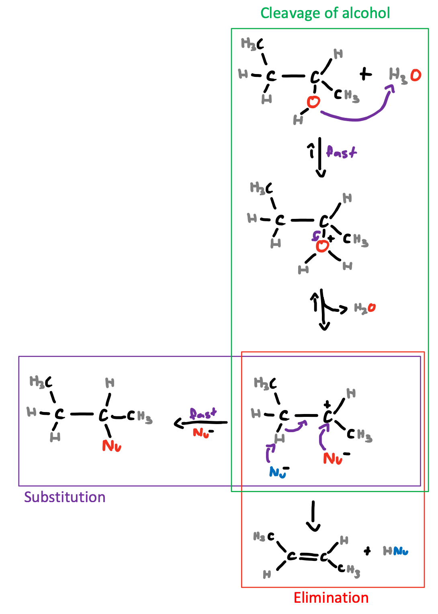
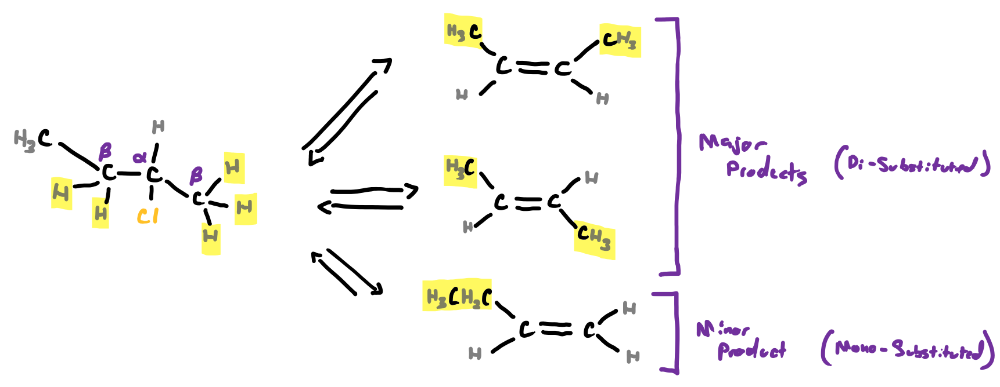

# β-Elimination

Substitution reactions can go one of two ways, if the resulting nucleophile acts as a base AND if there's a neighbouring H (on the $\beta$ carbon), then elimination will occur, creating an alkene as one of the products.

{: style="width: 60%;" class="center"}

## Zaitsev's Rule

When more than one $\beta$ H is available, the more substituted form will be the most stable and thus the likely major product.

{: style="width: 80%;" class="center"}