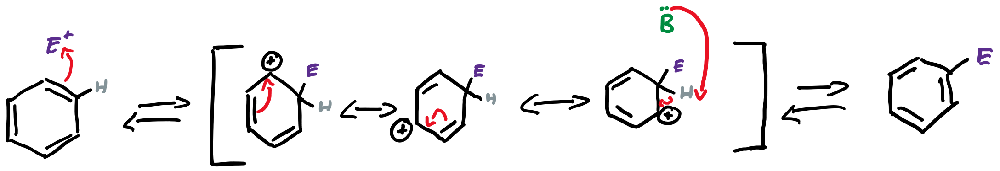
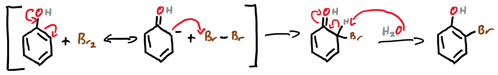
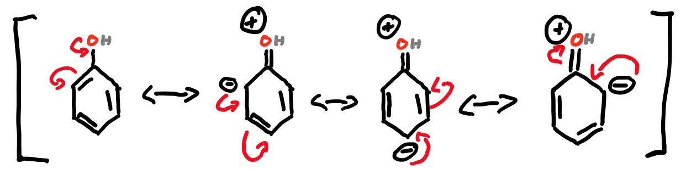
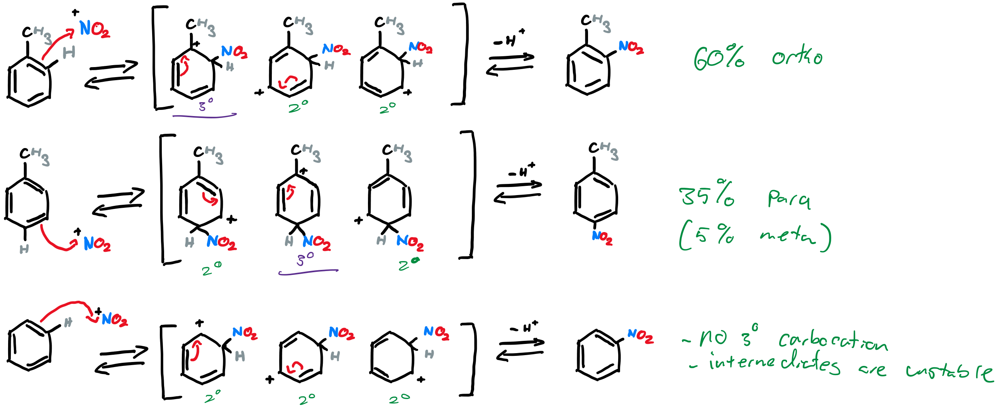
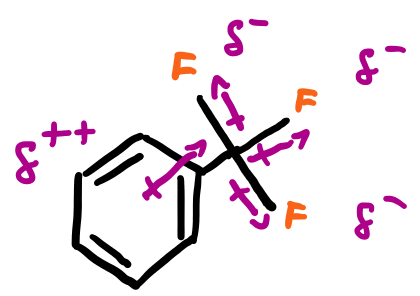
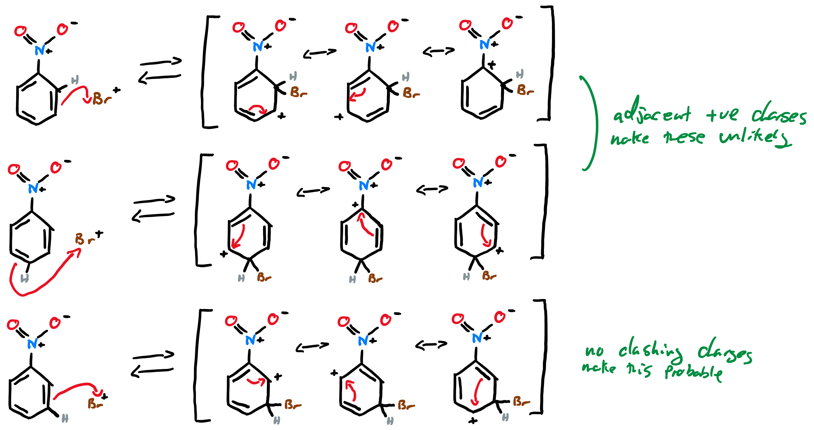
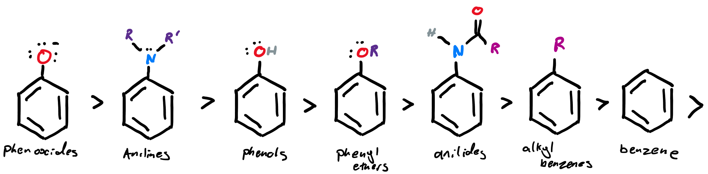
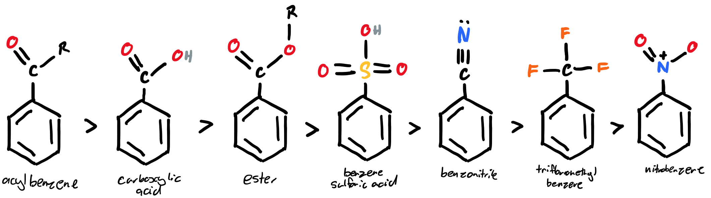

# Aromatic Compounds

## Summary

| Electronic Effect                                            | Example                 | Activation        | Direction      |
| ------------------------------------------------------------ | ----------------------- | ----------------- | -------------- |
| [Donation   by conjugation](#donation-by-conjugation-activating-reactions-o-p) | $\ce{-NR2, -OR}#               | Very Activating   | o/p            |
| [Donation   by inductive effect](#donation-by-inductive-effect-activating-o-p) | alkyl                   | activating        | mostly o/p     |
| Donation by conjugation and withdrawal by inductive effect   | $\ce{F, Cl, Br}$ and $\ce{I}$         | activating        | o and mostly p |
| [Withdrawal   by inductive effect](#withdrawal-by-inductive-effect-deactivating-m) | $\ce{-CF3, +NR3}$              | deactivating      | m only         |
| [Withdrawal   by conjugation](#withdrawal-by-conjugation-very-deactivating-m) | $\ce{-NO2, -CN,  -COR, -SO3R}$ | Very deactivating | m only         |

[{: style="width:60px;" class="right"}](http://adreasnow.com/Notes/Undergrad%20Notes/Sem%203.%20Organic/Aromatic%20Activation%20and%20Deactivation.pdf)

!!! info "Overall rules to follow" 
	
	Does the substituent give electrons? 
	$\hskip{1cm}$Yes - Deactivating (m)
	
	Does the substituent take electrons? 
	$\hskip{1cm}$Yes - Activating (o,p)
	
	Does the substituent have resonance structures that electrons can flow into? 
	$\hskip{1cm}$Yes - Activating (o,p)
	
	Does the substituent have resonant structures that electrons want to escape from? 
	$\hskip{1cm}$Yes - Deactivating (m)
	

## Rules for Aromaticity

1. Huckel's Rule
  1. The system must have $4n+2\:\pi$ electrons
  2. $n$ must be an integer
  3. The $\pi$ electrons can come from atoms other than carbon, particularly, N and O which have free lone pair electrons to contribute
2. Conjugated structure $\ce{\bond{-}\bond{=}\bond{-}\bond{=}\bond{-}\bond{=}\bond{-}}$
3. The system must be planar

## Addition Reactions

* Since aromatic compounds have pi electrons (and a fair few of them...), addition across the double bond is possible, however due to the nature of aromatic compounds, they will be rearomatized, before the resulting carbocation can pick up another substituent.
* This intermediate is known as a Wheland intermediate

{: style="width: 100%;" class="center"}

## Electrophilic Aromatic Substitution - EAS (Bromination)

{: style="width: 100%;" class="center"}

This will continue on uncontrollably until all three activated sites are brominated

## Donation by Conjugation - Activating Reactions (o, p)

* The pi electrons in benzene are free flowing and like to move around. This is emphasized when the electrons can move off onto a substituent or off the substituent on to the benzene ring itself
* With activation, the electrons in the substituent contribute to the electron density of the benzene ring

{: style="width: 60%;" class="center"}

* This gives phenol three particular points for electrophilic addition, two of which are the same molecule mirrored.
* This process can happen with any substituent with lone pair electrons, such as amines. This can also have the effect of deactivating or activating the basic properties of the substituent

## Donation by Inductive Effect - Activating (o,p)

* Carbocation intermediates need to be considered in the orientation of the reaction

{: style="width: 100%;" class="center"}

## Withdrawal by Inductive effect - Deactivating (m)

By adding an electron withdrawing group to a benzene ring, the electron density is pulled out of the $\pi$ system, preventing EAS from occuring entirely

{: style="width: 30%;" class="center"}

## Withdrawal by Conjugation - Very Deactivating (m)

* Deactivating substituents withdraw electron density from the benzene ring, making EAS unlikely
* They can also deactivate by resonance electron withdrawal, relocating the electrons through resonance rather than through induction

{: style="width: 100%;" class="center"}

## Reactivity Effect of Substituents

The less reactive, the more you can control the rate of reactivity with temperature

 More activating

 More deactivating

{: style="width: 100%;" class="center"}
{: style="width: 100%;" class="center"}

