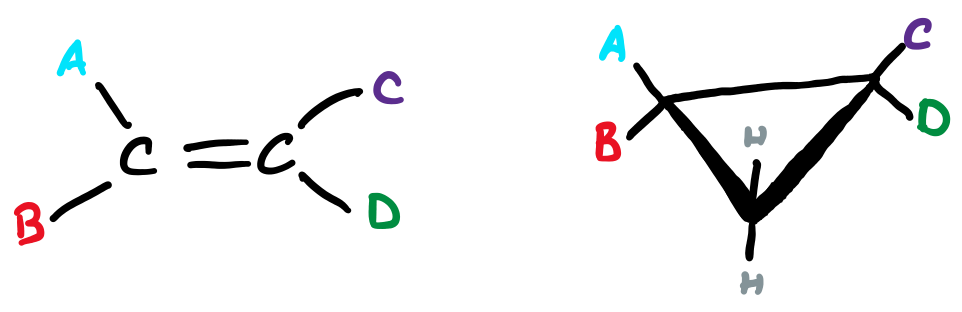
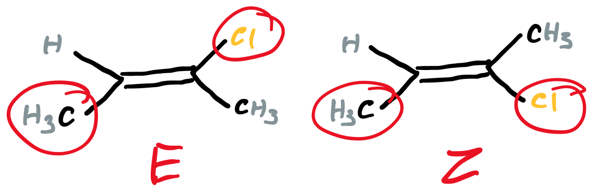
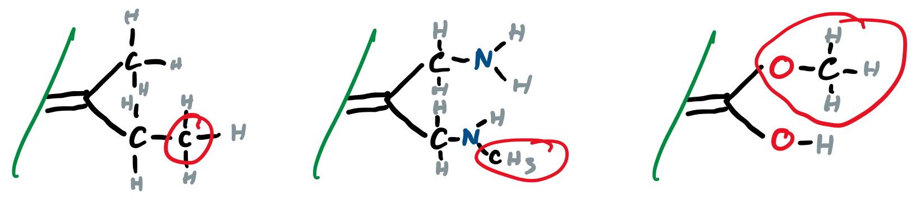
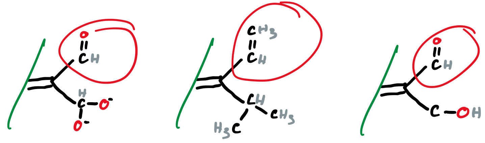
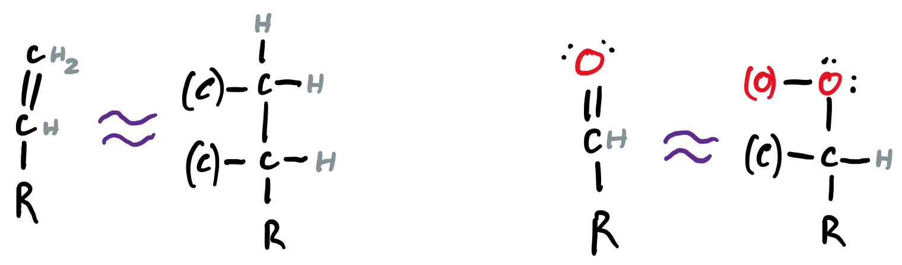

# Cis-Trans Isomerism

An alkene or cyclohexane can have a cis or trans conformation if each side of the bond (double for alkene, single for cycloalkyl) is connected to two different groups.

{: style="width:50%;" class="center"}

## Cis or Trans?

* If the bulky groups are on the same side, it's Cis
* If the bulky groups are on opposite sides, it's Trans

## E or Z designation

Sometimes "bulky" is not sufficient for designating priority, in which case we can use the Cahn-Ingold-Prelog designations to identify which groups should have priority

If the higher priority groups are on the same side, it's classified as Z

{: style="width:50%;" class="center"}

If the higher priority groups are on opposite sides, it's classified as E

{: style="width:50%;" class="center"}

## Rules for Priority

#### Rule 1

* Consider each doubly bonded carbon independently
* Look at the two atoms directly connected to it and rank them by atomic number (higher is more important)

{: style="width:60%;" class="center"}

#### Rule 2

* If the two first atoms are the same, move up the chain to the next atom to compare

{: style="width:80%;" class="center"}

#### Rule 3

* Multiple bonded atoms are considered to be equivalent to the same number of single bonded atoms

{: style="width:80%;" class="center"}

* Double bonds should be considered as split into single bonds

{: style="width:70%;" class="center"}