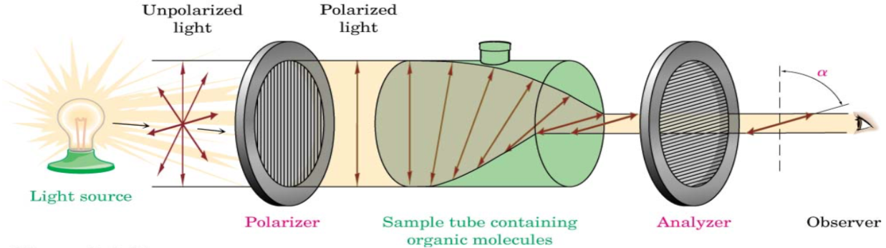

# Optical Rotation

## All Chiral Molecules are Optically Active

* Optically active here meaning that they rotate polarised light
* This can be measured using a polarimeter as shown in the diagram

{: style="width:70%;" class="center"}
	
* While all chiral compounds are optically active, each possible configuration of the compound will rotate the light in a different direction, a different amount. This can be used to isolate and identify the compound but also to calculate the "optical purity", or how much of each enantiomer there is.

## (d)/(l)  (+)/(-)

* If one molecule will rotate the light counter clockwise 40$^\circ$, it is designated the (-) or the (l) enantiomer, and it's (-) or (d) counterpart will rotate the light 40^∘  clockwise.

## Optical Purity

Since the optical activity is stoichiometrically identical, a racemic mixture (equal parts of (+) and (-) enantiomers) will have 0$^\circ$  of rotation. Using this fact we can measure the observed roataion with a polarimiter and use it to calculate the specific rotation using the following formula,

Where:

* $[\alpha]_D=$ the specific roation at the sodium D line
* $\alpha=$ the observed rotation
* $l=$ the path length in decimetres (10cm)
* $c=$ the concentration in g/ml

$$
[\alpha]_D=\frac{\alpha}{l×c}
$$
	

We can then use the specific rotation to identify the enantiomeric purity (enantiomeric excess) of the solution:

$$
\text{optical purity}=\frac{\alpha}{[\alpha]_D}\times100
$$

* It is important to note though that this will tell us how much of the mixture is pure with the remaining amount being racemic.
* We need to calculate further to determine how much of each compound is in the solution
