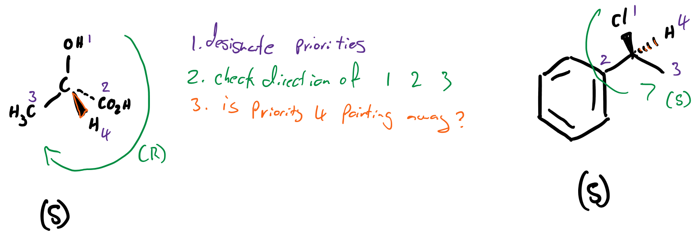
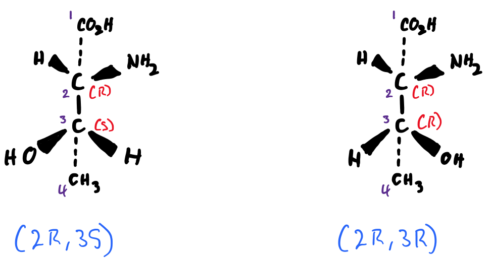

# (R)/(S) Designation (Absolute Stereochemistry)

* While the optical rotation will give us a result of the observed situation chirally, it can't tell us what the molecule itself looks like. For that we need another designation of (R) and (S). These look at the individual chiral centres  and allow us to label the chirality in one of two ways.

## Rules and process

The rules for designating a chiral centre are the same as the [Cahn Ingold Prelog](../14.%20Cis-Trans%20Isomerism/#rules-for-priority) rules

1. Look at all the substituents of the chiral centre and label them in order of priority using the Cahn Ingold Prelog rules.
2. 
Go back to the molecule and look at the direction that the substituents go in order from 1 $\ce{->}$ 2 $\ce{->}$  3, ignoring 4

  1. Designate (R) if going clockwise and (S) if anticlockwise
3. Check to see if substituent 4 is pointing towards or away from the other 3 substituents, if it's not, then change the designation to the other option

{: style="width:80%;" class="center"}

## Multiple Chiral Centres

When a molecule has multiple chiral centres, you designate them all with and mark their chiral centres with their carbon numbers (from their IUPAC name)

{: style="width:70%;" class="center"}