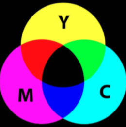
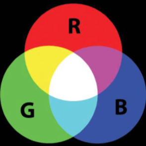
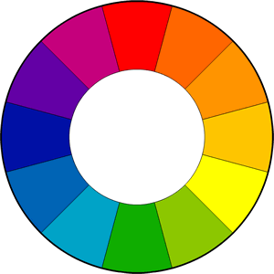

# Colour

## Colour Theories

#### Subtractive theory (pigment theory)

* Deals with how white light is absorbed and reflected off coloured surfaces
* As coloured compounds interact, they subtract colour from the incoming light
* Rules: {: style="width: 30%;" class="right"}
  * Black absorbs the most light
  * White reflects the most light
  * Coloured pigments (natural sources) and dyes (synthetic sources) absorb light and only reflect the frequency of the pigment colour
  * All other colours are absorbed and are subtracted from the incoming light
  * Primary colours
    * Cyan (C)
    * Magenta (M)
    * Yellow (Y)
    * Black (K)

#### Additive theory (light theory)

* Deals with radiated light
* As coloured compounds radiate different wavelengths, the colours add together
* Rules: {: style="width: 30%;" class="right"}
  * Black radiates no light
  * White (sun) radiates all light
  * Primary colours:
    * Red (R)
    * Green (G)
    * Blue (B)
* The primary colours add to give white
		
## Solution colour

When a compound in solution absorbs light, the resulting colour will be the opposite on the colour wheel

{: style="width: 50%;" class="center"}