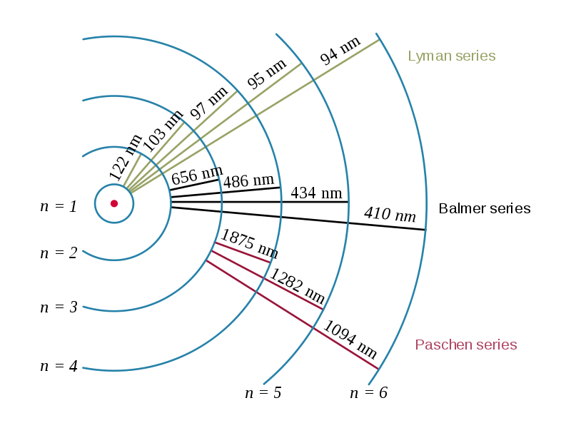
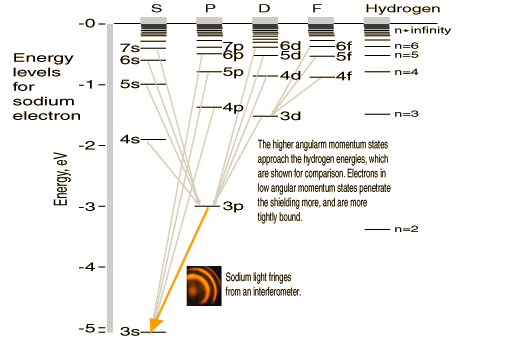
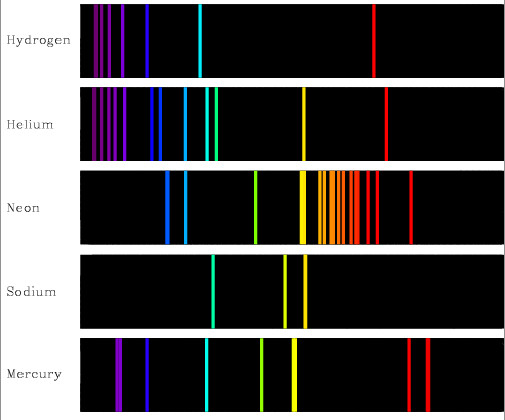

# Absorption and emission

Valence Electrons can make transitions between the orbitals by absorbing and emitting a discreet amount of energy

* The amount of energy absorbed and emitted must be exactly the energy difference between the two orbitals
* The energy absorbed places the atom in an excited state
* The exact amount of energy absorbed must then be radiated, as per the energy difference of orbitals

## Emission Series {: style="width: 40%;" class="right"}

* Since the emissions of light are of exactly the same energy as the energy difference between the electron orbitals, the light that's emitted will be very specific
* The emitted light from an electron dropping back down to the energy level n=1 (Lyman series) will be too high energy and will not be visible
*  The opposite is true for an electron dropping back down to an energy of n=3 (Paschen series)
* Electrons dropping back down to energy level n=2 (Balmer series) will be visible
Fraunhofer Lines
* Since only certain electron excitations/emissions will be visible and statistically probable for each element, various lines for different elements are assigned letters and used for characterisation purposes

## Sodium D line

* A perfect example is the sodium D line
* Since the valence electron occupies the 3s orbital, the most common excitation and emission will the path from the $\ce{3p -> 3s}$
* This results in a  significantly brighter emission at 589 nm than any other wavelength.

{: style="width: 50%;" class="center"}

??? abstract "List of more character spectral lines"
	
	<table> <thead> <tr> <th><strong>Designation</strong></th> <th><strong>Element</strong></th> <th><strong>Wavelength (nm)</strong></th> </tr> </thead> <tbody> <tr> <td>y</td> <td><a href=https://en.wikipedia.org/wiki/Oxygen>O2</a></td> <td>898.765</td> </tr> <tr> <td>Z</td> <td>O2</td> <td>822.696</td> </tr> <tr> <td>A</td> <td>O2</td> <td>759.370</td> </tr> <tr> <td>B</td> <td>O2</td> <td>686.719</td> </tr> <tr> <td>C</td> <td><a href=https://en.wikipedia.org/wiki/Hα>Hα</a></td> <td>656.281</td> </tr> <tr> <td>a</td> <td>O2</td> <td>627.661</td> </tr> <tr> <td>D1</td> <td><a href=https://en.wikipedia.org/wiki/Sodium>Na</a></td> <td>589.592</td> </tr> <tr> <td>D2</td> <td>Na</td> <td>588.995</td> </tr> <tr> <td>D3 or d</td> <td><a href=https://en.wikipedia.org/wiki/Helium>He</a></td> <td>587.5618</td> </tr> <tr> <td>e</td> <td><a href=https://en.wikipedia.org/wiki/Mercury_(element)>Hg</a></td> <td>546.073</td> </tr> <tr> <td>E2</td> <td><a href=https://en.wikipedia.org/wiki/Iron>Fe</a></td> <td>527.039</td> </tr> <tr> <td>b1</td> <td><a href=https://en.wikipedia.org/wiki/Magnesium>Mg</a></td> <td>518.362</td> </tr> <tr> <td>b2</td> <td>Mg</td> <td>517.270</td> </tr> <tr> <td>b3</td> <td>Fe</td> <td>516.891</td> </tr> <tr> <td>b4</td> <td>Mg</td> <td>516.733</td> </tr> <tr> <td>c</td> <td>Fe</td> <td>495.761</td> </tr> <tr> <td>F</td> <td><a href=https://en.wikipedia.org/wiki/Hβ>Hβ</a></td> <td>486.134</td> </tr> <tr> <td>d</td> <td>Fe</td> <td>466.814</td> </tr> <tr> <td>e</td> <td>Fe</td> <td>438.355</td> </tr> <tr> <td>G&rsquo;</td> <td><a href=https://en.wikipedia.org/wiki/Hγ>Hγ</a></td> <td>434.047</td> </tr> <tr> <td>G</td> <td>Fe</td> <td>430.790</td> </tr> <tr> <td>G</td> <td><a href=https://en.wikipedia.org/wiki/Calcium>Ca</a></td> <td>430.774</td> </tr> <tr> <td>h</td> <td><a href=https://en.wikipedia.org/wiki/Hδ>Hδ</a></td> <td>410.175</td> </tr> <tr> <td>H</td> <td>Ca+</td> <td>396.847</td> </tr> <tr> <td>K</td> <td>Ca+</td> <td>393.366</td> </tr> <tr> <td>L</td> <td>Fe</td> <td>382.044</td> </tr> <tr> <td>N</td> <td>Fe</td> <td>358.121</td> </tr> <tr> <td>P</td> <td><a href=https://en.wikipedia.org/wiki/Titanium>Ti</a>+</td> <td>336.112</td> </tr> <tr> <td>T</td> <td>Fe</td> <td>302.108</td> </tr> <tr> <td>t</td> <td><a href=https://en.wikipedia.org/wiki/Nickel>Ni</a></td> <td>299.444</td> </tr> </tbody> </table>

## Hyperfine Spectrum

* When observed at very high resolution, spectral lines split can split into two (sodium $D_1$  and $D_2$)
* They are caused by an interaction of the atom's nuclear magnetic dipole moment, due to the distribution of charge within the atom.
* The distance of the orbitals can vary, so slightly that there is a marked difference in the energy absorbed and emitted.

## Absorption and Emission

* Since the excitation and emission processes happen in conjunction with each other, absorbance is proportional to the emission and an absorption spectra is ultimately an inverse emission spectra

{: style="width: 50%; margin-bottom: 0px;" class="center"}
{: style="width: 50%; margin-top: 0px;" class="center"}

## Fingerprinting

* Due to the specific nature of the electron configuration of each element, due to it's valence, electronegativity, mass, etc. Emission spectra can be used as a fingerprint of a different elements 

{: style="width: 50%;" class="center"}

