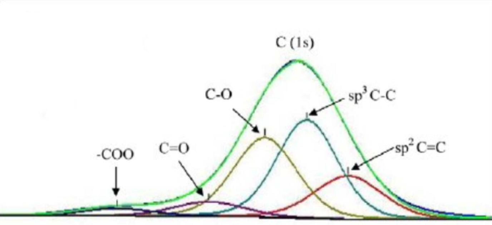
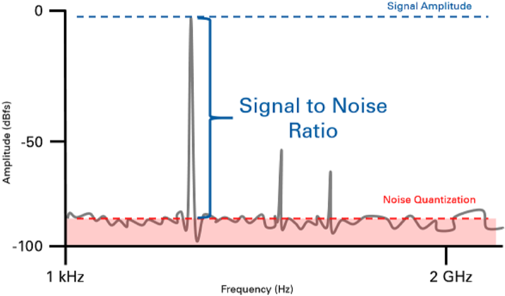
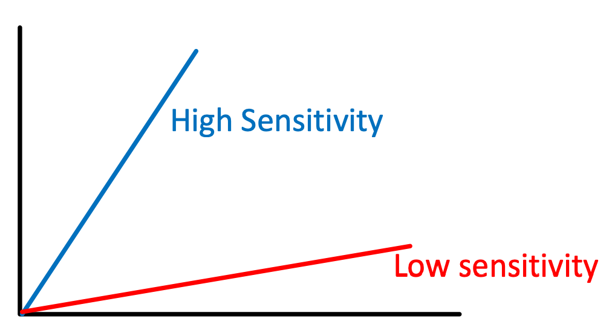
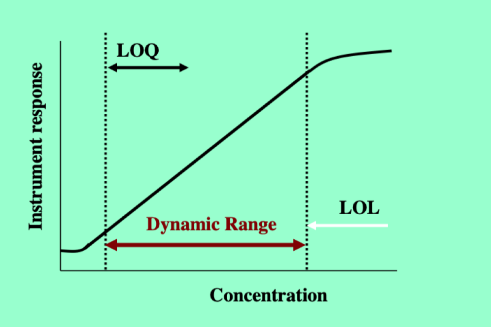

# Signals

* A signal is an output reading from an instrument that represents a sample
* All signals are either <u>Gaussian</u> or <u>Lorentzian</u> in distribution, meaning they are all perfectly symmetrical
  * If not symmetrical, the signal will be made of constituent symmetrical contributors
  * The process of reversing this is called deconvolution and is a computational process.
* Signals are always accompanied by noise, the general background uncertainty of the universe.
* The ratio of the signal:noise can be used as a measure of statistical usefulness.
	

{: style="width: 50%;" class="center"}

## Performance Characteristics

### Accuracy

* Arise from determinate (non random) errors
* Can be:
  * Instrumental - the instrument is not functioning correctly. (operating temp, calibration error, etc.)
  * Personal - Judgement errors (reading at the wrong angle, subjective determination of endpoint)
  * Methodical - a result of poor experiment design (slow reactions, instability of reagents, concentration change from volatilisation)

{: style="width: 50%;" class="center"}
		

### Sensitivity

* How well a technique is capable of detecting a change in signal
* How much does the signal change for a change in the measured variable
* Can be depicted by the slope of the calibration curve
  * Dependent on the scale of both axis

{: style="width: 50%;" class="center"}

### Detection Limit

* The smallest amount of analyte that can be reliably read
* Often considered to be $3\times$SNR

### Quantisation limit

* Is the limit of what the instrument can be used to make quantitative determinations.
* Considered to be $10\times$SNR

### Linearity limit 

* As samples are taken of increasing concentration, often, if the readings continue, a linear trend will disappear

{: style="width: 50%;" class="center"}

### Dynamic Range

* The range between the quantisation limit and linearity limit

### Selectivity

* How capable is the technique of detecting the analyte without excessive interference
* This can be accounted for with a method blank, however all components cannot always be  negated completely
  * A selectivity coefficient can be produced to represent how much of the signal is actually from the analyte, compared to the rest of the matrix.
