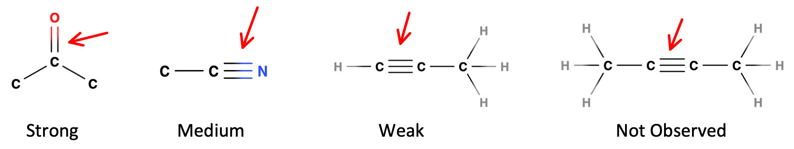

# IR Spectroscopy

Creates conformational changes in molecules with varying polarity

* Is useful for identification of molecular structure, however is limited to identification of functional groups and "fingerprinting"
* Is highly limited by its likelihood of being interfered with

## Typical Spectrum

* Measured as transmittance (peaks going down from 100%) instead of absorbance
* Wavelength measured in $\bar{\nu}=\frac{1}{\lambda (cm)}$

## Types of IR

* Near-IR - Photometry/spectrophotometry similar to UV-VIS - quantification of organo-macromolecules 
* Mid-IR - Surface analysis, reflectance/diffuse reflectance/photoacoustic
* Far-IR - Quantification of functional groups containing C, H, O rather than compound identification

## FTIR

* measures an interferogram and uses FT to convert it to a spectra
* IR radiation is primarily thermal energy and induces stronger molecular vibrations within bonds
  * Bonds act as springs, even with their own spring constant (see later)

## Types of molecular interactions

#### Rotational

* Rotational transitions occur in the far-IR range (lower energy) at $<100\:cm^{−1}$  
* There are far more rotational transitions than vibrational transitions and only small amounts of energy are required to trigger them
  *This however means that they only are really observed in gasses
	
#### Vibrational

* Vibrational modes are higher in energy and come in bond length and atom rotational forms.
* Each mode is given a Greek letter to denote it's behaviour

### 

### Radial

| Symmetrical Stretching - $\nu_s$                             | Asymmetrical Stretching - $\nu_{as}$                         |      |
| ------------------------------------------------------------ | ------------------------------------------------------------ | ---- |
|  |  |      |

### Latitudinal

| Scissoring - $\sigma$                                        | Rocking - $\rho$ |
| ------------------------------------------------------------ | ---------------- |
|  |                   |

### Longitudinal

| Wagging - $\omega$ | Twisting - $\tau$ |
| --------------------- | ---------------- |
|  |  |

## Peak height

* Peaks can be (depending on their height):
  * Weak (w) - <30%
  * Medium (m) - 30−60%
  * Strong (s) - >60%
* This is dependent on the polarity of the bond in question. The more polar the bond, the higher the absorbance at that peak.
	
## Peak width

* Peaks can also be:
  * Broad - wide and smooth
      * Typically seen in O-H bonds (water!)
  * Narrow - thin and pointy
* This is caused by resolution limitations causing multiple absorbance peaks to blend into the one curve
  * This is dependent on the amount of excitation states for the particular bond

## Polarity

* Only polar bonds will be active, as they need to be able to change their dipole when they rotate or vibrate
  * The movement of atoms causes a shift in the electron density and thus a shift in the bond's dipole
* As a result pure covalent bonds will not show up, such as $\ce{O2, N2, H2}$  etc.
  * $\ce{CO2}$ and $\ce{H2O}$ are still envirnmental interferants however.

## Symmetric bonds 

* If a bond has polarity but the molecule is symmetric, the resulting dipole will not move either, causing there to be no identifiable change  
  * Strong
      * Strongly Polar bonds
  * Medium
      * Medium polarity bonds
      * Asymmetric bonds
  * Weak
      * Weakly polar bonds
      * Symmetric bonds

{: style="width: 70%;" class="center"}

* Symmetric molecules will also show a more simple spectra, as the bonds will be duplicated, since they'll be in the same environment and will overlap in their absorbance.

## Coupling

* If vibrations occur around a central atom, the effect of their shift may not cause a net change in the dipole
* This is likely when:
  * The have a common atom in stretching modes
  * They have a common bond in bending modes
  * They have a common bond in bending and stretching modes
  * They have similar vibrational frequencies
* This is unlikely when
  * The atoms are separated by two or more bonds
  * The symmetry is inappropriate

## Electron density

* When an EDG contributes more density to a bond, it gets stronger and as a result will take more energy to excite the group
* The opposite is true for EWGs
* E.g. $\ce{C-O}$ bond in:
  * Methanol - $1034\:cm^{−1}$
  * Ethanol - $1053\:cm^{−1}$
  * Butanol - $1105\:cm^{−1}$

## Anharmonic oscillation

* The vibrational modes of bonds is dependent on the amount of energy put in. The process follows the Morse Potential pattern

{: style="width: 50%;" class="center"}

* Too much energy and the bond will break
* The bond will get significantly longer rather than compressing significantly
* This is due to a Coulombic effect as well harmonic oscillation

## Diatomic formula

#### calculates where peaks appear

Where:

* $m_1$ and $m_2=$ the masses of the atoms
* $k=$ the sprinc constant (Hooke's law)
* $\mu=\text{reduced mass}=\frac{m_1m_2}{m_1+m_2}$
		

$$
\bar{\nu}=\frac{1}{2\pi c}\big(\frac{k}{\mu}\big)^{\frac{1}{2}}=130.3\big(\frac{k}{\mu}\big)^{\frac{1}{2}}
$$

$k$ can be obtained from the following table

| $\ce{O\bond{-}H}$ | $\ce{C\bond{-}H (sp^3)}$ | $\ce{C\bond{-}H (sp^2)}$ | $\ce{C\bond{=}O}$ | $\ce{C\bond{#}C}$ | $\ce{C\bond{=}C}$ | $\ce{C\bond{-}C}$ | $\ce{C\bond{-}O}$ |
|:----:|:----:|:----:|:----:|:----:|:----:|:----:|:----:|
| 780  | 480  | 510  | 1210 | 690  | 760  | 540  | 450  |

## Peak count

* To determine the amount of peaks we'd expect to see, we can use the following formula, which utilises the degrees of freedom for a molecule to determine what is possible
* Where $N=$ number of atoms:

$$
\text{Linear molecule - }3N−5
$$

$$
\text{Non-linear molecule - }3N−6
$$

* Each vibration is called a **normal mode** and has a characteristic frequency
* This will give the maximum number of fundamental peaks

#### Fewer peaks

Fewer peaks may be observed due to:

* Symmetry of the molecule causing cancellations
* Similar bonds sharing energy
* Low absorption intensity 
* Energy of peak being out of the range of the spectrophotometer
	
#### More peaks

* Harmonics of the fundamental frequency can cause overtones at multiples of the fundamental frequncy
  * uncommon but possible
  * occurs when an excitation happens from ground state to the second excited state ($\ce{v=0 -> v=2}$)
* When multiple vibrational modes are excited by a single photon, either the sum of the two modes or the difference can be seen as a result
	

#### Example - $\ce{CO2}$

* Has $3N−5=4$ vibrational modes
* Actual peaks:
  * Symmetric stretching will result in no net change of the dipole
  * Asymmetric stretching will result in a net change and thus a peak
  * The two bending modes will have the same energy and thus will show up as a single peak
* Thus only two peaks are observed, not the expected four

