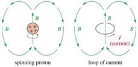
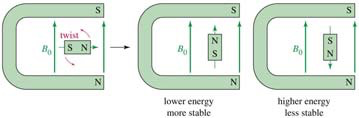
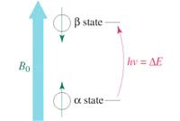
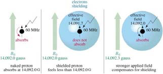
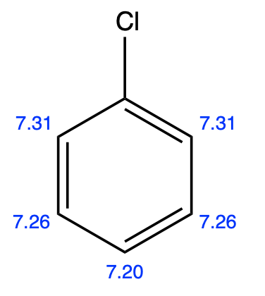
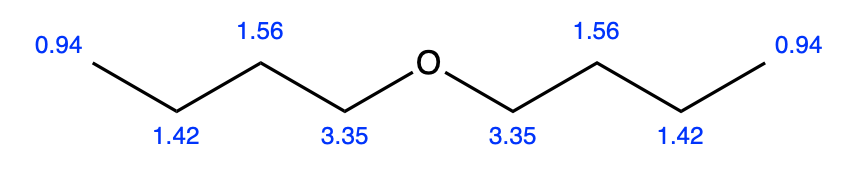
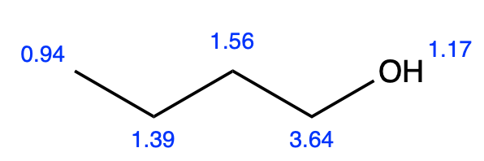
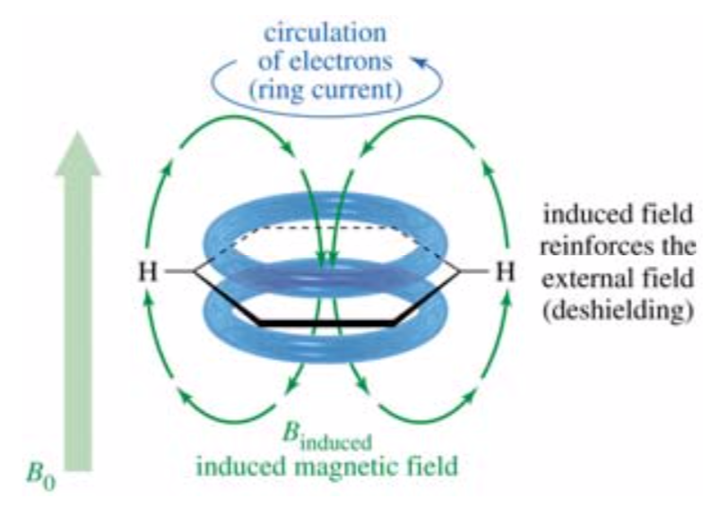
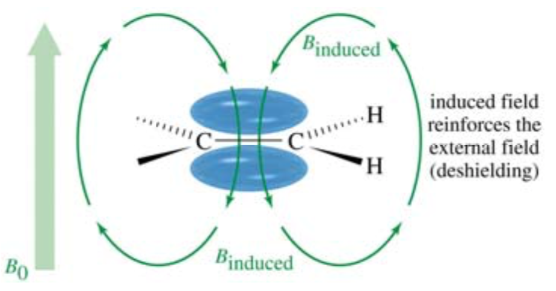
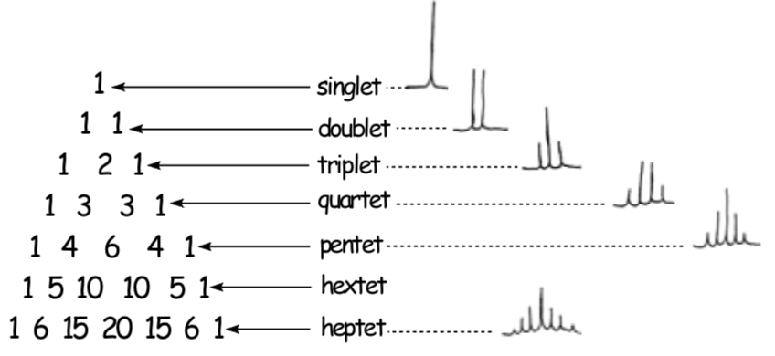

# Proton NMR Spectroscopy

Nuclei of odd number of protons and neutrons will have an intrinsic magnetic pole, as they will spin about an axis

{: style="width: 50%;" class="center"}

When put into a strong, induced magnetic field, the nucleus will then align itself either with or against the induced magnetic field

{: style="width: 50%;" class="center"}

When an EM wave of the same energy as it takes to align the proton is introduced, it is absorbed, causing the nucleus to flip spin direction and absorbing a small amount of the EM radiation in the process. 

{: style="width: 40%;" class="center"}

This radiation is within the radio frequency band (MHz) 

## Shielding

* Since magnetism and electricity are synonymous, any moving electron will produce a "shield" to the nucleus that will require a stronger magnetic field to be applied to cause it to flip.
* Since the amount of electrons that are shielding a nucleus can greatly differ, so too will the amount of energy required to flip them

{: style="width: 50%;" class="center"}

* The compound tetramethylsilane (TMS) {: style="width: 20%;" class="right"} is used as a zero reference as the silicon donates its electrons to the methyl groups, shielding them beyond a typical alkane.
  * This, combined with the 12 protons in one peak, and non splitting, make it a perfect reference to use as zero

## The NMR Spectra

NMR spectra can be broken down into four specific components:

1. Number of peaks
2. Location of peaks - deshielding
3. Intensity/area of the peak
4. Peak splitting

## Number of peaks

* The number of peaks directly reflects the amount of electronic environments that protons can be found in. That is to say that protons that have the same shielding will show up as the same peak
* Symmetric molecules will show up with double the are within the peaks, as the protons on either side of the plane of symmetry will exist in the same electric environment.

## Location of the peaks

The location of the peaks is the direct result of the amount of shielding that the protons in that electronic environment experiences.
	
#### Units

The shift down (left) or upfield (right) is measure in  ppm, that is, it's a ratio of how much energy is required to make the shift, compared to TMS in a ratio of thousands. 

$$
\text{Chemical shift }\sigma\:(ppm)=\frac{\text{Shft downfield from TMS}\:(Hz)}{\text{Operating frequency of the NMR spectrometer}\:(MHz)}
$$
				
	
#### Cause

The whole process follows the same logic as EWG and EDG, where the functional groups and position of the proton within the molecule will change its electronic environment and thus its shift

| chlorobenzene  |  dibutylether  |    butanol     |
| :------------: | :------------: | :------------: |
|  |  |  |

#### Stereochemistry

It's important to note that stereochemistry plays a large role in electrical environment, as orbitals will be shifted one way or another. This means that just because two protons are connected to the same parent atom, they will not necessarily have the same chemical shift.
	

#### $\pi$ Bonds

There is also an inductive effect with π bonds, where the free flowing electrons can respond to the magnetic field by producing their own magnetic field that will either reinforce the external magnetic field, deshielding it further, or in the case of acetylenic protons, shield them further from the external magnetic field.

{: style="width:41%;" class="left"}{: style="width: 55%;" class="right"}

#### H-Bonding

When a solution is concentrated enough, H-bonding will deshield the protons, as the protons will surround themselves with the EWG oxygen. 

## Intensity of signals

* While the height of the peak doesn't present much information directly, the area of the peak, when integrated reflects the ratio of protons in that particular electronic environment.
* TMS can serve as a good standard, as it contains 12 protons and will provide a good reference to scale the integrated area to.

## Splitting

* Possibly the most important component of NMR is that the spectra is taken over a period of time, so the results we get are an average of all the possible states of the molecule.
* Since NMR is a highly sensitive analytical tool, it can be manipulated by incredibly subtle changes in the environmental magnetic field. This includes the direction of spin of any neighbouring protons, which are not in the same electronic environment.
  * When the direction of a neighbouring proton is in the direction of the magnet field it will be additive and cause the peak to increase in shift
  * When the direction of a neighbouring proton is in the opposite direction the external magnetic field it will be subtractive and will shield the proton further.
  * Since all possible states exist, both will occur at the same time
* The process is additive and as more interfering protons are incorporated, the possibilities will stack up in a binomial pattern
  * This leads to a distribution of split heights based on Pascal's triangle

{: style="width: 50%;" class="center"}

## The rule 

* The rule is that for every proton that causes splitting, $N+1$ split peaks will appear
* These are known as singlets, doublets, triplets etc..
* Only protons that are on the next carbon along will cause splitting
* Protons attached to oxygen do not split or cause splitting (unless completely anhydrous)

{: style="width: 50%;" class="center"}