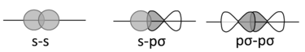
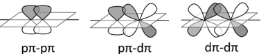
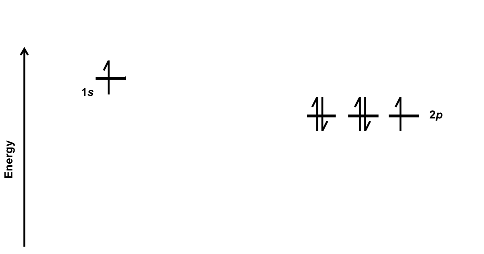
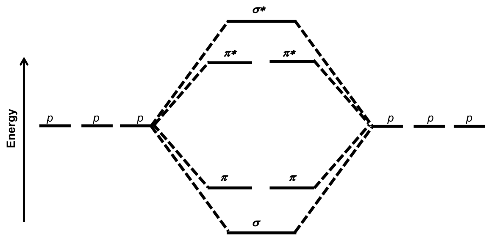
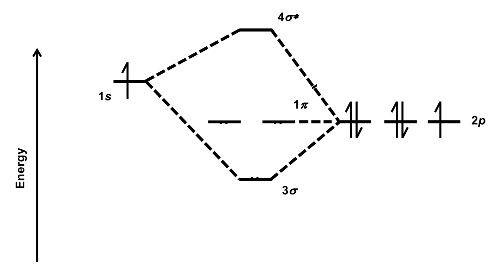
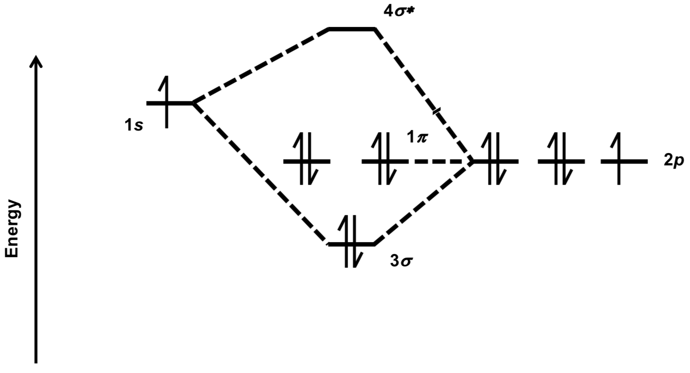
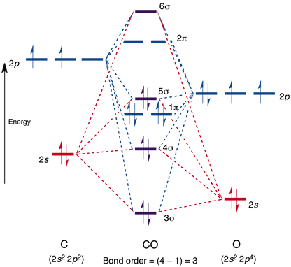

# MO Diagrams

* As bonding occurs and atomic orbitals (AOs) combine to form molecules, new molecular orbitals (MOs) are formed in the process
* Two types of bonding can occur

#### Sigma bonding

The AOs meet end to end and have a significant overlap

{: style="width: 50%;" class="center"}

#### Pi bonding

The AOs meet adjacent to each other and have lesser overlap

{: style="width: 50%;" class="center"}

* Pi bonds are weaker than sigma bonds, however pi bonds are usually observed as a part of a double or triple bond and thus have the combined strength of pi and sigma bonds

## The quantum

* As two AOs combine as wavefunctions, there is both constructive and destructive interference, that causes two distinct waveforms/MOs to form:
  * Bonding orbitals
    * Have a lower energy than the two AOs that make them up
    * Are primarily located between the two nuclei that make formed the bond
  * Antibonding orbitals
    * Have a higher energy than the two AOs that make them up
    * Are primarily located on the outside of the two nuclei that make formed the bond
    * Have one more node than the parent orbitals

{: style="width: 50%;" class="center"}

## The rules

1. The total number of MOs is equal to the total number of AOs
2. Bonding MOs are lower energy than the AOs
3. Antibonding MOs and higher energy than the AOs
4. Electrons follow the Aufbau principle - they fill from lowest to highest energy
5. They follow the Pauli exclusion principle - they will remain unpaired until no equivalent MOs are left
6. MOs are most stable when formed of AOs of like energy

## Bond order (BO)

* A measure of stability
* Uses the equation:

$$
\frac{1}{2}(\text{bonding}\:e^− −\text{antibonding}\:e^−)
$$

* A molecule with a bond order $>0$ is likely to exist and be more stable
* The higher the bond order the more stable the bond

## How to draw MO diagrams

1. Only consider your valence shells, as core shells will always have a BO of 0 and will not contribute to bonding
2. Draw out the contributing valence AOs in order of energy

{: style="width: 60%;" class="center"}
	
3. Connect the AOs with lines to show how the MOs will form in terms of energy
  1. Pi orbitals will form into $1\sigma$ and $2\pi$ bonding orbitals and $1\sigma^∗$ and $2\pi^∗$ antibonding orbitals 
  2. In atoms up to N, the $\pi$ bonding MO will be lower energy than the $\sigma$ bonding MO {: style="width: 30%;" class="right"}
        1. This is reversed in atoms O and above
            2. $\sigma^∗$ always comes after $\pi^∗$
  3. If an atom cannot contribute to a particular MO formation, they're considered non bonding MOs and you do not connect them with a line

{: style="width: 60%;" class="center"}
	
  4. Assign electrons according to Aufbau's, Pauli's and Hund's rules
        1. Don't forget to assign extra or fewer electrons if the atom has a charge

{: style="width: 60%;" class="center"}
	
  5. Don't forget to number your MOs, including the core orbitals 
        1. Molecule will be paramagnetic if any of the MOs have unpaired electrons
      * If all the electrons are paired, it is considered diamagnetic

## Examples (probably better)

{: style="width: 48%;" class="left"}{: style="width: 48%;" class="right"}