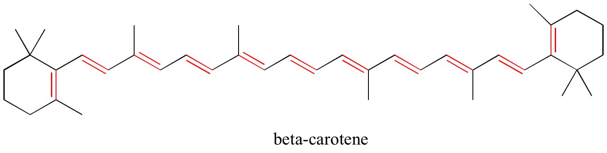
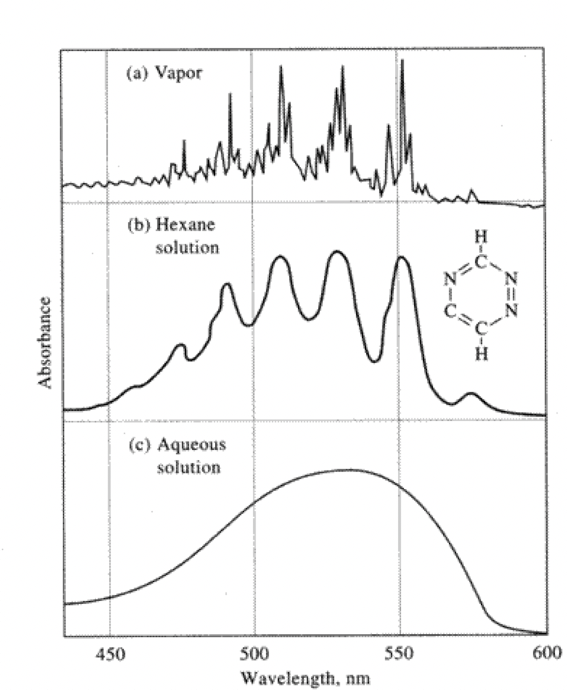
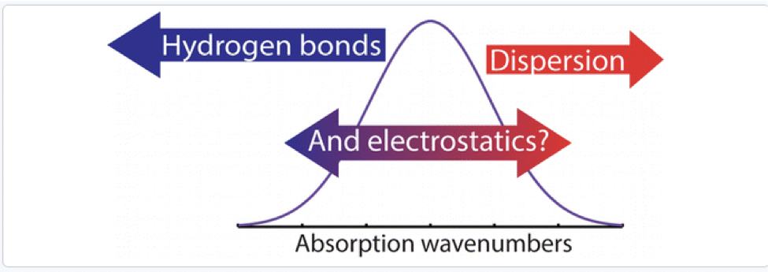

# UV-Vis Spectra

## UV-Vis modes

* Utilises the excitation of molecular orbital electrons rather than atomic orbital electrons
* Each transition is accompanied by a small vibrational transition as well
* The bands tend to be broad and undefined, due to unresolved vibrational contributions
* The precision of the readings is much lower (10 - 100 nm) than atomic spectra (0.01 nm)

## Limitations

* It is primarily quantitative, as there is far less ability to characterise functionality based on behaviour
* Local maxima will help to identify bond types
* Absorption at higher energies has the potential to ionise the molecule completely so it's useful to start at lower energy and sweep up to the higher energy
* Air tends to absorb at wavelengths < 200 nm

## Absorption

Is a two stage process, 

$$
\begin{align}
M + h\nu &\ce{->} M^∗\\
M^∗ &\ce{->} M + \text{heat}
\end{align}
$$

The small amounts of heat released are negligible to the system temperature

* The relaxations can also occur via photodecomposition, fluorescence, and phosphorescence

Absorption will occur on $\sigma$, $\pi$ and $n$ electrons

* Typical transitions are:
  * $n \ce{->} \pi^*$
  * $\pi \ce{->} \pi^*$
* Though any transitions are possible

### $\sigma \ce{->} \sigma^*$

* Very high energy transitions
* Single bonds, such as in alkanes
* $\ce{C\bond{-}H}$ bonds are higher energy (~125 nm) than $\ce{C\bond{-}C}$ bonds (~135 nm)
* Not particularly useful for analysis since it's beyond our 200 nm limit

### $n \ce{->} \sigma^*$

* Nonbonding electrons are specific to species with lone pair electrons, such as oxygen and nitrogen
* Seen at 150 - 250 nm
* Primary amine LPE (215 nm)
* Ether LPE (184 nm)

### $n \ce{->} \pi^*/\pi \ce{->} \pi^*$

* Most active and most important transitions
* Seen at 200 - 700 nm

## Beer-Lambert

* To use the beer lambert law, it's important to consider how ϵ is influenced by different bonding electron types
* It can also be influenced by the solvent used

#### Solvent influences

|Transition | Decrease polarity | Increase polarity | $\varepsilon$ |
|:----------|:------------------|:------------------|:-------------:|
|$\ce{\sigma -> \sigma^*}$ | Not measurable | | |
|$\ce{n -> \sigma^*}$ | Decrease energy | Increase energy | 100 - 3000|
|$\ce{n -> \pi^*}$ | Decrease energy | Increase energy | 10 - 100|
|$\ce{\pi -> \pi^*}$ | Increase energy | Decrease energy | 1000 - 10,000|

* A shift towards a shorter wavelength (higher energy) is called a blueshift - hypsochromic
* A shift towards a longer wavelength (higher energy) is called a redshift - bathochromic

## Chromophores

Are unsaturated functional groups that absorb longer wavelength UV/Vis radiation (closer to vis)

* Multiple chromophores won't effect $\lambda$ max, but will increase $\varepsilon$

## Conjugation

Shifts the absorbed radiation further towards vis (decreases energy) but increases $\varepsilon$

* The conjugation causes delocalisation of $\pi$ electrons, causing $\pi^∗$  to be stabilised
* The more conjugated, the more stabilised the molecule, hence $\beta$ carotene's blue absorbance

{: style="width: 70%;" class="center"}

## Aromatic species

Have three sets of excitation bands arising from the three $n \ce{->} \pi^*$  transitions

| Excitation | $\lambda$ (nm) | $\varepsilon$ |
|:-----------|:--------------:|:-------------:|
|1 | 184 | 60,000|
|2 | 204 | 7,900|
|3 | 356 | 200|

Each band has fine structure from the vibrational transitions that disappear in polar solvents

{: style="width: 50%;" class="center"}

## Analysis

* UV-Vis is typically not used for qualitative analysis since $\lambda$ max is highly dependent on the solvent
* Polar solvents also destroy any fine structure caused by vibrational transitions

## Solvatochromic shifts

Are shifts that occur from the solvent's interaction with the molecule
Simply put:

* Increased H-Bonds blueshifts (increases the energy required)
* Increased dispersion forces  redshifts (decreases the energy required)

{: style="width: 50%;" class="center"}

## Quantitative Analysis

UV-Vis is useful because they are:

1. Applicable to many organic compounds
2. Decently sensitive, working on the $\mu$M to nM scale
3. Decently selective
4. Accurate
5. Simple to use for data collection and analysis

* $\lambda$ max is a safe place to start analysis from, as it will typically behave linearly with the Beer-Lambert law
* Sensistivity is also greatest at $\lambda$ max
* Variables that will influence the spectra are:
  * Solvent
  * pH
  * Temperature
  * Sample matrix
