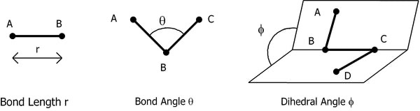
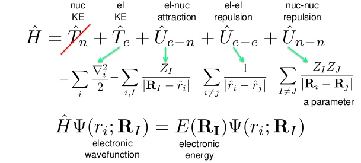

# Basics of Quantum Chemistry
* Modern quantum chemistry rests on a series of approximations to make solving the Schrodinger equation possible

### Geometry

* $R=$ The geometry of the protons
* $r=$ The geometry of the electrons

!!! info "Internal Coordinates"
	
	2 atoms gives bond length  
	3 atoms gives bond length and bond angle  
	4 atoms gives bond length, bond angle and dihedral angle

{: style="width: 70%; "class="center"}

## First Principles (ab initio)

* Calculation of chemistry without parametric properties input
* Uses the principles of:
  * Conservation of mass
  * Conservation of energy
  * Conservation of momentum

* Based on mathematically solving the Schrodinger equation to get an eigenvalue (energy) for an eigenfunction (wavefunction), and thus the electronic/structural configuration of the atoms

## Schrodinger Equation

The basic Schrodinger equation links the Hamiltonian to the energy output of the system

$$
H\Psi_{(R,r)}=E\Psi_{(R,r)}
$$

{: style="width: 40%; "class="right"}

#### The Wavefunction ($\psi)
This contains all of the probability information about the "particles" in the system. We cannot know $\Psi$, so we have to keep it on both sides an assume it instead

$$
|\Psi|^2=\rho_{e^−}
$$

### The Energy

* This is the energy associated with the wavefunction itself
* It measurable quantity and it's what we want out of the equation

### The Hamiltonian

* This term contains all of the kinetic and potential energy of the system
* Where:
  * $\widehat{T}$= Kinetic energy
  * $\widehat{V}$= Potential energy
    * $nn$/$ne$/$ee$ are interactions of protons ($n$) and electrons ($e$)

$$
\widehat{H}=\widehat{T_n}+\widehat{T_e}+\widehat{V_{nn}}+\widehat{V_{ne}}+\widehat{V_{ee}}
$$

### Approximations

* All approximation of the Schrodinger equation aim at trying to make the function mathematically solvable

#### LCAO

* This approximation states that a resulting wavefunction can be made of a linear combination of atomic orbitals
* If you literally add a whole stack of wavefunctions, you can create a single function that describes $\Psi$

#### Born-Oppenheimer Approximation - (PES)

* Also known as the Adiabatic principle
* Allows for the simplification of $\Psi$ to equal the LCAO approximation
* The BO approximation assumes that the electrons move so fast that the interaction of the protons and electrons can be ignored
* This cancels out terms in the Hamiltonian
  * $\widehat{V_{nn}}$  becomes a constant and can be omitted 
  * $\widehat{T_n}$  becomes zero
		

$$
\widehat{H}=\widehat{T_n}+\widehat{T_e}+\widehat{V_{nn}}+\widehat{V_{ne}}+\widehat{V_{ee}}
$$
			
* This also changes the Schrodinger equation itself to:

$$
H\Psi_{R,r}=E_R \Psi_{R,r}
$$

* Which has the effect of making the PES possible, which is fundamental to computational chemistry
		

Ultimately, the electrons move independently of the movement of the nucleus and therefore this interaction can effectively ignored

#### Hartree-Fock Approximation - (SCF)

* The HF approximation is the "mean field" approximation. This means that all the electrons, except for the one you're trying to calculate can be approximated to be a single field, without any particular interactions.
  * These interactions are correlation and account for a large amount of the electron's interaction
  * The approximation typically accounts for ~99% of the total electronic energy, however the extra 1% is a significant amount, when considering the energy interactions in reactions; $1\%=0.7500E_h$ or ~$1969 kJ\cdot mol^{−1}$
  * This error increases the more electrons are in the system, a single sulphur atom could have n uncertainty of ~$12415 kJ\cdot mol^{−1}$

  * The calculation is "variational", the lower the energy, the more accurate the model (DFT is non-variational)
  * HF methods are qualitative, but can’t be used quantitatively
  * The iteration process of finding \Psi and E is called the Self Consistent Field and will continue until the  energy variation of the field between iteration is $\Delta E<10^{−8}E_ℎ$

#### Correlation Energy

* Is the difference between the real energy and the energy calculated from the HF approximation of the SCF

$$
E_{corr}=E_{exact}−E_{HF}
$$

* There are multiple approaches to overcoming these issues
  * DFT which uses grids rather than wavefunctions
  * Semiempirical methods that parameterise the process to base the calculations on real world measurements
  * Post-HF methods that account for electron correlations
    * Configuration interaction (CI)
      * CI, CID, CISD, QCISD, CCSD, CCSD(T)
    * Moller-Plesset (MP) Perturbation Theory
      * MPn = HF methods + Moller-Plesset calculations
        * MP2, MP3, MP4
      * Non variational
      * Can be quite expensive
	
### Atomic units

* Atomic units are used to simplify the calculations and cancel out nicely
* They put all the units used in the calculations on the same relative scale
* They consist of:
  * Length - Bohr radius - $a_0$
  * Mass - Electron mass - $m_e$
  * Charge - Elementary Charge - $e$
  * Action - $\bar{h}$
  * Energy - Hartree - $E_ℎ$
