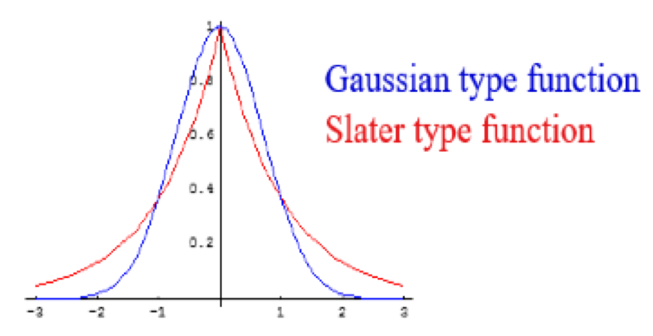

# Basis Sets
* Basis sets are a linear combination of atomic orbitals 
* Linear combinations of these will combine to form molecular orbitals (LCAO)
* The basis set itself is a set of mathematical functions from which the overall wavefunction is constructed

## SCF

* The SCF allows for the initial guess of $\Psi$ (the initial combination of AOs) to be formed into a best guess
* This can then be used to determine the properties of the molecule

## The Wavefunction

* $\Psi$ is a mathematical expression that determines the probability of electron distribution in 3D space
* From it we can determine some important properties about the electrons, such as:
  * The energy
  * The angular momentum
  * The orbital orientation within the shape
* $\Psi$ being  a wavefunction has a  polarity and can be combined to form in and out of phase combinations

## Slater Type Orbitals (STOs)

* Are based on the mathematical function $e^{−αr}$
* They are a complete set and represent the electron distribution well
* The cannot be cleanly integrated and cannot have nodes (kind of important)

## Gaussian Type Orbitals (GTOs)

* Are based on the mathematical function $e^{−αr^2}$
* Also have a complete set but they don't represent the electron distribution as well at STOs
* The can have nodes and are much more easily integrated

{: style="width: 30%; "class="right"}
## The Solution

* Use multiple GTOs to approximate an STO
* Thanks to the LCAO principle, it's possible to linearly combine GTOs

## Minimal Basis Sets - STO-nG

* Single $\zeta$ - the valence electrons are represented  by only a single function
* Are only good for spherical orbitals
* In STO-3G, three specific GTOs are used  to describe the orbital

## Pople Basis Sets

6-311G+(d)

* Uses 6 primitive basis sets to  describe the core electrons
  * All 6 gaussians use the same α

* Uses three separate functions to describe the valence orbitals
  * Each ζ split uses a different α in the gaussians

* Adds an extra (larger) function on each atom of Z>2 to account for loosely held electrons, long range interactions, excited states and transition states
  * ++ adds them form H as well

* For bonding  atoms adds extra functions of angular momentum as specified. First letter to Z>2 the second to Z≤2 atoms
* (d,p) adds p functions for Z≤2 atoms as well
  * (2df,pd) adds 2d and 1f functions to Z>2 and a p and d function to Z≤2
		
## Correlation Consistent Basis Sets - Dunning

* Designed mathematically so that they will **systematically converge** to the Complete Basis Set (CBS) limit
  * This limit is the maximum accuracy that a basis set can provide
  * The target of this convergence is different for different property calculations and is typically "trained" with empirical data to achieve the results desired

aug-cc-pVTZ

* Is correlation consistent
* Is polarised (has higher angular momentums)
* Has a split valence number - Valence Triple Zeta
  * D=Double, T=Triple, Q=Quadruple, 5=5…
* aug- are augmented with a diffuse function
				
				
## Dunning Vs Pople

* A parallel can be drawn with a few basis sets
  * cc-pVDZ ≈ 6-31G(d,p)
  * cc-pVTZ ≈ 6-311G(2df,2pd)

## Cost

* Number of GTOs used is roughly:
  * Minimal < Split Valence < Polarised < Diffuse
* The increase in the number of integrals is approximately $N^4$  where $N$ is  the number of basis functions
* Each iteration of the energy minimisation process iterates on the exponents (parameters) of the orbitals to define a new basis function for the next iteration
