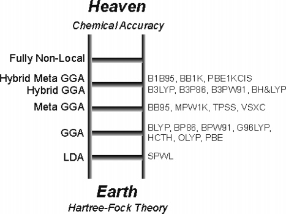
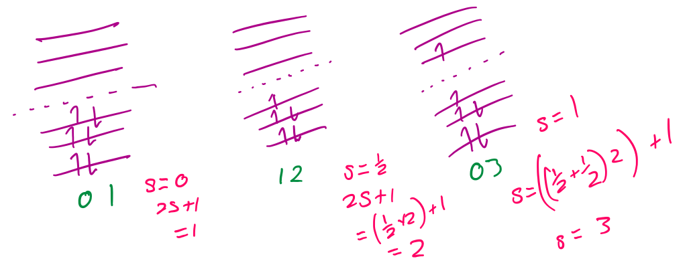

# Density Functional Theory
####Basics

* A  function takes a number and returns another number
* An operator takes a function and returns another function
* A functional takes a function and returns a number

Rather than putting effort into solving for $\Psi$ which has far too many variables to be practical, we can make a few inferences and approximations that essentially allow us to calculate the electron density over a grid and allow us to determine what the resulting wavefunction and energy will be

The Hamiltonian is a parameter that can be used to give \Psi

$$
\widehat{H }=\widehat{T}_n+\widehat{T}_e+\widehat{V}_{nn}+\widehat{V}_{ne}+\widehat{V}_{ee}
$$
	
Through some assumptions made, we can translate this to be in terms of electron density ($\rho$)

$$
E[\rho]=T[\rho]+E_{ext}[\rho]+E_{coul}[\rho]+E_{xc}[\rho]
$$

* The nightmare of solving for this exchange-correlation interaction becomes a functional of the electron density

### Jacobs Ladder
#### LDA - local (spin) density approximation
* $V_{xc}$  is defined as only depending on the local values of the electron density
* Is good for periodic systems but calculated bond strength and electron correlation to be too big
* E.g. SVWN, VWN5

$$
E_x^{LDA}[\rho]=−c_x\int{\rho^{\frac{4}{3}}(\hat{r})d\hat{r}} 
$$

{: style="width: 30%; "class="right"}

#### GGA - generalised gradient approximation

* $V_{xc}$  is also includes the first derivative of $\rho$ 
* Is better for molecules
* Builds upon LDA
* E.g. Exchange: PW86, B88, BP88, HCTH
* E.g. Correlation: LYP, PW91, BLYP
	

$$
E_x^{D88}[\rho]=E_x^{LDA}[\rho]−\beta\rho^{\frac{1}{3}} \frac{x^2}{1+6\beta x sin h^{−1} x′}
$$

`Parameters = β, 1+6β`

#### Meta-GGA
* Also includes second derivatives for better accuracy
* Not good for all molecules due to limited training set for determination of parameters
* E.g. M06-L, TPSS

#### Hybrid
* Mixes in HF exchange with GGA
* Most popular functionals
* E.g. B97/2,MPW1K
* E.g. B3LYP - 3 parameters; a, b and c
* Hybrid DFT mixes DFT with other post-HF methods to try and combine more concepts in to better account for correlation energy

$$
E_{xc}^{B3}=(1−a) E_x^{LDA}[\rho]+a_x^{HF}+b\Delta E_x^{B88}[\rho]+(1−c) E_c^{LDA}[\rho]+c\Delta E_c^{GGA}[\rho]
$$

```Parameters = a, b, c ```

#### Hybrid-Meta-GGA
* E.g. <span style="color:green">M05</span>-<span style="color:red">2X</span>, <span style="color:green">M06</span>-<span style="color:red">2x</span>, MPWB1K
  * <span style="color:green">Meta-GGA</span> <span style="color:red">Hybrid</span>

### Running DFT

#### What you need

* Molecule geometry
{: style="width: 50%; "class="right"}
* Molecular charge
* Spin multiplicity (2s+1)
* Basis set
* Exchange functional (S,B,B3 etc..)
* Correlation functional (LYP, PW91 etc…)


#### Precautions
* Different methods and basis sets can yield highly different results
* It is important to know the errors associated with the particular choices of computations
* This is doubly important when looking at someone else's results
* DO NOT TAKE ANYTHING AT FACE VALUE

#### Strengths and Weaknesses of DFT
* Strengths
  * Low computational cost
  * Accurate for structures and thermochemistry
  * The density is conceptually simpler than $\Psi$
* Weaknesses
  * Can fail in spectacular and unexpected ways
  * There isn't a  systematic way of  improving results
  * Multidimensional integrals can be problematic

#### HF vs DFT
* DFT is not approximate, it  is exact
  * Everything we do however is a functional of $\rho$ which means that the density has to be accurate
* Hohenberg-Kohn proved that the functional of $\rho$ must exist
* There is no definition as to what the functional should look like
  * We know $f[\rho]$  exists, we just don't know what it is

#### Contrast
* HF is an approximate theory that solves the relevant equations exactly
* DFT is an exact theory that solves the relevant equations approximately (since we don’t  know$f[\rho]$)
* DFT is not variation due to all the additions, however exact DFT is

#### About DFT
* DFT is good for determining geometries, but not so much for calculating energy
* Totally fails for non-covalent interaction
* Can have large errors for excitation energies
  * Fixes include CAM-B3LYP or TD-DFT
