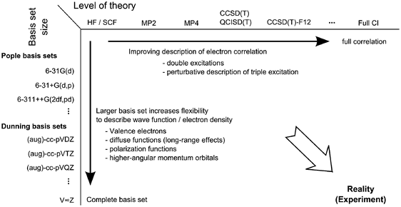
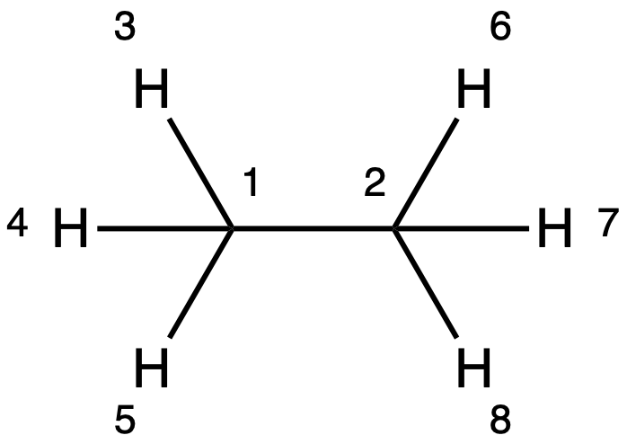

# Model Chemistry
* All quantum chemistry calculations start with HF as a baseline
  * Additional theories can be implemented:
    * Møller-Plesset perturbation theory
    * Configuration Interaction
    * Coupled Cluster
* Everything is a trade off between accuracy (large basis set, higher level of theory) and computational cost/time

{: style="width: 100%;"}


* The higher the theory and basis set, the more realistic the results
  * It's worth noting that DFT 

Electron Configuration
* We define electron configuration in comp chem much like we do in physical chem
* We use symmetry and number the order however, to describe the orbitals
* E.g. for water:

$$
1(A_1 )^2  2(A_1 )^2  1(B_2 )^2  3(A_1 )^2  1(B_1 )^2  4(A_1 )^0  2(B_2 )^0
$$

* We use the terms HOMO and LUMO to describe these and can often describe the surrounding orbitals as HOMO-1 and LUMO+1

#### Koopman's Theorem
* States that the ionisation energy of an atom or molecule is equal to the energy from the orbital of which the electron is ejected

$$
I_i=−\epsilon_t
$$

* In HF, the energies are more exactly calculated, however in DFT, we can only say that the energy is approximately equal to the ionisation energy (meta Koopman's theory)

$$
I_i≈−\epsilon_t
$$

{: style="width: 30%; "class="right"}
#### Coordinates
* The general rule of thumb is that the fewer coordinates there are, the less variables there are for the computer to have to optimise
* The connectivity is determined by the atom's behaviour, so we don't need to specify it explicitly
* We can depict geometry in two primary ways:

#### Cartesian Coordinates
* Use the cartesian system of X, Y and Z values for each atom
* E.g.
```
C       x     y     z
C       x     y     z
H       x     y     z
H       x     y     z
...
```
#### Z-Matrix
* Uses a system of internal coordinates of bond lengths, angles and dihedrals to define the geometry
* E.g.
```
C1
C2     R1     1
H3     R2     1     𝜃1     2
H4     R3     1     𝜃2     2     D1     6
H5     R4     1     𝜃3     2     D2     6
H6     R5     2     𝜃4     1     D3     3
H7     R6     2     𝜃5     1     D4     3
H8     R7     2     𝜃6     1     D5     3
			
R1=
R2=
...
𝜃1=
𝜃2=
...
D1=
D2=
...
```