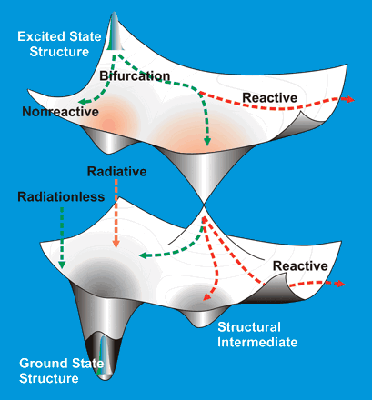
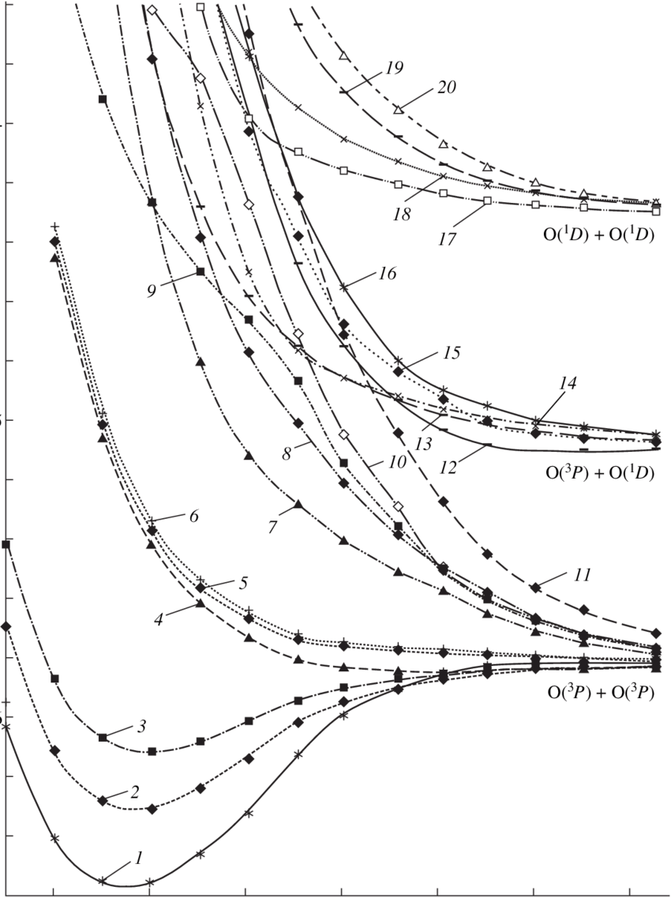
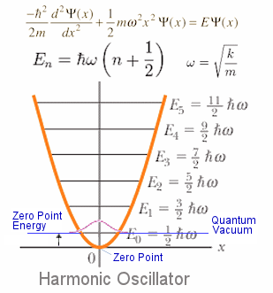

# Energy Calculations

## Things you need to know/consider:

* The structure of your chemical compound
* What properties you want to calculate
* What resources you have:
  * Hardware
    * Memory
    * CPU threads
    * CPU speed
    * GPU?
    * Scratch speed
  * Software
    * Does is support your model?
    * How well can it handle parallelisation?
    * Does it support GPUs?
* What model you will need for your particular properties
  * Are you running an iterative process? (PES scan, optimisation) or a single point calculation  (NMR, freq)
    * (Optimisation time) ≈ (single point time) × (degrees of freedom) × 5
  * Greatly impacts the expense of the research in both time and money
  * Scaling costs
    * HF scales $N^2$  to $N^4$
    * DFT scales $N^3$
    * MP2 scales $N^5$
    * CCSD scales $N^6$
    * CCSD(T) scales $N^7$
    * MP4 scales $N^7$

    * Full CI scales $N!$ 

Also the ionisation of electrons

#### Potential Energy Surface

* The potential energy surface is an highly dimensional surface that depicts the energy landscape of a molecule
* It can be characterised by a few features:
* 
## Minima

* Where all second derivatives are +ve
* Local minima are where we fine isomers, conformers etc
* The global is the most stable form of the molecule
  * This can be defined as any change in the geometry causing an increase in energy ($E_{(R)}$)

## Maxima

* Where all second derivatives are -ve
  * This can be defined as any change in the geometry causing an increase in energy ($E_{(R)}$)

## Saddle point

* Where all derivatives except for one are +ve
* This is the transition state between two equilibrium structures

* These stationary points can initially be found by looking at where the first derivative is 0
* The plane of second derivatives is called the hessian
* The equilibrium of a structure will be determined by the statistical interpretation of all the minima, given a certain temperature

#### Excited states

* We can also look at the PES and compare it to the PES of excited states
* Excited states will often have different geometric/PES properties, an can be used for generation of reaction intermediates in photochemistry
* In 3D, we can visualise the transition between excited and non excited states, to see how the geometry behaves and transitions
* Notice the subtle difference in bond length between excited states in these PES curves

{: style="width: 50%;" class="left"}
{: style="width: 40%; border-color: black; border-style: solid; border-width: 1px;" class="right"}

  

## Optimisation

* The optimisation is said to be complete when the four key properties have converged.
* They are:
  * Maximum force
  * RMS force
  * Maximum displacement
  * RMS displacement
* Force is the first derivative of the PES and the threshold is to make sure that in all dimensions the derivatives are within a certain distance of each other
* Displacement is the energy distance between the current geometry ($r$) and the next step ($r+1$) 
* Geometry certainty:
  * Energy - 6 d.p. for Ha and 1-2 d.p. for KJ/mol
  * Bond length - 3 d.p.
  * Bond angle - 2 d.p.
  * Dipole moment - 2 d.p.
  * Polarisability - 2 d.p.
  * Rotational constant - 6 d.p.

#### Checklist:

* Have you converged?
  * Check the four criteria (four "YES")
  * Look for normal termination
* Was the minima and saddle point found?
  * Check with a freq calculation
    * All frequencies should be positive
    * All but one frequency means the saddle point has been found
* Is this the local or global minima?
  * Run a PES scan to verify the geometry

#### Optimisation Precautions

* Optimisation will only find the local minima of the initial geometry.
  {: style="width: 30%; "class="right"}
  * Semi-empirical methods are an effective way of ensuring that the starting geometry is close to the global minima
  * A PES scan run in logical locations can also help to identify any possible lower minima
* Optimisation will only account for the specified geometry.
  * Tautomer, isomer and conformer variance will not be accounted for and to truly represent the molecule, one needs to calculate all of these and take a weighted average
  * This is particularly important for gas phase experimental results which will typically be run at higher temperatures and will thus have higher isomeric variance
* Zero Point Energy is another important consideration, as the energy minimisation will find the lowest possible configuration of the geometry, but in reality, the energy within the vacuum of space is enough to prevent the molecule from resting in its minima.
  * What this means in reality is that the difference between the PES minima and the actual minima is the zero point energy contribution, which can be calculated with freq 

#### PES scan

* A PES scan freezes all the geometry in one conformation and modifies one single property at a time (dihedral, angle, bond length)
* The energy is plotted at each change of that property to form a curve.
* Running a PES scan on multiple properties produces a PES surface
* It is possible to run a "relaxed" PES scan in which the geometry is optimised with each change of the geometric property.

#### Thermodynamics

* The PES shows the thermochemical landscape of the molecule, as the differences in energy between each point on the PES directly relates the thermodynamics of the molecule
* If the reactant goes from a low energy isomer to a high energy one; it's endothermic. From high to low; exothermic

