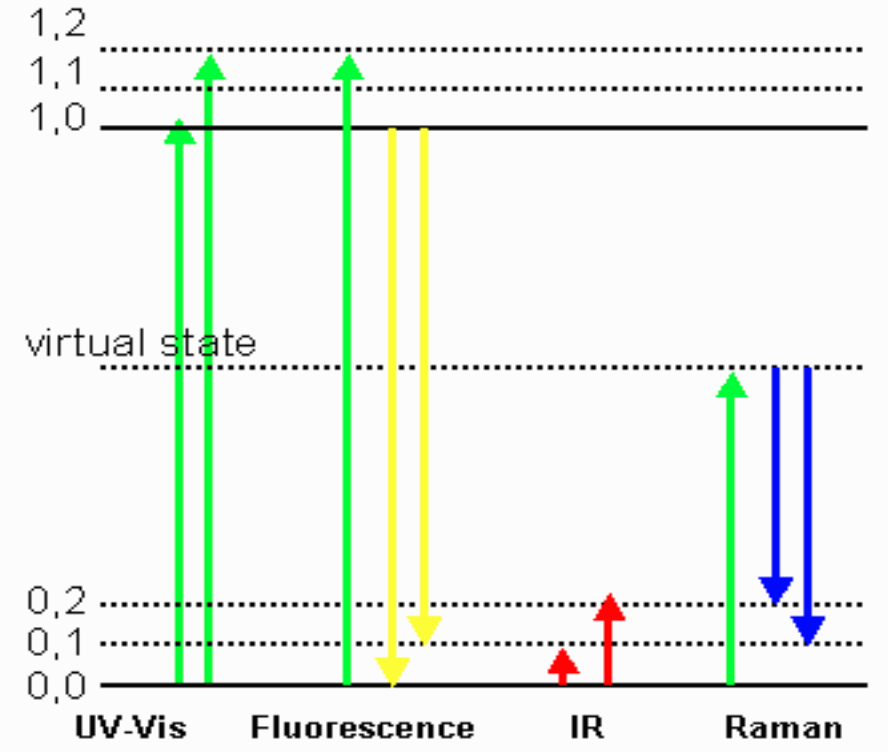
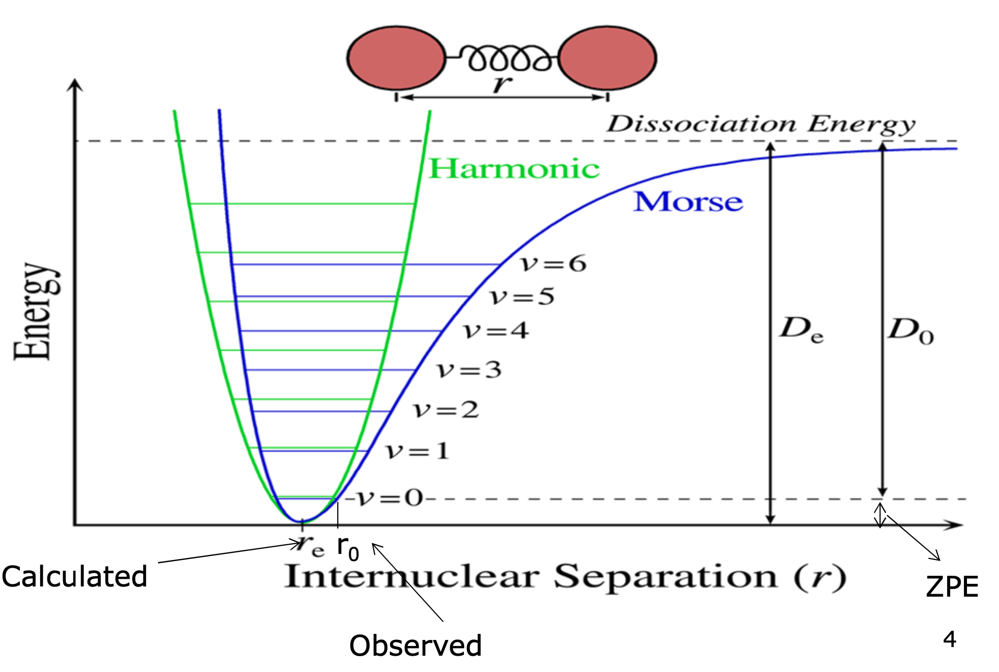
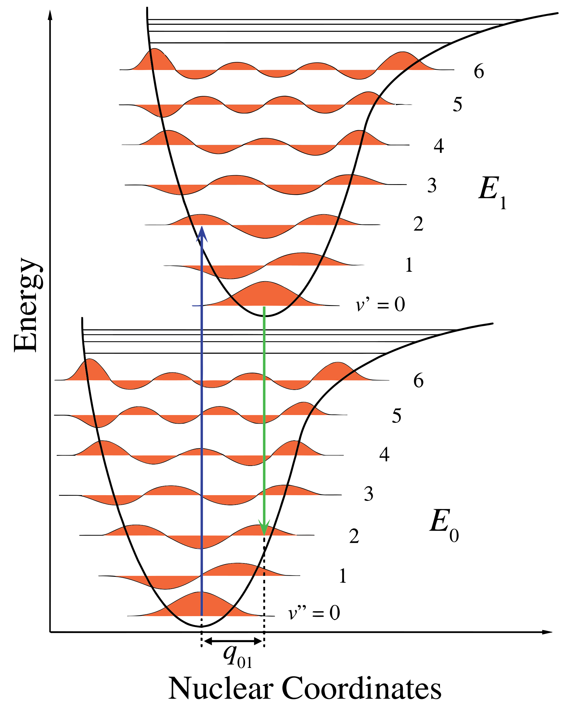
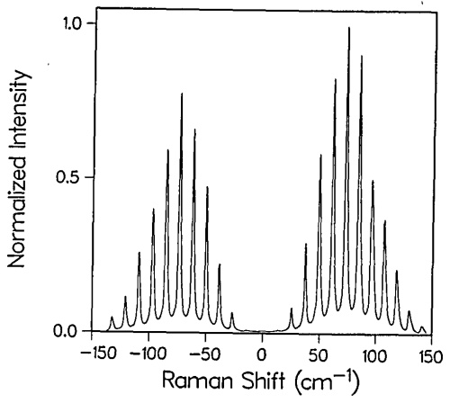

# Vibrational Spectra

* Is a really important tool to calculate:
{: style="width: 30%; "class="right"}
  * IR spectra
  * Raman spectra
  * ZPE
  * Thermochemical properties
  * Reaction rate coefficients
  * Isotopic substitution effects
  * Tunnelling corrections

* IR and Raman are complementary to each other
{: style="width: 30%; "class="right"}
  * Ramen is the de-excitation process, where are IR is the excitation
    * Think IR=UV-Vis, Raman=fluorescence
* Vibrational calculations are really important for thermochemical calculations, as the electronic energy is devoid of real world influences
  * E+ZPE is equal to $\nu$=0,x note that in the diagram, this is the difference between $r_e$ and $r_0$, the geometric oscillation triggered by the zero point energy that permeates through all of spacetime
    * Anything with a subscript e is the  calculated result, and subscript O is experimental (observed)
  * The excitations that come out of vibrational calculations are calculated as harmonic, before a correction is applied to make them behave in a Morse/anharmonic fashion.

## Franck-Condon States

* Describe why vibrational spectra can never exist in discreet bands, such as with AAS/AES
{: style="width: 30%; "class="right"}
* The geometry of the bond will spend most of its time near the extremes of its vibration, as it’s slowing down and reversing direction, this means that the majority of the excitations will be to a particular excited state
  * In the diagram, the transitions will only ever happen exactly vertically, but where they will come from and go to will depend on the statistical distribution of the geometry at that particular moment
* This is because much like in the BO approximation, the electrons move so fast that the nuclear movement is negligible in comparison
* This primarily denotes the peak distribution of the fine rotational states in between the vibrational states and will describe the intensity of their peaks accordingly.
{: style="width: 50%; "class="right"}

## Computing vibrational spectra

* The rotational constants ($R_A$, $R_B$ and $R_C$) give us a sense of the proportions of the geometry
  * A, B, C are akin to X, Y and Z
* $\mu$ is the permanent dipole moment
  * $\mu\neq 0$ means that the molecule is IR active
  * $\mu=0$ can still have IR activity, but it is not guaranteed
  * Symmetric molecules such as $CO_2$  can still have asymmetric vibrations
* $\mu_T$  is the transition dipole, the dipole created by vibrational excitation

## How to calculate:

1. We need to calculate the relevant molecular properties
  * Geometry
  * Force constants
  * Electronic energy states
2. This information can be used to calculate the spectra
  * Transition frequencies (energies)
  * Intensities 
3. Assigning peaks and DFT scaling
4. Comparison to the experiment

## Scaling factor

* Since a harmonic oscillator model is calculated, the results need to be scaled to better line up with the Morse potential
* This is done using a scaling factor

## Thermochemistry

* Freq calcs are based on:
  * $0K$ at gas phase for vibrational frequencies
  * $298.1K /1.0atm$ standard state for thermochemical frequencies

* $E_tot$  is the electronic energy calculated by the theoretical model
* $ZPE$ is the zero point vibrational energy that permeates through all of space
* $E_O=E_{tot}+ZPE$

Then we can start building thermochemistry

$$
H^\circ=E^\circ+pv=E^\circ+RT
$$

$$
G^\circ=H^\circ−T\cdot S^\circ
$$

