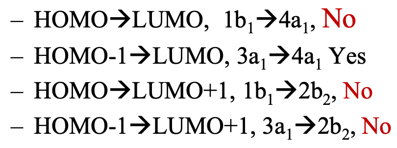
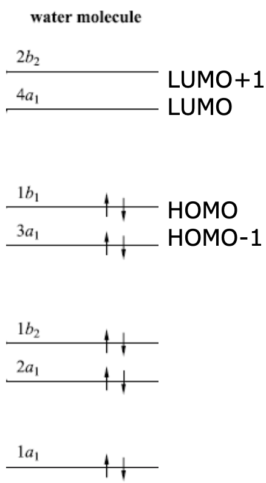

# UV-Vis Spectra

* UV-Vis excitations are between occupied and virtual orbitals
* In the gas phase, individual excitations can be seen with vibrational intermediates
  * Solvent effects smooth this into a broad convoluted curve

## Allowed transitions

* There must be a change in the dipole for the transition to occur
## Spin selection rule:

* Allowed transitions cannot change the spin of the electron
* Specifically, they cannot change electron spin direction (up to down, down to up)
  * Singlet to singlet
  * Triplet to triplet
	
## Orbital Selection rule

* A photon can only (and must) change the electron's angular momentum by 1
  * $s\ce{->}p\hskip{2cm}p\ce{->}d\hskip{2cm}d\ce{->}f$
  * No chance or too large of a change is forbidden
* Can be relaxed when orbital mixing occurs, however absorbance will be small when not enough of a character change occurs

## Laporte selection rule:

* In molecules that have symmetry - dyes tent to be asymmetric so that all excitations are allowed
* Transitions are forbidden if the orbitals have symmetry around the same point of inversion
{: style="width: 55%; "class="right"}
  * Forbidden - different symmetry
  * Allowed - same symmetry
  * Forbidden - different symmetry
  * Forbidden - different symmetry

{: style="width: 30%; float: center;"}