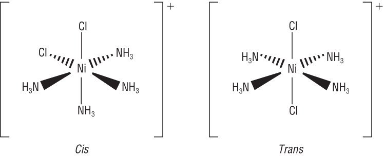
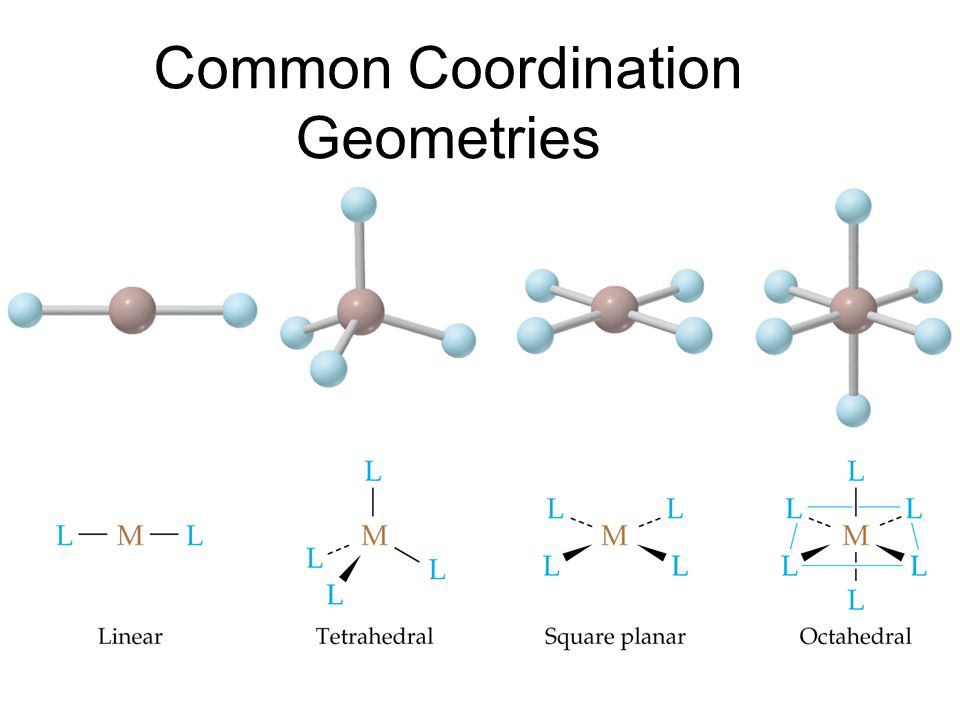
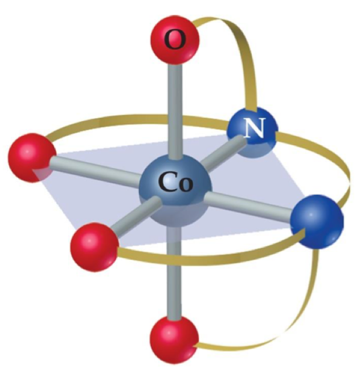
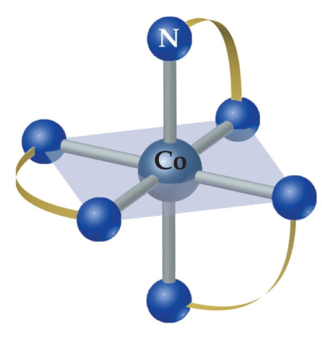
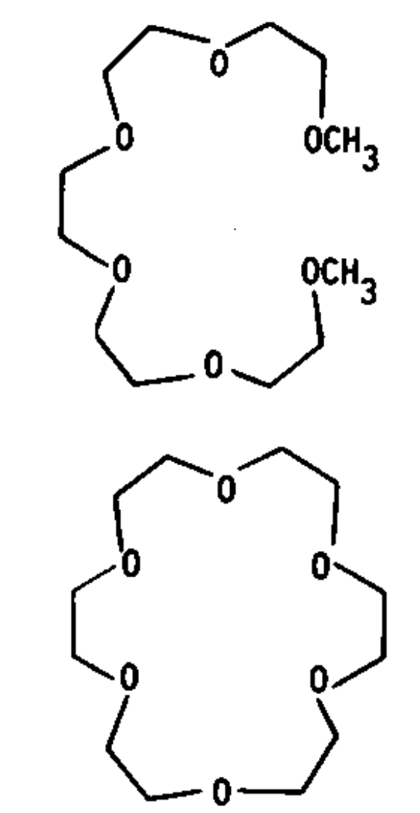
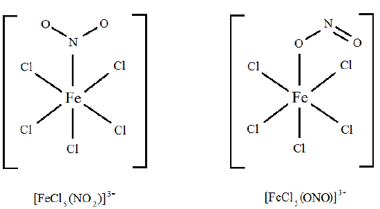
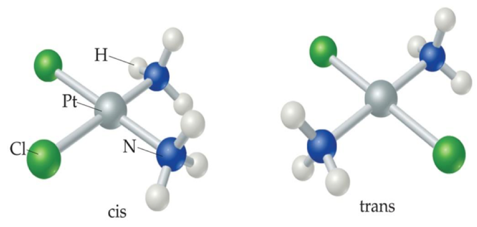
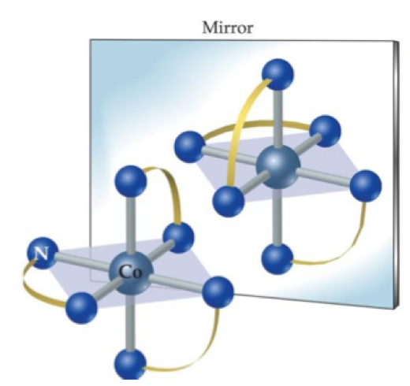

# Coordination

## Naming convention

* cis or trans − [core(ligand)]counterions
  * Cis/trans typical convention - same side of opposite side

{: style="width: 50%; "class="center"}

* The square brackets denote the coordination sphere
* When IUPAC naming coordination complexes, the ligand that's attached to the complex is a prefix
* The counterion is a secondary term
  * E.g. pentaamminechlorocobalt(III) chloride
  * $\ce{[Co(NH3)5 Cl]Cl2}$
	
* If a ligand has a prefix in it's name (ethane-1,2-diamine) the prefixes are used as such:
  * Mono, bis, tris, tetrakis, pentakis, hexakis,
  * E.g. tris(ethane-1,2-diamine)cobalt(III) sulphate
* Water as a ligand is called aqua
  * E.g. Hexaaquacobalt(III) bromide

## Oxidation state

* Is calculated by looking at the charges and oxidation states of the balancing atoms
  1.  Look at the counterion to determine the total charge of the complex
  2. Calculate the oxidation state of the ligands. This is purely related to the charge of the ligands
  3. Balance the charge of the coordination complex with the charge of the ligands to determine the oxidation state of the central ion.

## Electron Configuration

* As a rule of thumb:
  * In the gas phase, the electrons are taken from the d-orbitals first
  * In the liquid phase, the electrons are stripped from the s orbitals first, as the d orbitals are stabilised by the ligand field

## Coordination number

* Typically 4 or 6
  * Can be 2 in certain situations
  * Can be determined by looking at how many ligand there are surrounding the central atom
* Geometries formed are based on VSEPR and hinderance of the ligands

{: style="width: 50%; "class="center"}

* Square planar complexes are typically associated with a d8 electron configuration with a +2 charge
  * This corresponds with the Group VIII (3) metals, Ni, Pd, Pt 

## Denticity of Ligands 

* Ligands can have multiple donor atoms that all contribute to the metal at the centre of the complex
* This is known as the denticity of the ligands and uses the convention of mono-, bi-, tri-, tetra-, penta-, hexa-, hepta-
* E.g. EDTA is a hexadentate ligand and as such has 6 sites that it will coordinate with a metal ion

| EDTA | EN |
|:-----:|:-----:|
| {: style="width: 50%; "class="center"} | {: style="width: 50%; "class="center"} |

## Chelates {: style="width: 20%; "class="right"}

* Polydentate ligands will typically bind to the metal core with a higher affinity than monodentate ligands and as such can be used to remove the metal ion from activity in the solution
* The higher the denticity, the higher the chelate effect

### Cyclic chelates - Macrocycle effect

* Cyclic chelates are even more stable (up to 10^7  times) than non cyclic polydentate ligands
* A good example of this is a porphyrin which is not only more stable but also aromatic and chelates/coordinates incredibly strongly with iron 

## Structural Isomers

* As well as cis and trans, we also have linkage isomers, where one of the ligands may bind in a different manner

{: style="width: 50%; "class="center"}

## Coordination Sphere Isomers

* Have the same component groups but  differ in what groups are inside and outside the coordination sphere

| Core | Ligand | Counterion | Colour |
| ---- | ------ | ---------- | ------ |
| $\ce{Cr}$ | $\ce{(H2O)6}$  | $\ce{Cl3}$ |Violet |
| $\ce{Cr}$ | $\ce{(H2O)5 Cl}$ | $\ce{Cl2 \cdot H2O}$ | Green |
| $\ce{Cr}$ | $\ce{(H2O)4 Cl2}$ | $\ce{Cl \cdot 2H2O}$ | Green|

## Stereoisomers

* Any isomer which is based on linkage, where the pattern of linkages is different, e.g. cis/trans

{: style="width: 50%; "class="center"}

## Optical Isomers/enantiomers

* Are non-superimposable mirror images of each other

{: style="width: 40%; "class="center"}