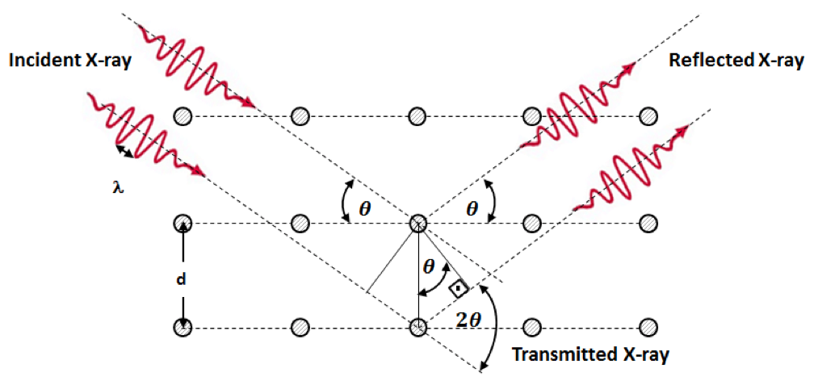
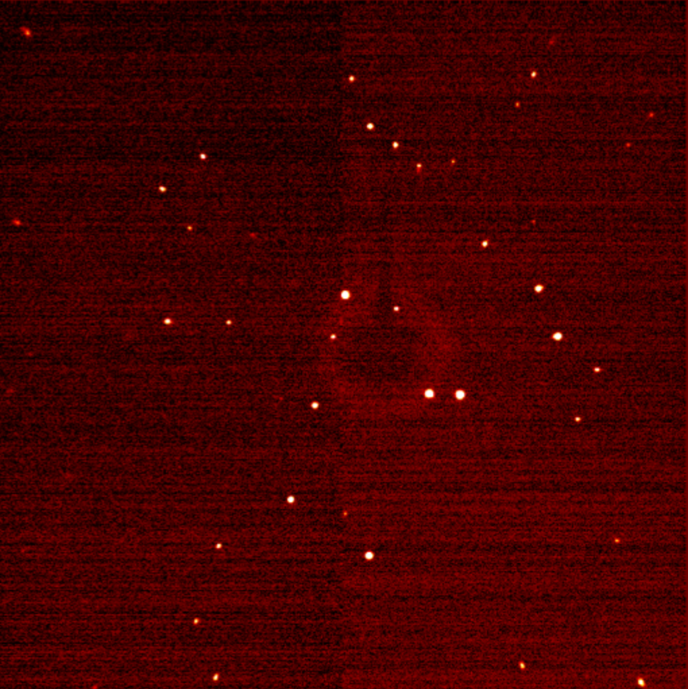
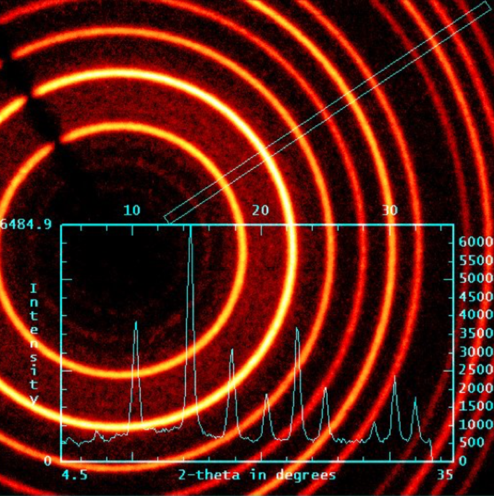

# XRD

* XRD is the process by which reflected X-Rays interfere with each other when reflected off the different layers within a crystal
* The general rule is that $n\lambda=2sin\theta$, which relates the distance between the two layers reflecting the xrays to the wavelength of the xrays bombarding the crystal.

{: style="width: 50%; "class="center"}

* XRD can be used to analyse both a single crystal and a crystalline powder.
* Since the orientation of the crystals can't be aligned in a powder, the resulting diffraction pattern becomes a series of concentric circles. 
* Single crystal spectra can be used to determine the absolute structure of a unit cell, and therefore the molecule
* Powder diffraction is used more as a profiling/fingerprinting technique

{: style="width: 48%; "class="left"}
{: style="width: 48%; "class="right"}