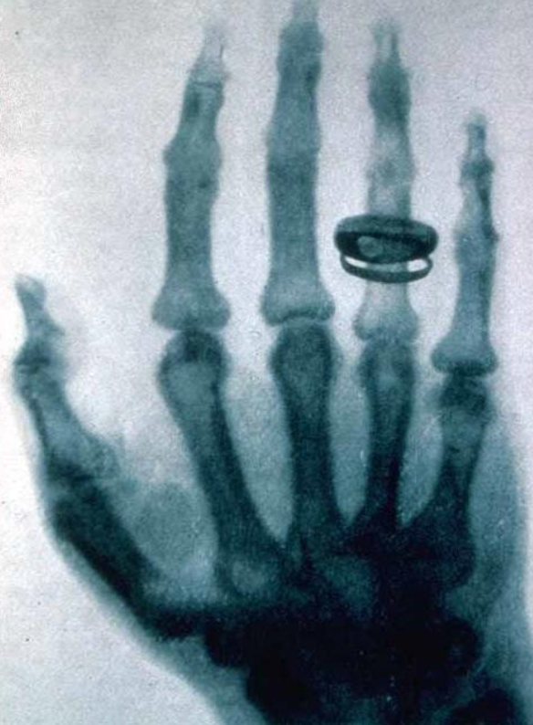
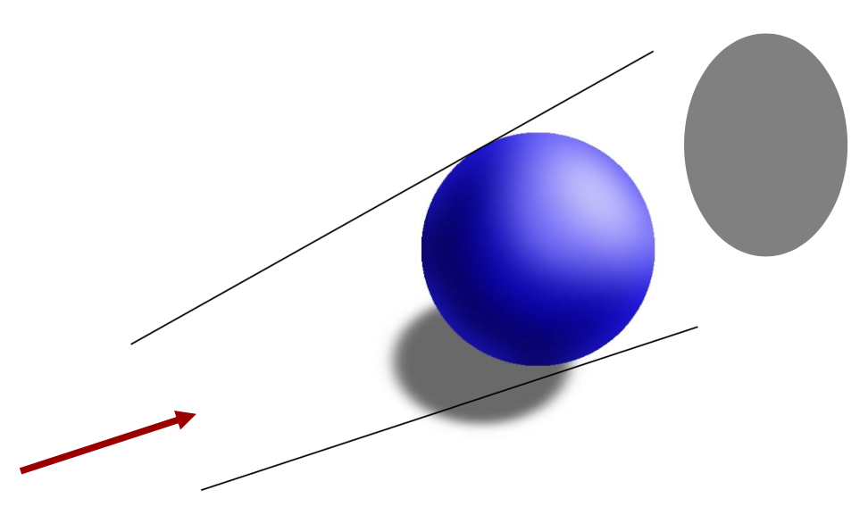
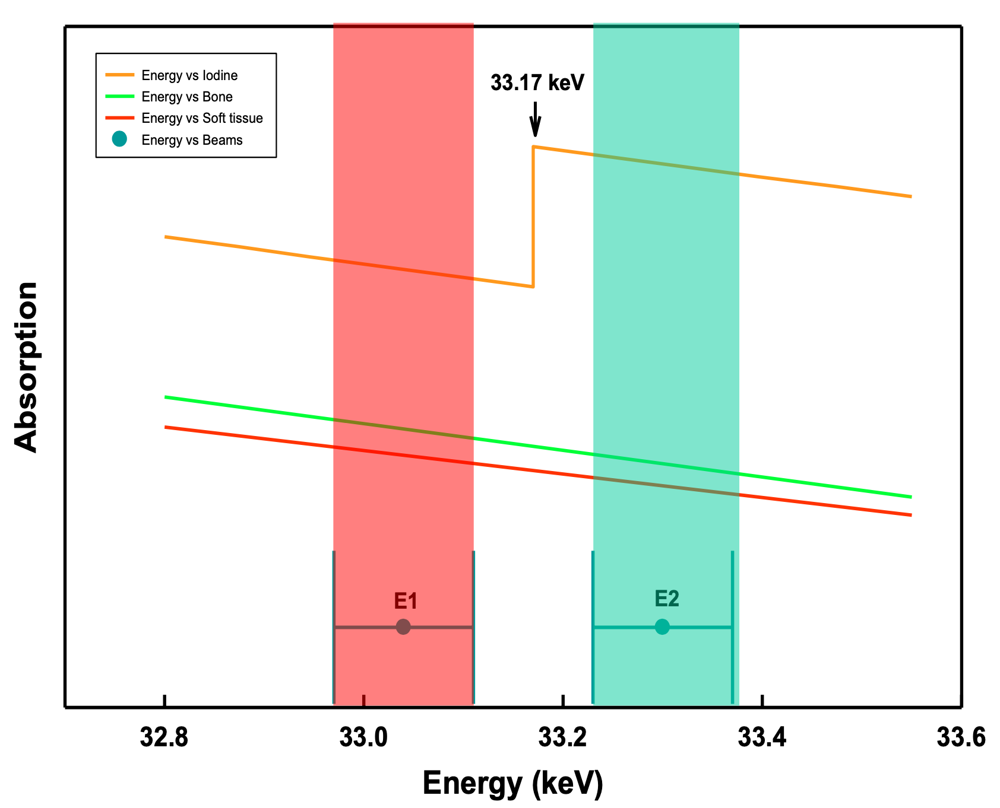
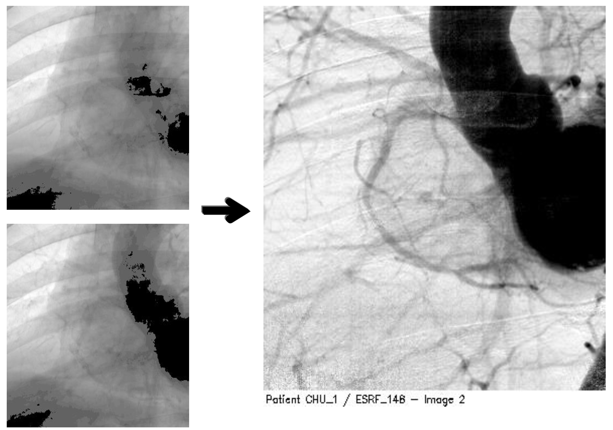
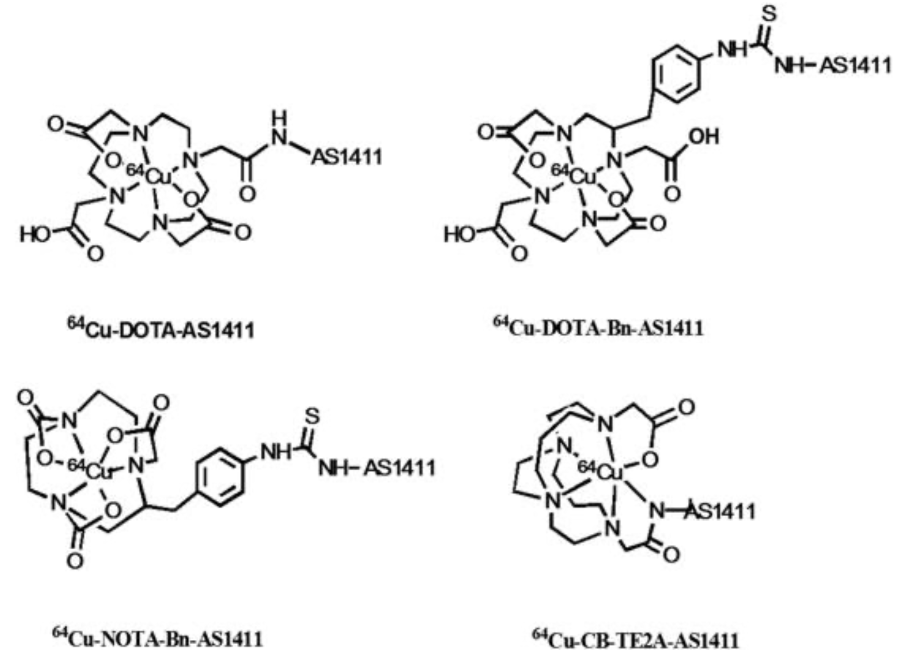
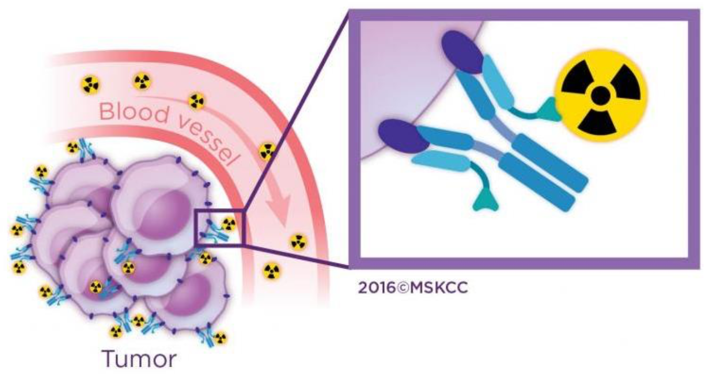
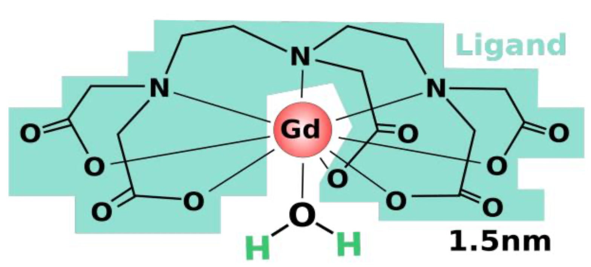

# Medical Imaging

{: style="width: 20%; "class="right"}

* Is fundamentally based on a difference in absorbance between different materials, based on density

## Tomography {: style="width: 30%; "class="right"}

* If multiple images are taken from different angles, the shadow cast can be used the calculate the shape of the initial geometry

## Subtraction Radiography -  Z-contrast

#### Iodine

* Uses a Z-contrast (Z for the atomic weight) 
  *  Has a higher atomic weight and therefore a higher density than the surrounding tissue.
* Multiple x-ray images are taken, one in which the iodine will absorb the radiation and one in which it won't
* The two can then be computed to enhance regions where the iodine is present
  *  The iodine is injected, so this will highlight the vascularity

{: style="height: 250px; "class="left"}

{: style="height: 250px; "class="right"}

#### Barium

* The same can be done with barium in a "barium swallow" to give a contrast to a digestive x-ray

## Radiotherapy

* The treatment of cancer with the use of targeted radiation

#### Iodine

* Since iodine is readily absorbed and processed by the thyroid, radioactive iodine can be administered, which will decay within the thyroid, killing off all local cells
* This is a regular treatment of thyroid cancer, as thyroxin can be provided as a supplemental hormone

#### Copper Chelates

* Copper 64 (radioactive) can be bound within chelates that are bound to antibodies to target a particular cell line
* This provides specificity as to where the copper will bind and destroy

{: style="width: 40%; "class="left"}

{: style="width: 55%; "class="right"}

## Magnetic Contrasts
* High spin metals within a chelate can be used to provide contrast in magnetic imaging
* Gadolinium is used due to its half filled f orbitals (7 unpaired electrons)
  *  It is also not particularly toxic and can be excreted from the body
* The multidentate ligand provides high stability

{: style="width: 50%; "class="center"}