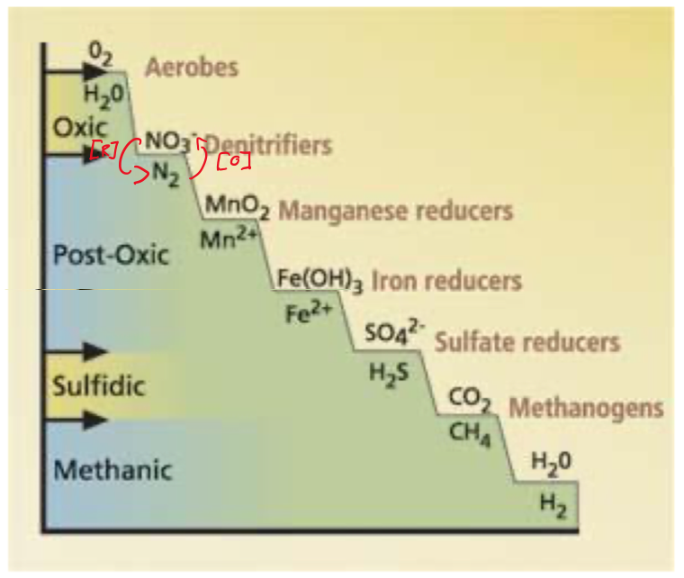
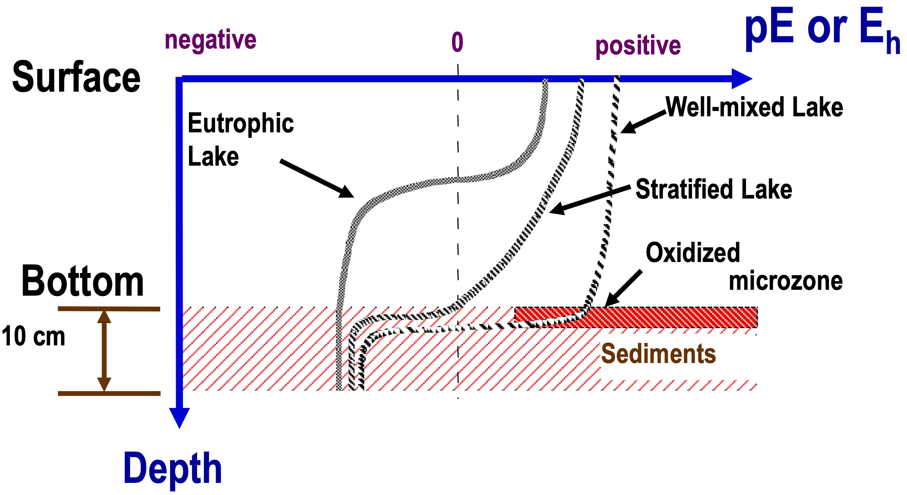
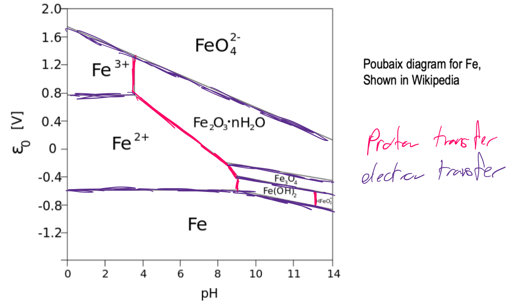
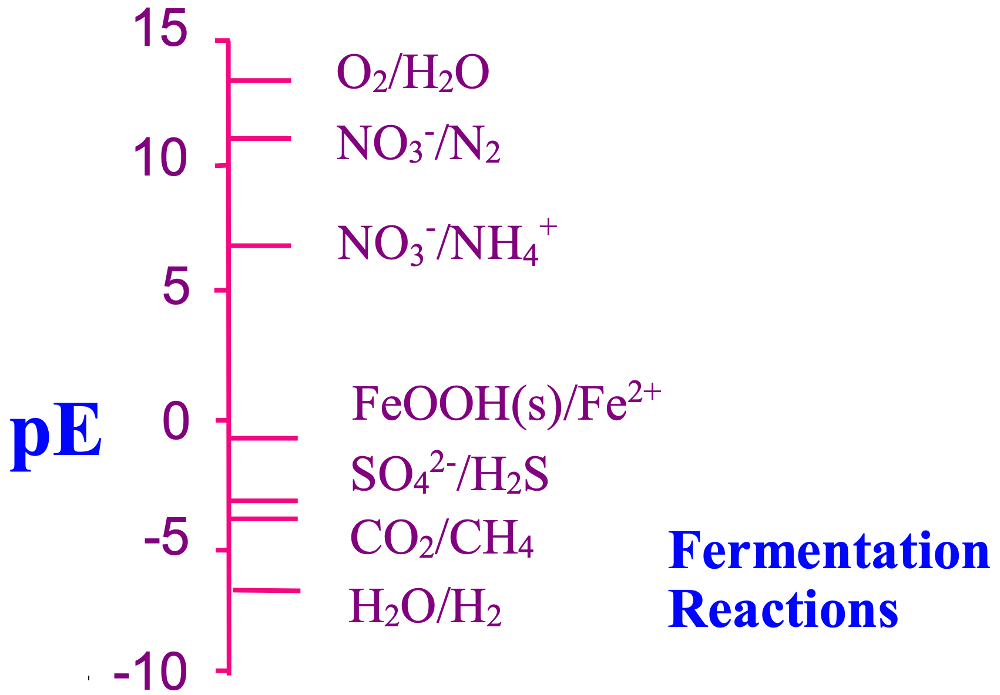

# Environmental Chemistry

* The primary consideration is the oxidation state of any species within the environment {: style="width: 40%; "class="right"}
* The figure to the right show a few contaminants and their oxidated and reduces states
  * These are ranked according to their anaerobic/aerobic nature

## Electrochemistry

* Defined as the study of the interchange of chemical and electrical energy
* It is primarily focused around redox reactions
  * The use of electricity to drive chemical reaction
  * The use of chemistry to produce electricity
* Redox couples are always written as reduction reactions
  * +ve for reduction, -ve for oxidation
* Standard state reduction potentials $E^\circ$  represent the "ease" with which the reaction will occur
  * Are always related back to the standard hydrogen electrode ($E^\circ=0.000V$)
  * Are measured at standard state (1M, 1atm.)
    * Since environmental systems are also pH dependent, and this process will produce protic/aprotic species, the pH will change, changing the reduction potential
* Most weathering processes are acid/base rather than redox reactions
* Many redox processes within natural systems are biologically mediated

## Catalysis

**Heterogeneous** - catalyse from a different phase - surface catalysis
**Homogeneous** - catalyse from the same phase - solute catalysis

Redox thermochemistry, the energy difference between product and reactant is $E^\circ$

* Redox reactions determine the speciation (what form the element exist in) of many of the environmental element
  * This also determine whether or not the compound is a solute or particulate matter

In natural bodies of water, the level of oxygen mixing determines the reduction state of the body of water

* The more mixed the body of water, the higher the reduction potential (more oxidised) over the depth.
* In more stagnant environments, the oxygen is pulled from the water, creating a more reduced environment as the depth increases

{: style="width: 50%; "class="center"}

## Pourbaix Diagrams

* Show the speciation of the specific component, based on the environmental conditions
  * pH is shown horizontally, with a vertical line showing a proton transfer
  * Reduction potential is shown vertically with horizontal lines representing electron transfer

{: style="width: 50%; "class="center"}

## Microbial Mediation

* Since microbes can use compounds other than oxygen for energy production, they can often oxidise other species such as iron, nitrogen and phosphorous
  
  * They can't carry out difficult redox reactions, but instead catalyse simple ones
* This plays a large part in the equilibrium of a natural system
* As oxygen levels deplete in the environment, different energy sources are used, with successively lower reduction potentials

{: style="width: 50%; "class="center"}

## There are a few reactions of note, namely

#### Denitrification - removal of nitrate

  * $\ce{2.5C + 2NO−  + 2H+ -> N + 2.5CO + 2HO}$ 
  * Useful for wastewater treatment
		

#### Ferric iron reduction

* $\ce{C_{org} + 4Fe(OH)3 + 8H+ <=> CO2  + 4Fe^{2+} + 10H2O}$
* More important in groundwater systems than in open bodies
  
  * In open bodies of water, the iron will ppt out as rust and will not be particularly available
* Can then be bound to $\ce{CO3^{2−}}$  or $\ce{FeS/FeS2}$ depending on the further reduction process
* Is often found as soluble $\ce{Fe(H2O)6^{2+}}$  in anoxic sediments
  * When exposed to oxygen, Fe(II) is typically quickly oxidised to Fe(III)

#### Sulphate reduction

* $\ce{SO^{2−} + 2C_{org} + 2H2O <=> H2S + 2HCO3−}$ 
* If the pH is less than 7, $\ce{HS−}$  will form and exchange with $\ce{FeS}$

#### Fermentation reactions

* Oxidise organic matter to form $\ce{CO2}$
* Can often ferment organic matter to produce $\ce{CH4}$  as well as $\ce{CO2}$

#### Bioremediation

* The process of using bacteria to fix issues
* Commonly used to reduce soluble $U^{6+}$  to $U^{4+}$
* Too much bacterial build up can prevent nutrients from dispersing evenly through the media to be remediated
