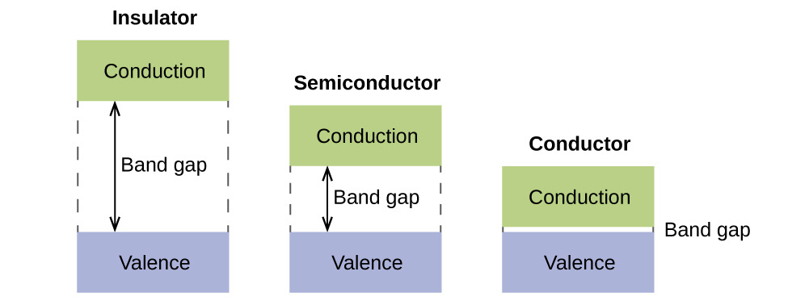
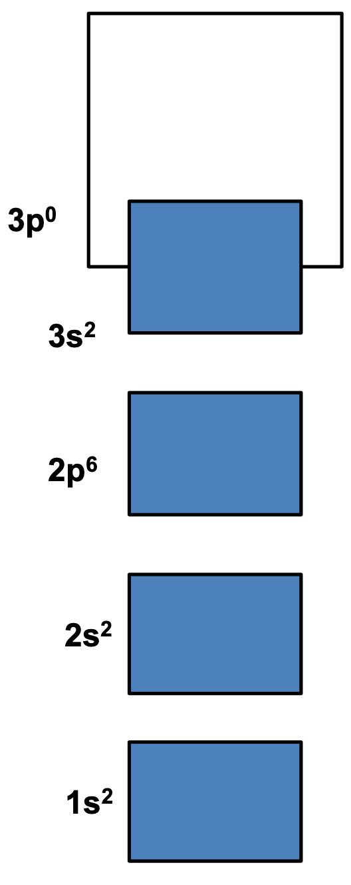
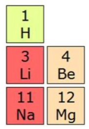
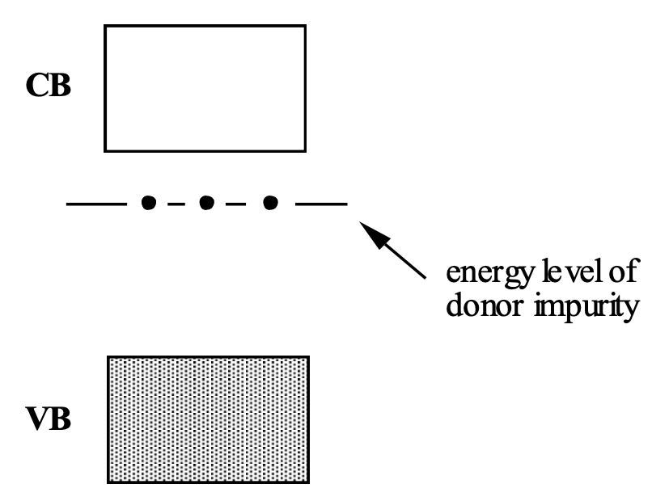
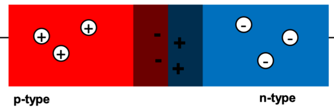
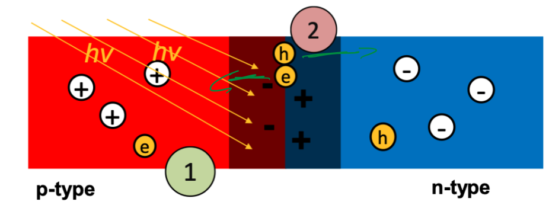
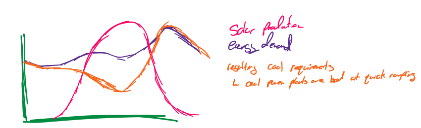

# Photovoltaics 

## There are fundamentally three types of solids

1. Conductors - typically metals
2. Insulators - may be small molecules or ionic solids
3. Semiconductors - 
    a. elements on the border of metal and non-metals - silicon, germanium
    b. Compounds made of the above elements

## Band Structure

* In conducting materials, as we add more and more of the element in, the additional MOs will aggregate closer and closer together, and stabilise/destabilise each other, through the entirety of the lattice structure
* This causes a generation of "MO bands", both bonding and antibonding
  * Since the HOMO will be occupied, the only way for electrons to migrate is to be excited from the valence band (HOMO) to the conduction band (LUMO/SOMO) 
  * This excitation energy is what determines the bulk properties of the solid, as depicted below

{: style="width: 50%; "class="center"}

{: style="width: 15%; "class="right"} {: style="width: 10%; "class="right"} 
* In the case of Mg, the conduction band is actually overlapping in energy with the valence band, making it a conductor 
* This can also occur when the HOMO is a SOMO, such as with Li

* This also explains the white colour of metals, as they can absorb and emit practically all wavelength of light, due to the massive potential for electron excitation
* Since the kinetic energy of electrons can also be delocalised throughout the lattice, this also explains the high heat conductivity

## Holes

* When an electron moves from the valence band to the conduction band, it leaves behind an empty "hole", which based on Z, will have an inherent positive charge associated with it.
* The net movement of the holes in the valence band and the electrons in the conduction band is what gives in "intrinsic" semiconductor its conductivity
  * At room temperature, in a pure semiconductor, the number of holes in the valence band is equal to the number of electrons in the conduction band

## Doping 
{: style="width: 30%; "class="right"} 

* The addition of a dopant will change the properties of the base material making an "extrinsic" semiconductor, in which the number of holes and free electrons are not equal 
* Only needs to be 100-1000ppm of dopant
	

## N-Type

* In n-type semiconductors (negative) the semiconductor is doped with a group V element
  * This impurity adds a new energy level to the MO that is close to the conduction band
  * This also allows for electrons to be more readily excited to the conduction band, from the new impurity MO, making an easier jump (stepping stone) for the valence electrons to take along the way
  * This causes more electrons in the conduction band than holes in the valence band, causing there to be more charge carrying influence from the electrons than from the holes

## P-Type

* In p-type semiconductors (positive) the semiconductor is doped with a group IIIB element
  * This impurity adds a new energy level to the MO that is close to the valence band
  * This also allows for electrons to be more readily excited to the new impurity MO, causing an excess of holes in the valence band 
  * This causes more holes in the valence band than electrons in the conduction band, causing there to be more charge carrying influence from the holes than from the electrons

## P-N Junction

* When a p-type and n-type semiconductor are placed next to each other, they normalise each other's charge and create a neutral region between them, called the "depletion zone", which acts like an insulator and prevents electrical flow entirely

{: style="width: 60%; "class="center"} 

## Diode

* This allows electricity to pass only in one direction, as the electrons from the battery will want to fill the holes in the diode, pushing on the electrons in the depletion zone and forcing the n-type electrons out

## Photovoltaic Effect

* In its simplest, states that when a photon hits an atom with enough energy to excite it, the electron is ejected and a hole is created int its place
* When this occurs in a diode, the hole can only travel towards the n-type region and the electron can only travel toward the p-type region
* This creates an energy potential (voltage)

{: style="width: 60%; "class="center"} 

* In a semiconductor, the band gap means that only certain photons will have the correct energy to excite the electrons
  * In Si solar cells, the cells are black, which is a decent indicator that it absorbs lots of the light
		

Problems
* At higher energy levels (blue light) the photons will have too much energy and will inevitably be wasted
* Since the light has to excite the n-type side of the diode to work, it has to be very thick
* The duck curve
  * Coal power plants produce steady energy all day
  * During the day when solar panels are working hard, the cola power plants have to ramp down, but just as the sun goes down, energy usage peaks and the coal power plants have to massively ramp up again

{: style="width: 70%; "class="center"} 

* So we need to store the energy produced by solar cells in Batteries to be used as the demand grows
	
