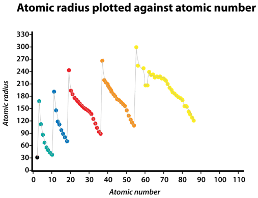
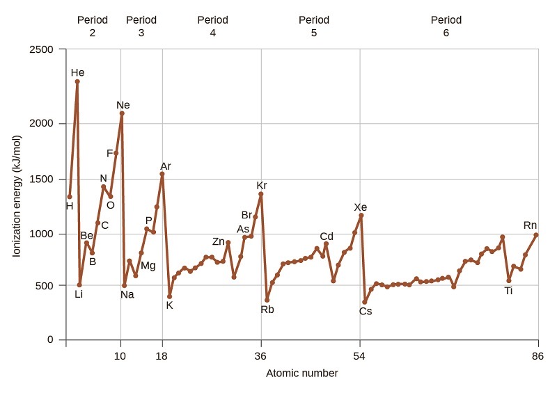
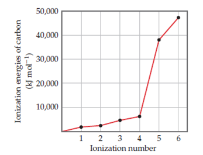
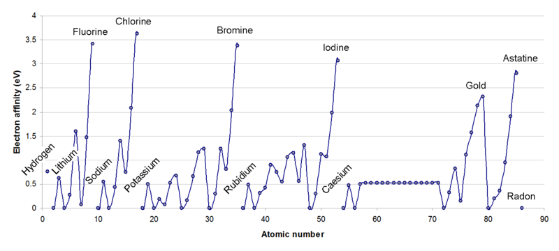
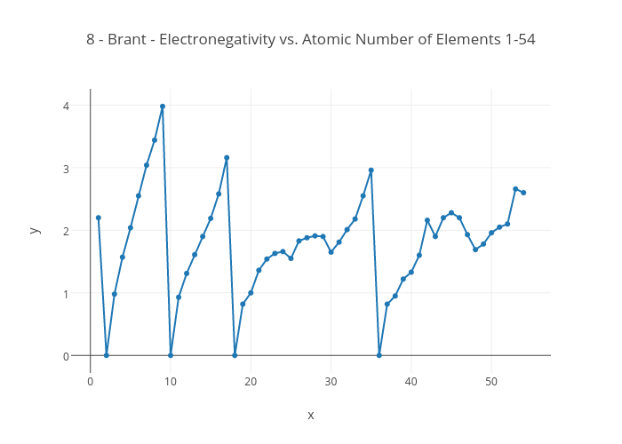

# Periodic Trends

### Definitions:

#### Metal:

An element category that give electrons. The more metallic the character, the more readily they will part with electrons. Typically have large atomic radii, allowing the electrons to be pulled off the atom more easily

#### Non-Metals:

An elemental category that take electrons

#### Metalloids:

In between metals and non metals, these elements can both take and give electrons as the situation demands

#### Atomic Radius:

The half distance between the centre of the two atoms in an atomic homo-dimer. This is the pure covalent definition of atomic radius

#### Ionisation energy:

The minimal energy that is needed to pull the first valence electron from a ==gas phase== atom, making a ==cation==

#### Electron affinity:

The energy released when a neutral atom in the ==gas phase== takes on an electron and forms an ==anion==

#### Electronegativity:

The tendency of an atom to attract a bonding electron

#### Chemical Reactivity:

An indicator of how likely/energetically an atom will react with another species

#### Bond Strength:

The energy needed to break a chemical bond

### Periodic Groups:

* From the left, the S and P groups are numbered first, as IA to VIIIA
* The D block is ordered from IIIB to VIIIB then IB to IIB
  * There are 3 columns in group VIIIB
* The transition metals are those which have D shell valence electrons

## Trends:

### Atomic Radius {: style="width: 30%; "class="right"}

* Atomic radius is the product of both the amount of subatomic particles and of the attractive forces within the atom itself
* As elements get heavier, they increase in mass and therefore in size, however, as the charges get bigger, the forces pulling the atom together get stronger, which makes the atom more compact.
  * This resets after each period however, as the new, larger electron shells will be more shielded and less tightly bound to the nucleus, causing them to exist further away from the centre, increasing the atom's radius

### Ionization energy {: style="width: 30%; "class="right"}

* Since ionisation energy increases as affinity of the electrons to the nuclei increase, the more tightly bound the electrons are, the higher the ionization energ
* The ionization energy trend therefore follows the inverse pattern as the atomic radius{: style="width: 30%; "class="right"}
* As more and more electrons are stripped off, the energy to rip subsequent electrons off increases
  * Progressive electrons are not only more tightly bound by the shape of their orbital, but they also experience greater net forces, due to the progressively increasing net positive charge on the atom
* This trend is also skewed by orbital and spin pairing, making the energies more greater when there are entirely half filled orbitals, e.g. N and P

## Electron Affinity {: style="width: 50%; "class="right"}

* Based on the atomic radius, electron shielding and nuclear charge, when an electron is added to the atom, the closer the electron is to the nucleus, the stronger the attractive force and the  greater the energy released
* Since the shielding of each orbital group is the same (all 2p atoms will be shielded by 1s and 2s electrons), the only other factors at play are atomic radius and nuclear charge, so as nuclear charge increases, so too does the electron affinity 
* Any group that has full valence orbitals cannot take on another electron due to their full configuration and will have a resulting EA of < 0

## Electronegativity {: style="width: 40%; "class="right"}

* Can effectively be summed up as being the net force after shielding has taken place. Whatever positive attractive force the nucleus  has left over for other atoms can be summed up as electronegativity.
* In this vein, electronegativity is a relatively  straightforward trend, where the smaller the atomic radius and the fewer shielding electrons the greater the electronegativity

### Reactivity

#### *Metals*

* Reactivity is based on how readily the atom will give up electrons, as such the lower the ionisation energy the more reactive the species

 

#### *Non-Metals*

* Reactivity is based on how actively the atom will take on electrons and thus is proportional to the electronegativity

 

### Bond Strength

* Strong $>800\:kj\cdot mol^{-1}$
* Average $\sim 500\:kj\cdot mol^{-1}$
* Weak $<200\:kj\cdot mol^{-1}$

* Often depend on the size of the atoms involved, so bond strength gets weaker going down the group

E.g.

| atoms | Bond Strength           |
| ---- | ------------------------|
| HF   | $568\:kj\cdot mol^{-1}$ |
| HCl  | $432\:kj\cdot mol^{-1}$ |
| HBr  | $366\:kj\cdot mol^{-1}$ |
| HI   | $298\:kj\cdot mol^{-1}$ |