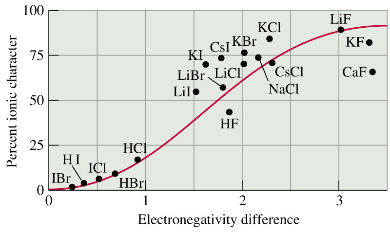

# Ionic Bonding

## Compounds 

* A compound is a **pure** substance that contains **two or more elements** that are **chemically bonded** to each other
  * Can be molecules or ions

## Types of bonds

#### Ionic

* Electrons are transferred from one atom to another and the resulting ions are held together with electrostatic forces
* Typically made from a metal and non-metal
* Are commonly identified as having an electronegativity difference ($\Delta\chi$) of $>2$
* The transfer of electrons is physical as the electrons move from the HOMO of one atom to the LUMO of another

#### Covalent

* The atoms do not take electrons, but instead the electrons sit between the atoms and are shared
	
#### Metallic

* The electrons delocalise and move freely between the interspersed metal atoms

## Ionic Compounds

* Compounds made from metal and non-metal elements are typically ionic
  
* The groups that they're in can tell the resulting formula, e.g. $\ce{CaBr2}$  Calcium is in 2A and needs to get rid of two electrons. Bromine is in group 7A and needs to gain two electrons
  
* Polyatomic ions in a compound makes it an ionic compound, e.g. $\ce{Ba(NO3)2}$

  * The nitrate component is a the nitrate ion $\ce{NO3−}$
  * The $\Delta\chi>2$ rule is not quite accurate, as bonding character is not a cutoff, but instead can vary from strongly covalent to strongly ionic

{: style="width: 50%; "class="center"}