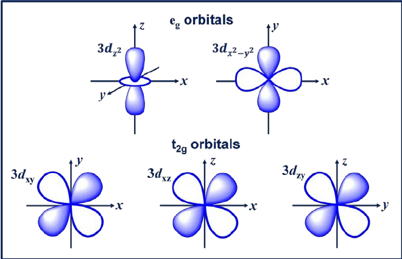
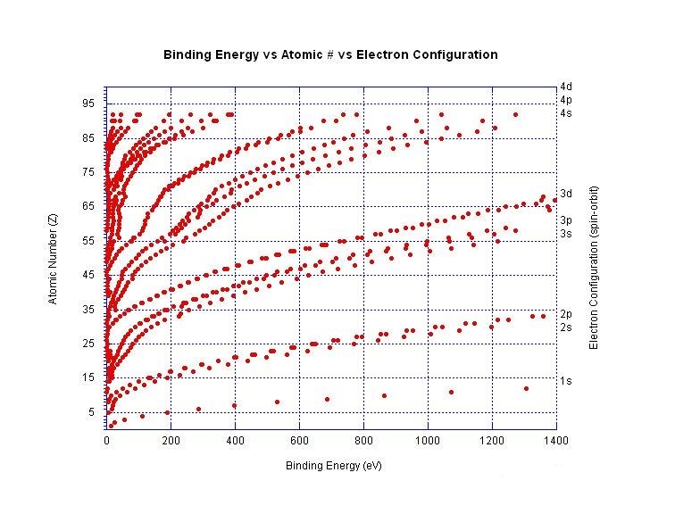
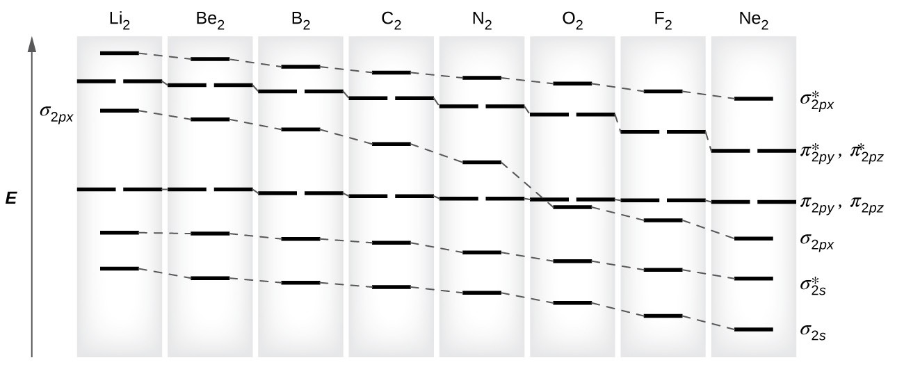
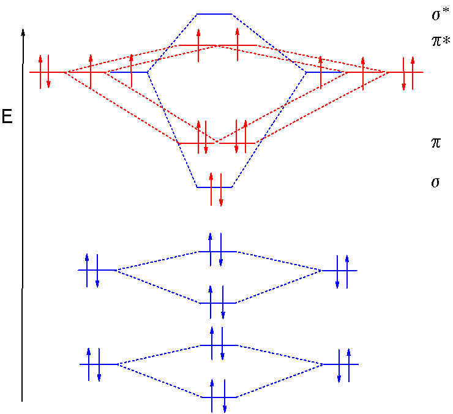
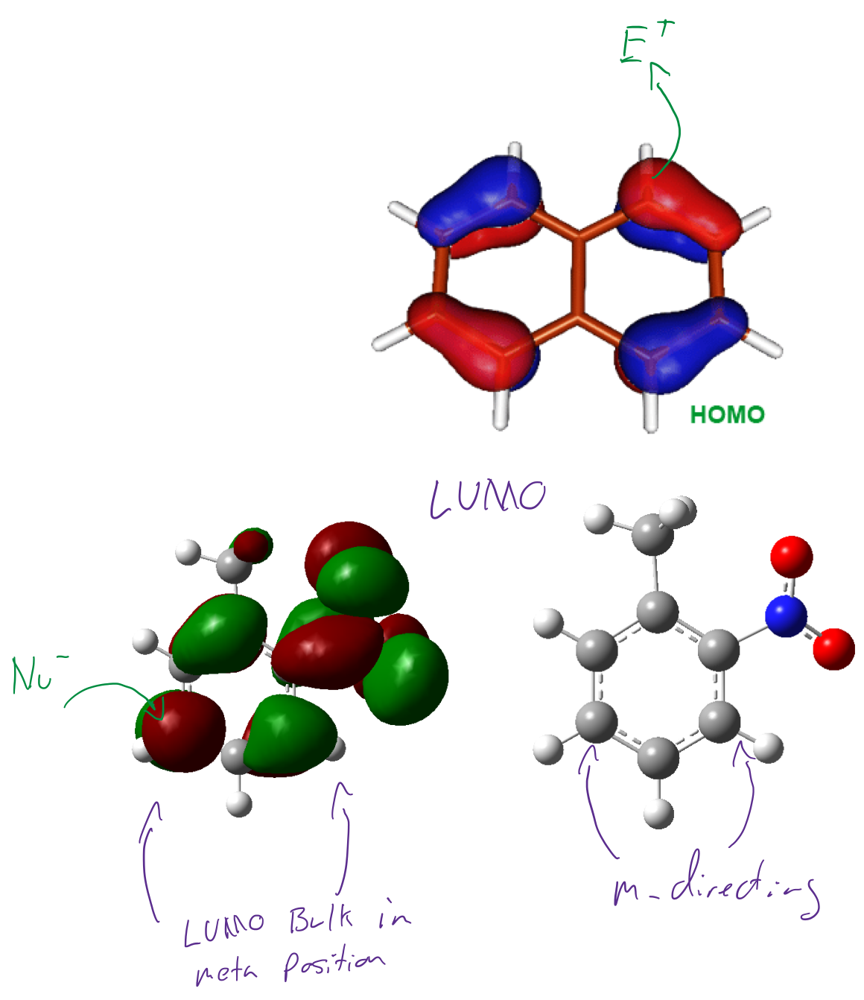

# MO Theory

## Naming orbitals
S and P orbitals are simple: {: style="width: 30%; "class="right"}
* S has no directionality
* P is listed as the plane on which the lobes of the orbital sit

D orbitals are slightly different

* For orbitals with lobes off the axis/nodes on the axis
  * They are named after the axis which they sit across
  * $3d_{xy}$,$3d_{xz}$, and $3d_{xy}$
* For orbitals whose nodes lie on the axis
  * They are named after the axis in which they are on (squared)
  * $3d_{z^2}$  and $3d_{x^2−y^2}$

## When d orbitals collide
* Dealing with planar interacting d orbitals, we introduce the δ bond
* These are found in quadruple bonded species such as $\ce{Re2Cl8}$

## S-P gap {: style="width: 40%; "class="right"}
* As you progress along the periodic table, the gap in energies between s orbitals and p orbitals within an individual atom increases
* This is also why atoms Z<8 have their π orbitals first

{: style="width: 70%; "class="center"}

## Fragment Orbital (FO) energy difference {: style="width: 30%; "class="right"}

* The energy of the bond is $E=\Delta E_s+\Delta E_d$. The bond is stabilised by the energy drop from the atoms to the occupied bonds
* The bond is destabilised by the energy increase of the antibonding from the atomic orbitals
* The bond energy is the difference between these  two 

This energy depends on the amount of orbital overlap, so the difference is greater when there is a greater overlap, as the resulting orbitals interact more greatly 

* Splitting energy: $\sigma>\pi>\delta$
	

$\sigma$ orbitals have greater overlap and thus greater splitting energy than $\pi$ orbitals (as shown in the MO diagram)

## Orbital Hybridisation {: style="width: 30%; "class="right"}
When hybridisation occurs, the result is a series of degenerate orbitals. This process occurs before the actual bonding (in terms of drawing the MO diagram) and any unhybridised orbitals will remain a the same energy level as the original orbital.

## Frontier MO (FMO) theory
* FMO theory describes the integration of nucleophilic and electrophilic species with HOMO and LUMO electron density, rather than with curvy arrows
* The notion here is that sites in the HOMO with higher electron density will be more likely to  react with nucleophilic species
* Likewise, electrophilic reactions will likely happen where the LUMO is the most dense, as it's the next location on the molecule that wants electrons

{: style="width: 100%; "class="center"}
