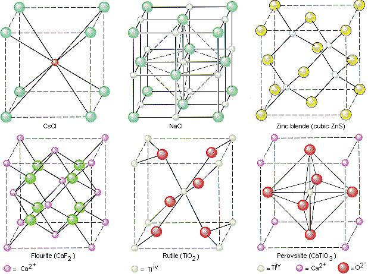
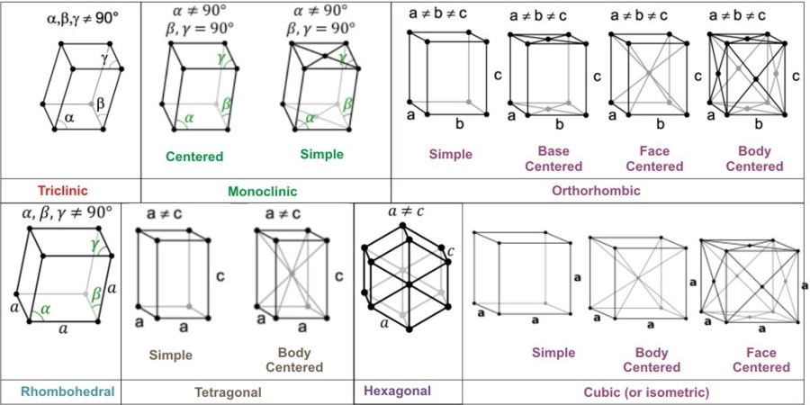
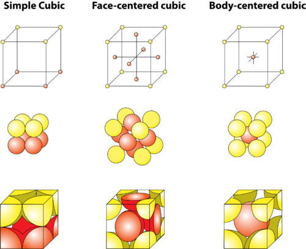

# Solid Metals

 * Form a crystalline lattice structure
 * Form using metallic bonds - electron delocalisation within the lattice matrix

## Solid state physics and materials science

 * We need to understand structural chemistry as the structure of molecules determines its function
 * We can characterise  solids using various methods
   * XRPS/XRD
   * Electron microscopy
   * Thermal analysis
   * Spectroscopy
   * Conductivity characterisation
   * Etc..
 * In understanding the properties we can tune them, such as:
   * Magnetism
   * Conductivity
   * Sorption
   * Luminescence
   * Defects - point, dislocation, grain boundaries
    * Doping to produce strategic defects
 * We can also synthesise such products using:
   * Hydrothermal synthesis, soft chemistry and physical manipulation of the environment

## Categories of solids

 * Crystalline solids are periodic systems, consisting of a unit cell, repeated over and over
   * They pack in a continuous pattern, occasionally with defects
 * Amorphous solids have little, if any long range order
 * Polycrystalline Solids are an aggregate of smaller crystalline grains, or fragments that pack together in a random fashion

## Atoms as spheres
 * Atoms can be simplified to be treated as spheres, for purposes of packing efficiency and bonding properties
 * The definition of the bond length is based on the type of bond it forms
   * The general form is that the radius is half the bond length between two atoms of the same type

## Structure
**Lattice**

 * Is the mathematical descriptor of the symmetry of the components of the un it cell
 * E.g. Simple cubic, body centred cubic, face centred cubic

**Motif**

 * Is the specific atoms/molecules that are placed on each of the points as defined by the lattice

**Unit Cell** {: style="width: 30%; "class="right"}

 * Is the 3D translational structure (the grid) that forms the overall periodic structure
 * How to move the components of the cell to make the overall lattice (translational vectors)

**Coordination number** 

 * Is the amount of atoms that any atom is coordinated with
 * How many atoms are there to coordinate a stable structure
 * Can be defined as "the number of nearest neighbours"

{: style="width: 70%; "class="center"}

**Structures of unit cells**

 * These are  defined by the equivalence of angles and lengths

| Crystal  System | Restriction  Axis | Restriction  Angles |
| --------------- | ----------------  | ------------------- |
| Triclinic       | -                 | -                   |
| Monoclinic      | -                 | $\alpha=\gamma=90^\circ$ |
| Orthorhombic    | -                 | $\alpha=\beta=\gamma=90^\circ$ |
| Tetragonal      | $a=b$             | $\alpha=\beta=\gamma=90^\circ$ |
| Trigonal        | $a=b$             | $\alpha=\beta=90^\circ,\:\gamma=120^\circ$ |
| Hexagonal       | $a=b$             | $\alpha=\beta=90^\circ,\:\gamma=120^\circ$ |
| Cubic           | $a=b=c$           | $\alpha=\beta=\gamma=90^\circ$ |

## Structure of metals

{: style="width: 50%; "class="center"}

 * In this unit we'll only really cover the structure of metals, within a cubic system
 * Metal crystals are simple since they don’t deform too much, so a spherical approximation can be made
 * All of them crystallise into one of four basic structures
   * Simple Cubic (SC) (Lattice type P)
     * $52\%$ packing efficiency
     * Contains one atom $8\frac{1}{8}$
     * Coordination number of $6$
		
   * Body Centred Cubic (BCC) (Lattice type I)
     * $68\%$ packing efficiency
     * Contains two atoms $\big(8\frac{1}{8}\big)+1$
     * Example elements (STP) - Li, Na, K, Ba, Rb, V, Cr, Fe
     * Coordination number $8$
		
   * Cubic Closest Packed (CCP) or Face Centred Cubic (FCC) (Lattice type F)
     * $74\%$ packing efficiency
     * Contains $4$ atoms $\big(8\frac{1}{8}\big)+\big(6\frac{1}{2}\big)$
     * Example elements - Al, Cu, Au, Ir, Pb, Ni, Pt, Ag
     * Coordination number $12$
		
   * Hexagonal Closest Packed (HCP)

## Packing Efficiency

 * This is a metric of how much space is left between the atoms when packing them together
 * They are simple to calculate, given a single parameter, utilising Pythagoras' theorem
 * The basic formula is:

$$
\frac{[\text{total number of atoms}][\text{atomic volume}]}{[\text{Unit cell volume}]}
$$

