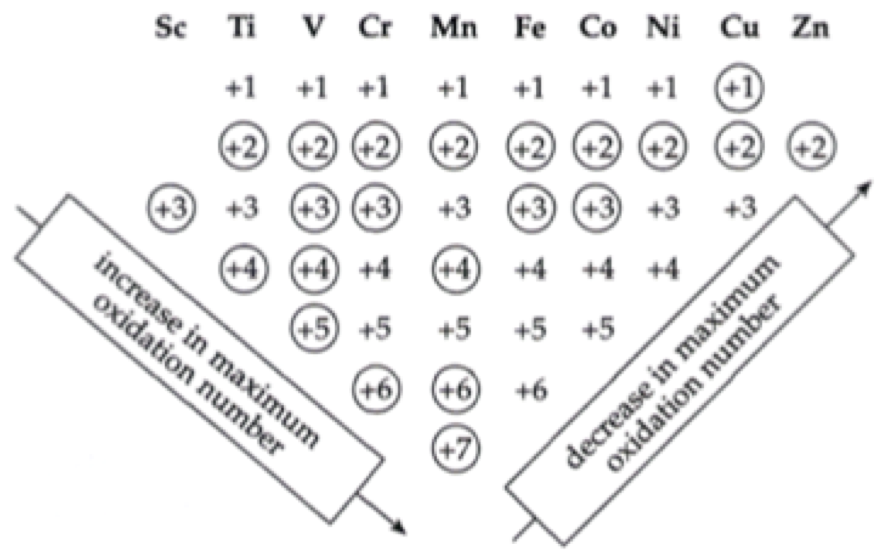

# Transition Metals and Complexes

* Transition metals are defined by their many d orbitals that can be filled and configured in many different ways.
  * This gives rise to many different properties, oxidations states, and stable ions
  * Through the formation of complexes, they also tend to create highly coloured species

## Physical properties

* Transition metals tend to have similar properties, due to their relatively small difference in Zeff
  * Leads to  similar ionisation energies, atomic radii and ionic radii

## Oxidation states

* Possible oxidation states of a transition metal are based on their electronic configuration
  * Namely, how  many electrons they can stably lose to form a cation
* The s electrons will likely be removed before any of the d electrons (as per $V^{2+}$)
* An s electron will likely be promoted to complete the d orbitals (as per $Cr$)

E.g. 

$\hskip{1cm}Sc=[Ar]\:4s^2\:3d^1$

$\hskip{1cm}Ti=[Ar]\:4s^2\:3d^2$

$\hskip{1cm}V=[Ar]\:4s^2\:3d^3\hskip{2cm}V^{2+}=[Ar]\:4s^0\:3d^3$

$\hskip{1cm}Cr=[Ar]\:4s^1\:3d^5$

 
E.g. Manganese can form a $+7$ ion when it loses all of its $d$ and $s$ electrons

* +6 refers to $4s^0\:3d^1$  
* +4 refers to $4s^0\:3d^3$
* +2 refers to $4s^0\:3d^5$  which is stable due to it's complete d orbitals and has only lost the $4s$ electrons

{: style="width: 50%; "class="center"}
		
## Complexes

* Transition metals often form complexes with ligands that have lone pair electrons (Lewis bases)

* The lone pair electrons on the ligands occupy and hybridise higher angular momentum ($l$) orbital
  * Though this theory is considered obsolete
