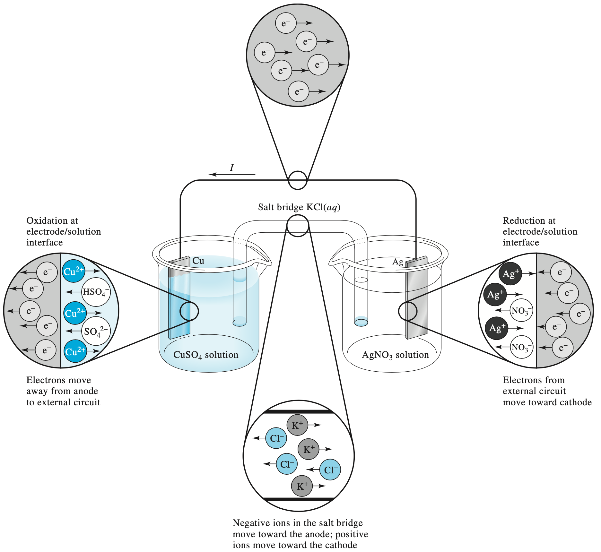
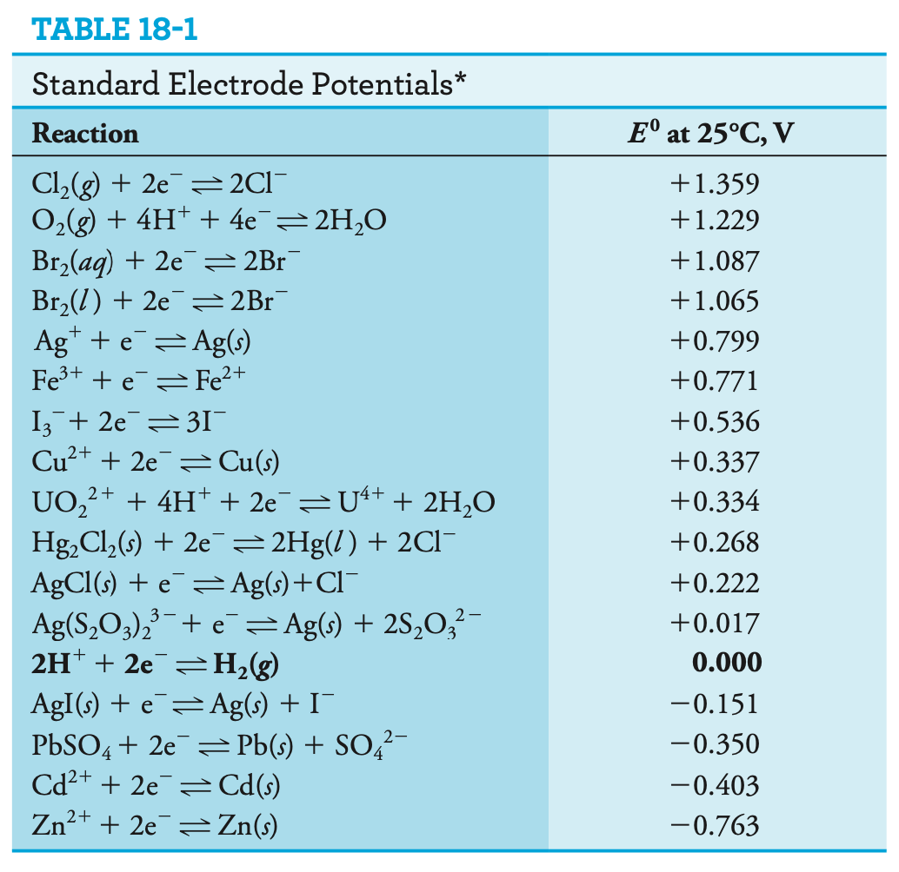
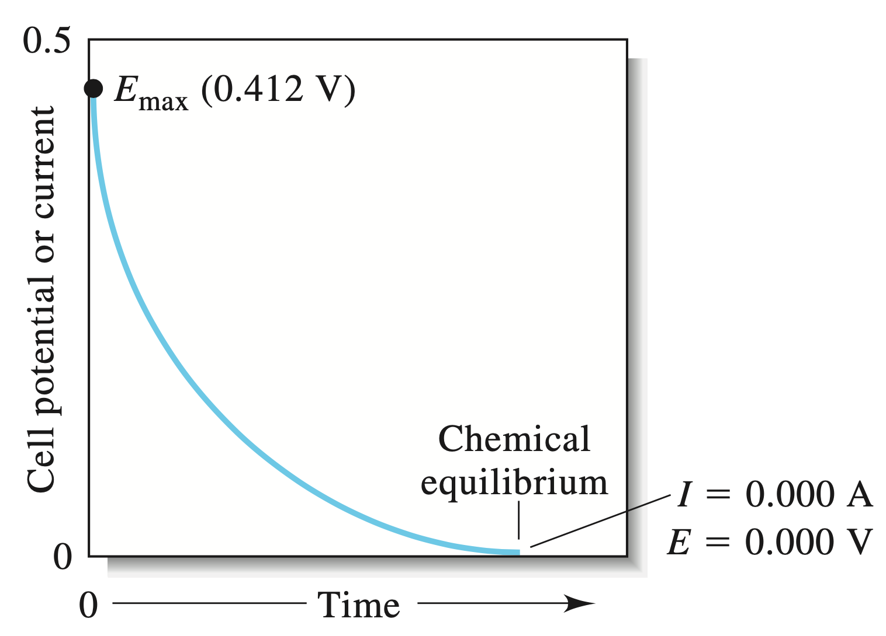
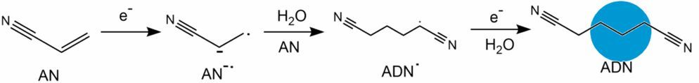
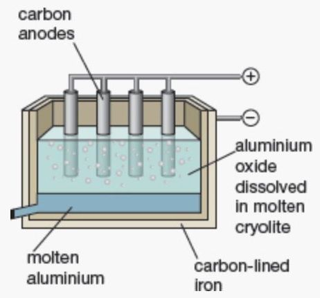
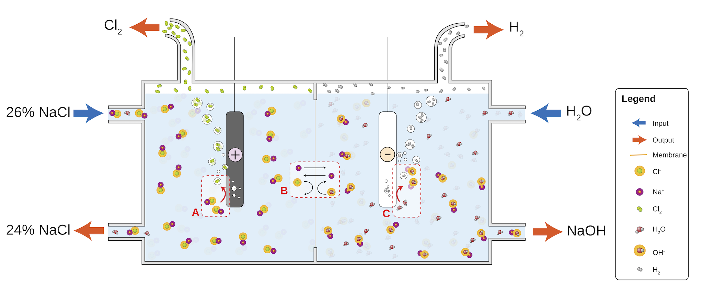

# Electrochemical Cells

## Faraday's Constant

Relates fundamental atomic charge to a mole of substance

$$
Q=zFn
$$

* $Q=$ amount of charge ($C$)
* $z=$ ionic charge of each molecule
* $F=$ Faraday's constant ($96485\:C\cdot mol^{-1}$)
* $n=$ the amount of substances ($mol$)

## Electrochemical cells (Galvanic)

A galvanic cell is made up of two half cells connected by a salt bridge. As one cell is reduced, the other is oxidised, with the salt bridge and wire allowing for electrons to flow between the two.

# {: style="width: 60%; "class="center"}

As we can see in the above figure, the process is all about flow of electricity carriers through the system

## Electrochemical Potential

When the half-cells are in their reference state then the electrochemical potential is just the difference between the standard reduction potentials ($E^0$) for the two half reactions:

$$
E^0_{cell}=E^0_{reduction}-E^0_{oxidation}
$$

The reference state for a solute in solution has an activity of 1 (this is related to its molar concentration) and is measured at $1\:M,\:1\:atm,\:25^\circ C$.

The ionisation of $\ce{H2}$ is defined as $E^0=0$. The lower the standard potential, the more likely it's going to be involved in oxidation. The higher, the more likely the reaction will be involved in reduction.

{: style="width: 50%; "class="center"}

## Nernst Equation

When the standard state conditions don't apply, we can use the Nernst equation to calculate the new potential:

$$
E=E^\circ-\frac{RT}{|z|F}\ln Q=E^\circ-\frac{0.0592}{|z|}\log Q
$$

* $E^0=$ standard reduction potential
* $R=$ gas constant
* $T=$ temperature ($K$)
* $|z|=$ ionic charge of the species
* $F=$ Faraday's constant ($96485\:C\cdot mol^{-1}$)
* $Q=\frac{[products]}{[reactants]}=\frac{[reduced]}{[oxidised]}$ 
  * These should be the activity ratio but molar concentrations are used without too much error

We write a cell as such

$$
\ce{Cu_{(s)}}|CuCO4_{(aq,\:0.02\:M)}||AgNO3_{(aq,\:0.02\:M)}||Ag_{(s)}
$$

Which would have the two half cell reactions of:

$$
\begin{align}
\ce{Cu&->Cu^{2+} + 2e-}\\
\ce{Ag+ + e- &-> Ag}
\end{align}
$$

!!! info "Example 1 - Calculate the potential of the cell above  with the conditions specified"
	
	$$
	\begin{align}E_{cell}&=E_{reduction}-E_{oxidation}\\
	&=\bigg(E^0_{\ce{Ag+/Ag}}-\frac{0.0592}{|z|}\log\frac{1}{[\ce{Ag+}]}\bigg)-\bigg(E^0_{\ce{Cu^{2+}/Cu}}-\frac{0.0592}{|z|}\log\frac{1}{[\ce{Cu^{2+}}]}\bigg)\\
	&=\bigg(+0.799-\frac{0.0592}{1}\log\frac{1}{[0.02\:M]}\bigg)-\bigg(+0.337-\frac{0.0592}{2}\log\frac{1}{[0.02\:M]}\bigg)\\
	&=+0.412V
	\end{align}
	$$

Balancing the redox reaction gives us the *spontaneous* overall reaction, but we don't actually need to account for this, since the electrons transferred isn't accounted for in the Nernst equation.

## Measuring a potential

When the conditions don't match the reference state, we need to measure the half cell against the standard hydrogen electrode (SHE), with $Q=1$

This is known as the formal potential $E^{0}{'}$ as is only applicable for the specific conditions in which it was measured.

E.g. $\ce{Ag+/Ag}$

* $E^0=+0.799\:V$
* $E^{0}{'}_{(1\:M\:\ce{HClO4})}=+0.792\:V$

This is more important if the components have acid/base properties

E.g. $\ce{Fe(CN)_6^{3-}/Fe(CN)6^{4-}}\hskip{1cm}$ *($\ce{Fe(CN)6^{4-}}$ is the stronger base)*

* $E^0=+0.36\:V$
* $E^{0}{'}_{(1\:M\:\ce{HClO4})}=+0.72\:V$

## Letting it Run

When we let the cell run with a small load, the cell will decrease in potential over time (according to half-life kinetics), until it reaches chemical equilibria.

{: style="width: 40%; "class="center"}

## Applications of Galvanic Cells

### Thermodynamics of Galvanic Cells

We can relate the potentials of the cell back the thermodynamic state functions, as such

$$
\begin{align}
\Delta G^0&=-|z|FE^0\\
\Delta S^0&=|z|F\frac{dE^0}{dT}\\\Delta H^0&=|z|FT^2\frac{d}{dT}\bigg(\frac{E^0}{T}\bigg)
\end{align}
$$

That is an effective way of measuring the state functions of ions that would otherwise be difficult to calculate.

| Neutrals | $\Delta_f G^p\:(kJ\cdot mol^{-1})$ | Cations | $\Delta_f G^p\:(kJ\cdot mol^{-1})$ | Anions | $\Delta_f G^p\:(kJ\cdot mol^{-1})$ |
| ----------------------- | :--------------------: | --------------------- | :-----: | ------------------------------------------------------------ | :-----: |
|$\ce{AgCl_{(s)}}$| -109.59                | $\ce{Ag+_{(aq)}}$     | 77.08   | $\ce{Cl-_{(aq)}}$ | -131.02 |
| $\ce{CaCO3_{(s)}}$      | -1128.79               | $\ce{Ca^{2+}_{(aq)}}$ | -553.57 | $\ce{CO3^{2-}_{(aq)}}$                              | -527.82 |
| $\ce{CO2_{(g)}}$        | -394.38                | $\ce{Cd^{2+}_{(aq)}}$ | -77.65  | $\ce{Fe(CN)6^{3-}_{(aq)}}$                         | 729.4   |
| $\ce{CO2_{(aq)}}$       | -386.2                 | $\ce{Cu^{2+}_{(aq)}}$ | 65.7    | $\ce{Fe(CN)6^{4-}_{(aq)}}$                           | 695.08  |
| $\ce{H2O_{(l)}}$        | -237.13                | $\ce{Fe^{2+}_{(aq)}}$ | -78.9   | $\ce{I-_{(aq)}}$           | -51.65  |
| $\ce{H2S_{(aq)}}$       | -27.84                 | $\ce{Fe^{3+}_{(aq)}}$ | -4.5    | $\ce{I3-_{(aq)}}$                                       | -51.48  |
| $\ce{PbCl2_{(s)}}$      | -313.94                | $\ce{Mn^{2+}_{(aq)}}$ | -228.1  | $\ce{OH-_{(aq)}}$ | -157.24 |
| $\ce{PbO2_{(s)}}$       | -218.96                | $\ce{Zn^{2+}_{(aq)}}$ | -147.19 | $\ce{S2-_{(aq)}}$                                          | 86.34   |

## Potentiometry

If we know about the composition of one half cell, we can use the Nernst equation to determine the concentrations of the other half cell. The cell that is stable is the reference electrode and the cell that changes is the indicator electrode.

$$
E=E^\circ-\frac{0.0592}{|z|}logQ
$$

## Liquid Junction Potentials

??? info "For a better description"
	
	
<iframe width="560" height="315" src="https://www.youtube.com/embed/qQoDML0miVg" frameborder="0" allow="accelerometer; autoplay; encrypted-media; gyroscope; picture-in-picture" allowfullscreen></iframe>

In a salt bridge, there is typically a porous membrane that allows for the separation of two solutions of differing concentration. Diffusion will mean that the electrolytes in the high concentration solution will migrate to the low concentration region.

{: style="width: 50%; "class="center"}

 This is based on the [ion mobility](../01a/#mobility) and means that faster ions will migrate faster than slow ions across the junction, causing a potential difference ($E_j$). The junction potential will factor in to our cell and the Nernst equation is no longer accurate.

$$
E_{cell}=E_{reduction}-E_{oxidation}+E_j
$$

## Electrodes

Potentiometric electrochemical cells can be described as **Reference||Indicator** and has a potential of $E_{cell}=E_{ind}-E_{ref}+E_j$.

The ideal reference electrode has a stable potential, so that any change to $E_{cell}$ is directly related to $E_{ind}$, and is easy to use and maintain.

## Reference Electrodes

### Standard Hydrogen Electrode (SHE) - $E_{SHE}=0.000V$ {: style="width: 30%; "class="right"}

The SHE is used as a reference against which all other reduction potentials are measured and takes the form $\ce{2H+_{(aq)} + 2e- <=> H2_{(g)}}$. It isn't often used for experimental work, as it's difficult to prepare and inconvenient to use.

  

### Saturated Calomel Electrode (SCE) {: style="width: 30%; "class="right"}

Based on the reaction $\ce{Hg2Cl2_{(s)} + 2e- <=> 2Hg_{(l)} + 2cl-_{(aq)}}$, The SCE uses a saturated $\ce{KCl}$ solution ($\sim4.6\:M$) to provide the maximum $[\ce{Cl-}]$. This is because the potential is given by the equation:

$$
E=E^\circ_{\ce{Hg2Cl2/Hg}}-\frac{0.0592}{|z|}log[\ce{Cl-}]^2
$$

It takes on the form $\ce{Hg_{(l)}|Hg2Cl2,KCl}$ 

### Silver/Silver Chloride Electrode {: style="width: 20%; "class="right"}

Based on the reaction $\ce{AgCl_{(s)} + e- <=> Ag_{(s)} + cl-_{(aq)}}$, The electrode can use a saturated $\ce{KCl}$ solution, but more commonly uses a $3.5\:M$ solution since the electrode can be used over a greater range of temperatures than the SCE. The potential is given by the equation:

$$
E=E^\circ_{\ce{AgCl/Ag}}-0.0592\log[\ce{Cl-}]
$$

It takes on the form $\ce{Ag_{(s)}|AgCl,KCl}$ 

## Indicator Electrodes

The potential of the indicator electrode is dependent on the concentration of the analyte. An ideal indicator electrode will rapidly and reproducibly respond to changes in concentration.

there are two types of indicator electrode; metallic and ion-selective.

## Electrolytic Cells

When an external current is applied to the cell, then the flow of the current can be reversed, as will the half-cell processes. The generation of chemicals by electrolysis in an electrolytic cell is known as electrosynthesis. This is particularly useful when trying to encourage a reaction that has a $+ve\: \Delta G$.

The electrolytic extraction of metal from ore is called **electrowinning**, when the metal is purified, it's called **electrorefining** and using electrolytic processes to deposit metal on a surface, it's called **electroplating**.

### Electrosynthesis of adiponitrile

Electrolytic methods are involved in the production of nylon that converts acrylonitrile to adiponitrile

$$
\ce{2(H2C=CH-C#N_{(aq)}) + 2H+_{(aq)} + 2e- -> (H2C-CH2-C#N)2_{(aq)}}
$$

{: style="width: 60%; "class="center"}

### Electrowinning of aluminium{: style="width: 20%; "class="right"}

The electrolyte is molten cryolite ($\sim1000^\circ C,\:\ce{Na3AIF6}$) that contains aluminium ore ($\ce{Al2O3}$). The reaction is $\ce{2Al2O3 + 3C -> 4Al + 3CO2}$ which produces molten aluminium that sinks to the bottom of the tank and can be easily drained off.

  

### Chloroalkali Process

Incredibly useful because it converts brine into commodity products such as $\ce{Cl2, H2, NaOH, NaClO,}$ and $\ce{HCl}$. 

The brine is concentrated to $\sim7\:M$ and  the chloride is oxidised to chlorine gas ($\ce{2Cl- -> Cl2 + 2e-}$). The $\ce{Na+}$ passes through an ion selective membrane, where water is reduced to hydrogen gas and sodium hydroxide:

$$
\ce{2H2O + 2e- -> H2 + 2OH-}
$$

The products can be combined and further processed, such as hypochlorite production:

$$
\ce{Cl2 + 2OH- -> Cl- + ClO- +H2O}
$$

The Anode ($+ve$) is made of titanium metal, and the cathode ($-ve$) is made of nickel metal.

{: style="width: 60%; "class="center"}
