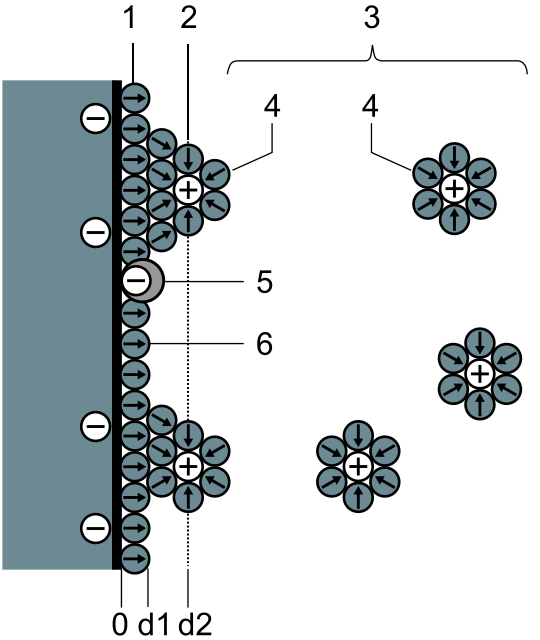
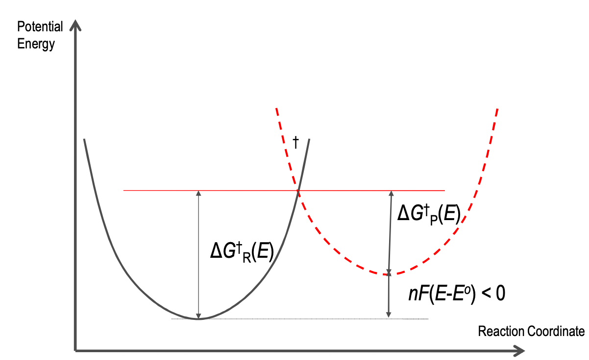
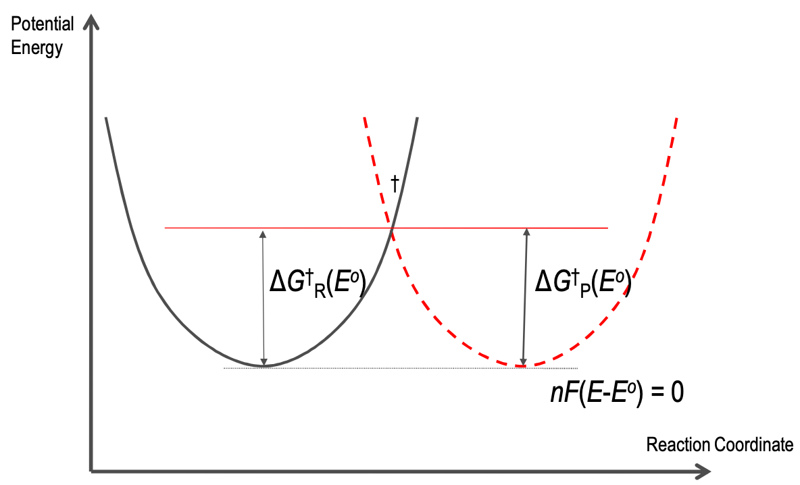
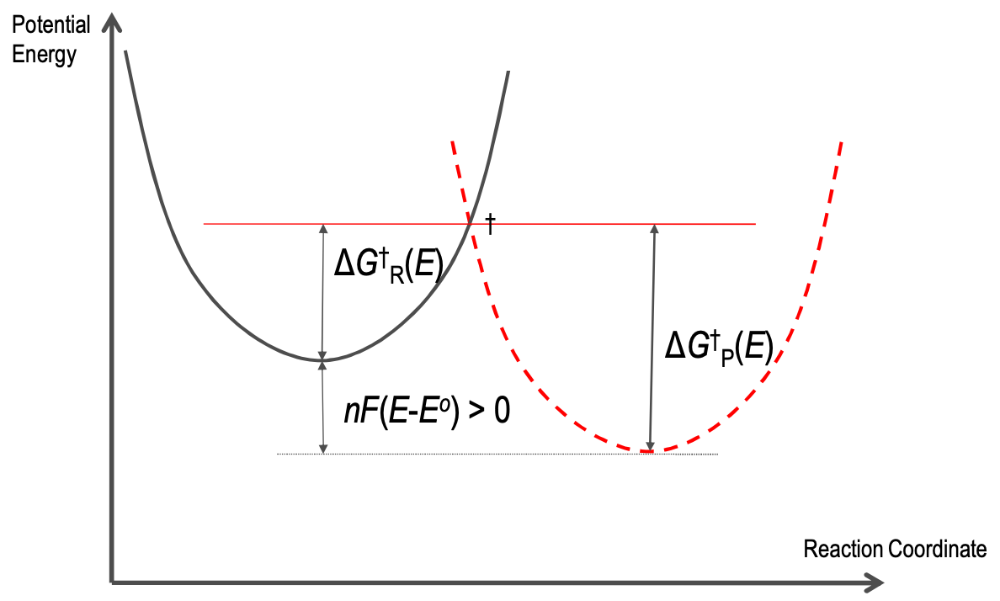
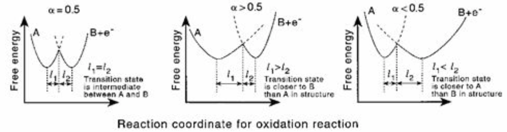
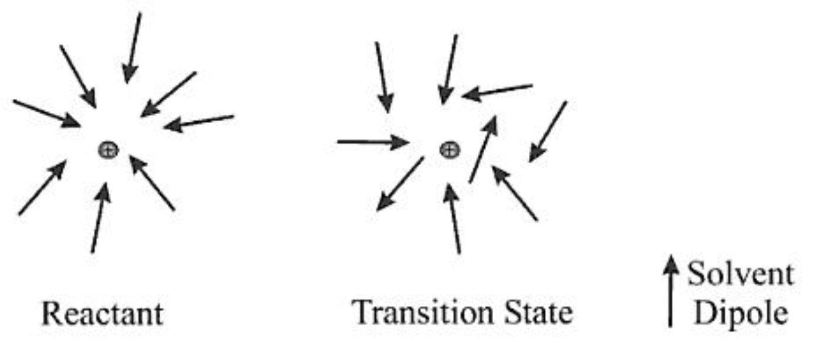
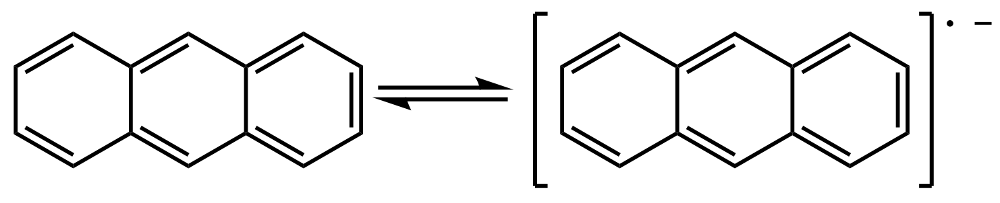
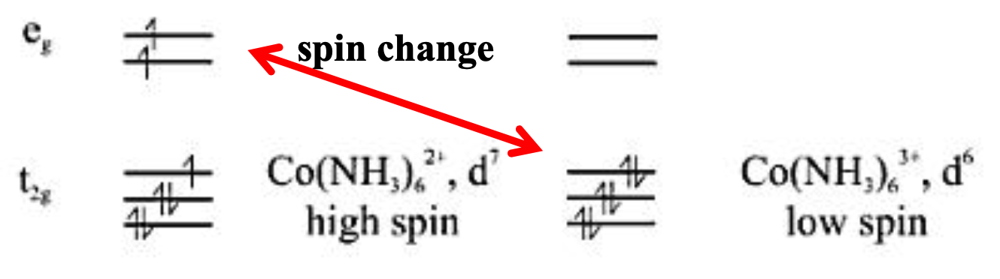
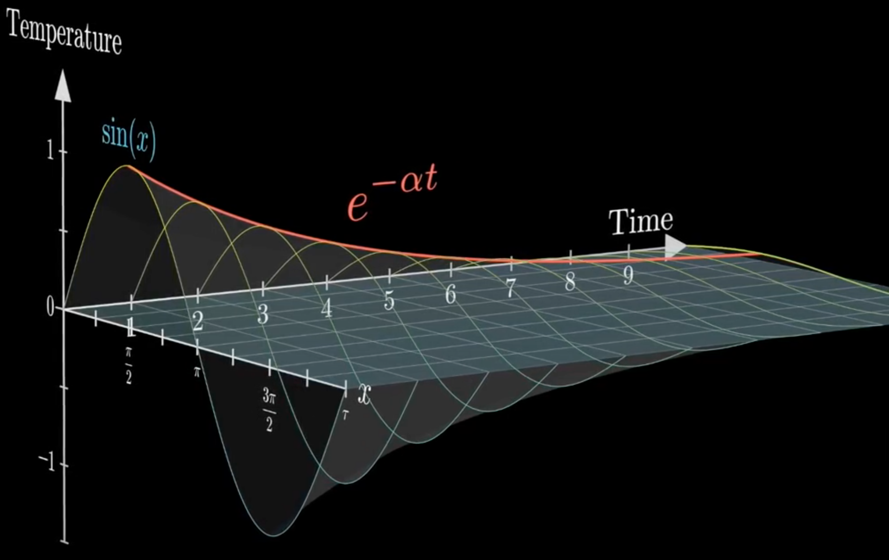

# Electrode Processes

It's a simplistic view to just think of ions being reduced and oxidised at the surface of the electrode, when in reality we need to consider the kinetics and dynamics of the process.

## Double Layer

{: style="width: 30%; "class="right"}

We also need to consider that there is a double layer of ions on the electrode surface, just like with any surface chemistry

This consists of:

* A compact layer of adsorbed ions and solvent, called the Helmholtz plane (1 is this inner plane, 2 is the outer plane in the figure to the right)
* A diffuse layer that contains an excess of counterions to the surface of the electrode. This layer has an increase in counter-ions and decrease in co-ions.

Electron transfer happens at  the outer Helmholtz plane (2 - in the figure to the right)

## Electron Transfer

It's important to consider the structural/geometric differences between different oxidation states of the same atom.

E.g., $\ce{Fe(H2O)6^{2+} -> Fe(H2O)6^{3+} + e-}$

* $\ce{Fe^{2+}-O}$ bond  length $=2.21\:\AA$
* $\ce{Fe^{3+}-O}$ bond  length $=2.05\:\AA$

## Franck-Condon Principle

Just like in IR spectroscopy, we can consider the Franck-Condon principle of the PES to determine where our transition state will occur, by looking at the appropriate transition state ($\dagger$) of the two oxidations states.

The electron transfer will only occur when the thermal vibrational states of the products and reactants are overlapping in the right way to allow the (almost instantaneous) electron transfer to occur.

### Features of the PES interaction

* The "nuclear configuration" in this case is the $\ce{Fe-O}$ bond length.
* The intersection of the two PES is $\dagger$
  * This occurs at a $\ce{Fe-O}$ bond length somewhere between the product and reactant energy minima.
* Given that the electron transfer won't happen at the energy minima, there is  a certain level of thermal activation required
  * After the electron transfer occurs, the excess thermal energy is lost through interactions with the solvent.
* The energy distance from $E_{\nu=0} \to E^\dagger$ is the activation energy of the system ($E_{act}$)
  * An increase in $\Delta_{act}$ results in a decrease in the rate of the electron transfer.

{: style="width: 50%; "class="center"}

The intersection of the PES of the product and the reactants, denoting the transtiions state ($\dagger$)

* $E_{act}-E_{\nu=0}$ gives us $\Delta G^\dagger$. If the product is more stable than the reactant $\Delta G_P<\Delta G_R$, then the reactant is going to be favoured  over the products.

{: style="width: 30%; "class="left"}{: style="width: 30%"}{: style="width: 30%; "class="right"}

$E < E_0$ (left) $\hskip{2cm}E=E_0$ (center) $\hskip{2cm}E>E_0$(right)

## Reaction Rates

Using a value ($\alpha$) called the charge transfer coefficient, we can determine the kinetic rate at a non-standard potential, based on the kinetic rate at the standard potential:

$$
\begin{align}
k_R(E)&=k^\circ \exp{\bigg(\frac{-\alpha nF}{RT}(E-E^\circ)\bigg)}\\
k_P(E)&=k^\circ \exp{\bigg(\frac{(1-\alpha) nF}{RT}(E-E^\circ)\bigg)}
\end{align}
$$

### Charge Transfer Coefficient

$\alpha$ reflects the  slope of the PES  at the intersection point, It's also known as the symmetry factor:

{: style="width: 50%" class="center"}

$\alpha$ is also potential dependent ($\lambda$ is the reorganisation energy, read ahead):

$$
\alpha=\frac{1}{F}\frac{\partial\Delta G^\dagger(E)}{\partial E}=\frac{1}{2}+\frac{F(E-E^0)}{2\lambda}
$$

As a result, $\alpha$ should $=0.5$ when $E-E^0$ or $\lambda$ is large

## Contribution to $\Delta G^\dagger$

Marcus Theory describes how the activation energy (barrier) of the system is dependent on the reorganisation energy ($\lambda$):

$$
\Delta G^\ddagger=\frac{\lambda}{4}\bigg(1+\frac{\Delta G^{\circ\prime}}{\lambda}\bigg)^2\\
$$

The reorganisation energy has two components:

* $\lambda_i=$ the inner contribution, from the reorganisation of $R$ to form $R^\dagger$
* $\lambda_o=$ the outer contribution which comes from the reorganisation of the solvent, as the ion changes its configuration

### Inner Reorganisation energy

Is in principle the sum of the normal vibrational modes of the PES:

$$
\lambda_i=\sum_j\frac{1}{2}k_j(q_{R,j}-q_{P,j})^2
$$

However this is not typically calculated as the force constants ($k$) and the displacements ($q$) are not well known.

### Outer Reorganisation energy

The outer reorganisation energy is based on how the solvent changes it's organisation networks and dipoles to solvate the transition state.

{: style="width: 30%" class="center"}

This can be described by the dielectric continuum model, where $R$ is the distance between the electrode surface and the reactant, and $\varepsilon_{op}$ is the optical permittivity (the permittivity of the solid electrode - the probability of photon absorption):

$$
\lambda_o=\frac{e^2}{8\pi\varepsilon_0}\bigg(\frac{1}{r}-\frac{1}{R}\bigg)\bigg(\frac{1}{\varepsilon_{op}}-\frac{1}{\varepsilon_{s}}\bigg)
$$

## Electron transfer rate

For the general reaction $\ce{Ox + e- <=>[k^o] Red}$, if $k^o$ is large then there's not much difference between the two oxidation states.

| Reaction                                                     | $k^0$ ($cm\cdot s^{-1}$) |
| :----------------------------------------------------------- | :----------------------: |
| {: style="width: 150px" class="left"} | $4$                |
| $\ce{MnO4- + e- <=> MnO4^{2-}}$                              | $0.2$                    |
| $\ce{Fe(CN)6^{3-} + e- <=> Fe(CN)6^{4-}}$                    | $0.1$                    |
| $\ce{Fe(H2O)6^{3+} + e- <=> Fe(H2O)6^{2+}}$                  | $7\times10^{-3}$  |
| $\ce{V^{3+} + e- <=> V^{2+}}$                                | $4\times10^{-3}$  |
| $\ce{Eu^{3+} + e- <=> Eu^{2+}}$                              | $3\times10^{-4}$  |
| $\ce{Co(NH3)6^{3+} + e- <=> Co(NH3)6^{2+}}$                  | $5\times10^{-8}$ |

### Anthracene

 Anthracene's transition is so fast because there is little overall change to the transition species:

* The radical electron is delocalised in the $\pi$ system
* The bond lengths and angles don't change
* There are very minor differences in solvation ($\lambda_o$)

### $\bf{\ce{Fe(H2O)6^{3+} + e- <=> Fe(H2O)6^{2+}}}$

The slow  transfer rate indicates that there are structural changes that are occurring. While both at octahedral, as stated before, the $\ce{Fe-O}$ bond length changes ($2.21\to2.07\:\AA$) which results in significant changes to both $\lambda_i$ and $\lambda_o$ 

### $\bf{\ce{Co(NH3)6^{3+} + e- <=> Co(NH3)6^{2+}}}$

The VERY slow transfer rate here indicates that the electron transfer isn't structural, but configurational. Both species are octahedral, however  we have spin changes occurring in this transfer. It turns out that this transfer is also spin forbidden.

{: style="width: 40%" class="center"}

## Transport Through Solution

The movement of solutes in solution is quantified on the basis of flux density ($j_i$) in units $mol\cdot (m^2\cdot s)^{-1}$. this can be thought of as the number of solutes ($N_i$) that cross a particular area in a certain amount of time:

$$
J_i=\frac{1}{A}\frac{dN_i}{dt}
$$

Flux transports are directional, that is that if $j_i>0$, then it's moving away from the electrode, and if $j_i<0$ it's moving towards it.

This rate is also concentration specific, so to relate it, we use:

$$
\frac{\partial c}{\partial t} = -\frac{\partial j}{\partial x}
$$

## Modes of Mass Transport

There are three ways that the ions will move through the solution:

* Migration - due to electrostatic effects
* Diffusion, results from concentration gradients that occur at the electrode surface, as $P\to R$. This will naturally lead to convection after about 200 seconds
* Convection - occurs when stirring or flowing conditions are present

### Migration

Migration occurs as there is a difference in potential between two points (an electric field)

$$
j_i^{mig}=-\frac{Z_i}{|Z_i|}u_ic_i\frac{d\phi}{dx}
$$

Since electroneutrality must be maintained and since the fields in solution that exist will influence both cations and anions, the flux densities of all the ions are coupled.

This has the effect of creating concentration gradients in solution that will diffuse. Migration does not typically happen without diffusion. 

### Diffusion

Driven by the difference in concentration between two points in solution (Ficks's first law), where $D_i$ is the diffusion coefficient

$$
j_i^{diff}=-D_i\frac{\partial c_i}{\partial x}
$$

When combined with the conservation law, we get Fick's second law:

$$
\frac{\partial c_i}{\partial t}=-\frac{\partial}{\partial x}\bigg(-D_i\frac{\partial c_i}{\partial x}\bigg) = D_i\frac{\partial^2c_i}{\partial x^2}
$$

It's a differential equation that will tend towards a constant value over time

{: style="width: 50%" class="center"}

#### Diffusivity

We can relate the diffusion to the mobility of a charged particle using the Nernst-Einstein equation:

$$
u=\frac{zF}{RT}D
$$

And we can see through the Stokes-Einstein equation how diffusivity is dependent on the medium but not the charge on the charge of the particle:

$$
D=\frac{k_BT}{6\pi\eta r}
$$

### Convection

The driving force behind convection is a pressure difference between two points (Poiseuille's law), where $v_i$ is the velocity, $c_i$ is the concentration and $p$ i the pressure

$$
j_i^{conv}=v_xc_i=-\frac{Ac_i}{8\pi\eta}\frac{dp}{dx}
$$

Uniform pressure gradients don't give rise to uniform flux densities. 

When in a tube, there is a drag force that causes the flow to be uneven. We get a parabolic flow profile across the cross section of the tube.

Small $dp/dx$ results in laminar flow and large $dp/dx$ results in turbulent flow