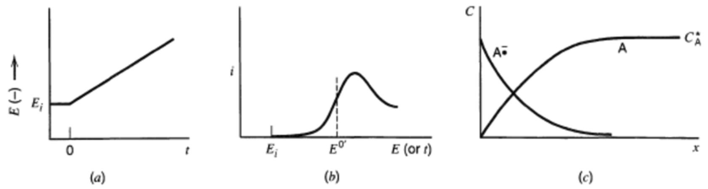
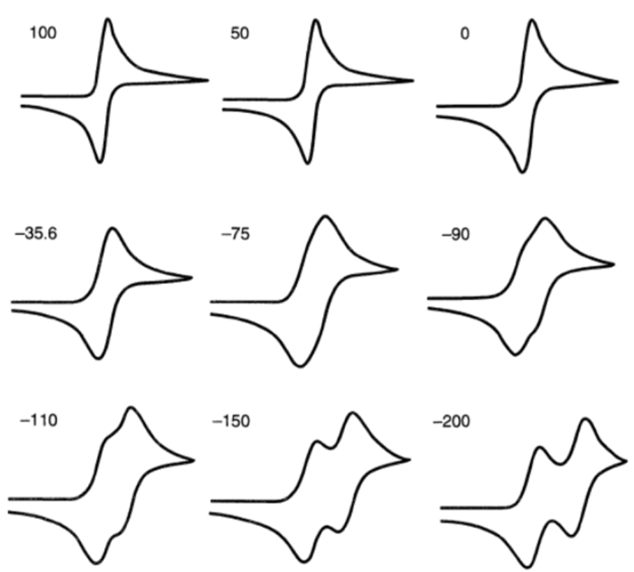

# Electrochemical Methods

Electrochemical analysis requires three electrodes:

* A **working electrode** with a well defined surface (this is what you're measuring)
* A **Reference electrode** that has a stable potential that you can compare your working electrode to
* An **auxiliary/counter electrode** which allows for the passage of current

A few tools are also needed, such as a **potentiostat** that will control the potential and measure the current or a **galvanostat** that controls the current and measures the potential

The cell must be purged of all $\ce{O2}$, and is temperature controlled in a water bath.

## Nomenclature:

Experiments are based on two of any three variables:

* Time - chrono
* Potential - volt
* Current - ampero
* Charge - coulo

The name therefore describes what's being measured

* Chronoamperometry - time(current)
* Voltammetry - potential(current)
* Chronocoulometry - time(charge)

## Chronoamperometry{: style="width: 40%; "class="right"}

When the potential is stepped from $E_1(<E^o)\to E_2(>E^o)$ then a diffusion limited current is generated

This is described by the Cottrell equation which is obtained from Fick's second law:

$$
I=\frac{nFA\sqrt{D}c^b}{\sqrt{\pi t}}
$$

This is often used to calibrate electrode areas and measure diffusion coefficients

As can be seen in graph B above, it's important to wait for a short period of time before recording, as the current will monetarily be infinite, which is impossible to measure.

## Electrode Shape/Size{: style="width: 40%; "class="right"}

There are many different shapes that can be used for the electrode setup, each with different implications.

### Spherical Electrodes

$$
I=mFA\sqrt{D}c^b\bigg(\frac{1}{\sqrt{\pi t}}+\frac{\sqrt{D}}{r}\bigg)
$$

The current will not become zero over long periods of time but will approach a steady-state value:

$$
I=\approxeq\frac{nFADc^b}{r},\text{ as }t\to\infin
$$

This is due to the reactant being able to approach the electrode from any angle, compared to the one dimensional supply when considering a shrouded plane.

### Cylindrical Electrodes

With cylindrical electrodes, the current continues to decay, but at a logarithmic rate and never reaches a steady-state equilibrium.

At small times, all electrodes, generate a current that is proportional to the electrode surface area. The diffusion layer at this point in time is small and doesn't obstruct access to the electrode. All electrodes at early timeframes can therefore be treated as planar.

## Double Step Chronoamperometry

If the potential is returned  to below $E^o$ after the initial step, then a current will be generated from the product that has formed during the first step.

$E_2$ is  often the same as $E_i$. Since the equation is being reversed $P\to R$, the voltage will turn negative.

{: style="width: 50%; "class="center"}

## Linear Sweep Voltammetry

Stepping the potential is not as informative as sweeping it with a constant scan rate ($V\cdot s^{-1}$). Both $I$ and $E$ are a function of time. b) is a voltammogram in the figure below

{: style="width: 60%; "class="center"}

a) $t(E)\hspace{2cm}$ b) $E(I)\hspace{2cm}$ c) $c_{\ce{A/A-}}(x)$

## Cyclic Voltammetry

if we take blot (b) from the figure above and then reverse the potential, then the product is converted back into the reactant

{: style="width: 60%; "class="center"}

## Kinetics
We can see there are many alternate pathways that the reactants and products can take, not all of which will be reversible.

{: style="width: 40%"}

{: style="width: 40%"}

The time scale in cyclic voltammetry can be altered by manipulating the scan rate (typically $0.01\to1000000\:V\cdot s^{-1}$). the effec ton the shape of the voltammagrams can be interpreted if the voltammetric time scale is comparable to the kinetic timescale of the reaction.

{: style="width: 50%; "class="center"}

### Example - $EC_i$ (Rearrangement)

For the reaction $\ce{R + e- <=>P->Q}$ it is possible to have a fast enough scan rate to skip the $\ce{P->Q}$ step and go straight to the $\ce{P->R}$ step.

{: style="width: 40%; "class="center"}

### Example - $EC'$ (Regenerate $\ce{RX}$ in solution)

For the reaction $\ce{R + e- <=>P + Q -> R + S}$ Where $\ce{[Q]>>[R]}$, at low scan rates the regeneration of R overcomes the depletion effect, due to diffusion limitations

{: style="width: 40%; "class="center"}

### Example - $E_rE_r$ (Further Oxidised)

For the reaction $\ce{R + e- <=>[E^o_1] P + e- <=>[E^o_2] Q}$ there are two potentials. $\Delta E^o=E^o_2-E^o_1\:(mV)$. Because of this, we can slow down the scan and see both the electron transfers.

{: style="width: 40%; "class="center"}

### Example - $ECE$ (electron transfers separated by a chemical step)

For the reaction $\ce{A + e- <=>[E^o_1=-0.44\:V] B -> C + e- <=>[E^o_1=-0.20\:V] D}$, The chemical step won't show up as a peak in the voltammogram, however we can see that The formation of $C$ at more negative potentials that $E^o_2$ results in the immediate formation of $D$. The Conversion of $\ce{D->C}$ results as a second wave, with the $\ce{C->D}$ process only being observed if the direction of the current is reversed.

{: style="width: 40%; "class="center"}

## Electrode Size

Over long time periods, the diffusion layer is bigger than the electrode, the rate of diffusion ($j_i^{diff}$) will be the limiting factor and a steady-state voltammogram will be obtained.

Ultramicroelectrodes are between $0.1$ and $20$ $\mu m$ and generate very small currents ($fA\to nA$)

## Other System Effects

* The double layer at the electrode interface acts as a capacitor and provides a current when t he  potential is changed ($I_c=vC_{dl}$)

* The solution resistance between the reference and working electrodes affects the potential due to $V=IR$

* The equivalent circuit of the system shows that the double layer capacitance is parallel to the electrochemical process and both are in series with the resistance

* At very high scan rates, the potentiostat begins to oscillate because the feedback process in the circuitry has the same time scale as the voltammetric experiment

  

  {: style="width: 40%; "class="center"}