# Electrical Storage

Cells can either be:

* Galvanic - they produce electricity from chemical reactions
* Electrolytic - they produce chemical reactions from electricity

In power storage, we consider the energy density, rather than energy alone, that is that we look at $\frac{Wh}{kg}$.

Energy $1Wh=3600\:J$

Power $1W=\frac{3600J\:}{60\min}=\frac{1\:J}{s}$

Electrical storage fits primarily into three categories:

## Batteries

Utilise a controlled chemical reaction with finite reactants to produce electricity. They can be primary - (non rechargeable) or secondary (rechargeable). They can be single or multi cell, with each cell having the following components:

### Anode

The negative electrode. This gives up electrons to the circuit as it is oxidised

### Cathode (think cation - positive)

The positive electrode. This accepts electrons from the circuit and is reduced

### Electrolyte

Provides the medium for the charge transfer, as ions in the battery that will migrate between the cathode and the anode

### Separator

Keeps the two electrolytes from binding and forming a non reactive salt

!!! info "Primary battery - Leclanché cell"
	
	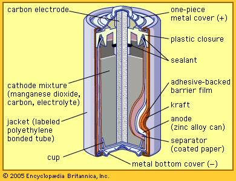{: style="width: 30%; "class="right"}
	
	#### Anode 
	
	$\ce{Zn + 2NH4Cl + 2OH- -> Zn(NH3)2Cl2 + 2H2O + 2e-}$
	
	#### Cathode
	
	$\ce{2MnO2 + 2H2O + 2e- -> 2MnO(OH)2 + 2OH-}$
	
	#### Electrolyte
	
	$\ce{NH4Cl}$ and/or $\ce{ZnCl2}$ in water

!!! info "Primary battery - Alkaline cell"
	
	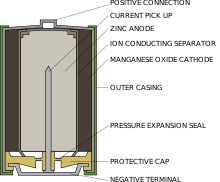{: style="width: 30%; "class="right"}
	
	#### Anode 
	
	$\ce{Zn + 2OH- -> Zn(OH)2 + 2e-}$
	
	#### Cathode
	
	$\ce{2MnO2 + 2H2O + 2e- -> 2MnO(OH)2 + 2OH-}$
	
	#### Electrolyte
	
	Aqueous $\ce{KOH}$

!!! info "Primary battery - Lithium Metal"
	
	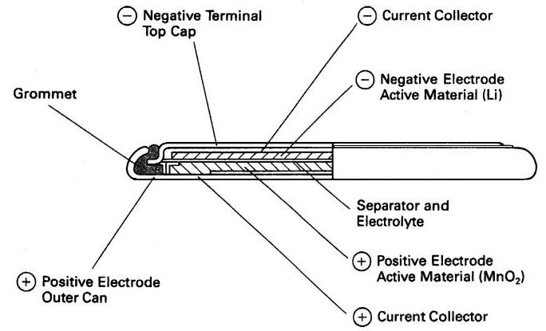{: style="width: 30%; "class="right"}
	
	#### Anode 
	
	$\ce{Li -> Li+ + e-}$
	
	#### Cathode
	
	$\ce{MnO2 + Li+ + e- -> LiMnO2}$
	
	#### Electrolyte
	
	Lithium salts in organic solvents

!!! info "Secondary battery - Lead Acid"
	
	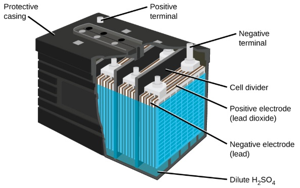{: style="width: 30%; "class="right"}
	
	#### Anode 
	
	$\ce{Pb + H2SO4 <=> PbSO4 + 2H+ + 2e-}$
	
	#### Cathode
	
	$\ce{PbO2 + H2SO4 + 2H+ + 2e- <=> PbSO4 + 2H2O}$
	
	#### Electrolyte
	
	Aqueous $\ce{H2SO4}$

!!! info "Secondary battery - Nickel Cadmium"
	
	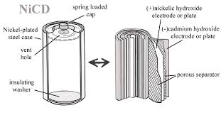{: style="width: 40%; "class="right"}
	
	#### Anode 
	
	$\ce{Cd + 2OH- <=> Cd(OH)2 + 2e-}$
	
	#### Cathode
	
	$\ce{2NiO(OH) + H2O + e- <=> Ni(OH)2 + OH-}$
	
	#### Electrolyte
	
	Aqueous $\ce{KOH}$

!!! info "Secondary battery - Nickel metal hydride"
	
	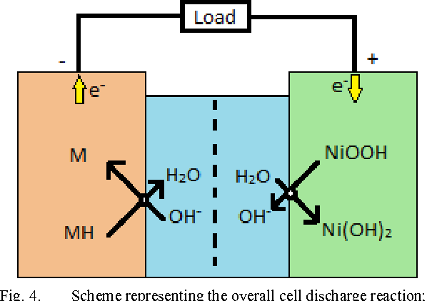{: style="width: 30%; "class="right"}
	
	#### Anode 
	
	$\ce{MH + OH- <=> H2O + M + e-}$
	
	#### Cathode
	
	$\ce{NiO(OH) + H2O + e- <=> Ni(OH)2 + OH-}$
	
	#### Electrolyte
	
	Aqueous $\ce{KOH}$

!!! info "Secondary battery - Lithium Ion"
	
	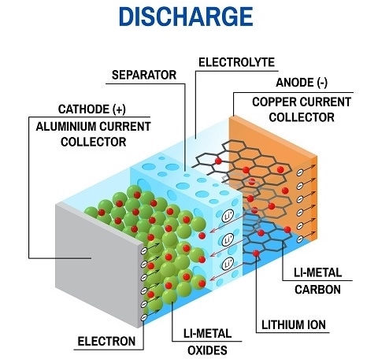{: style="width: 30%; "class="right"}
	
	#### Anode 
	
	$\ce{Li_xC6 <=> 6C + xLi+ + xe-}$
	
	#### Cathode
	
	$\ce{Li_{(1-x)}MO2 + xLi+ + xe- <=> LiMO2}$
	
	#### Electrolyte
	
	Organic electrolyte

!!! info "Secondary battery - Lithium Sulphur"
	
	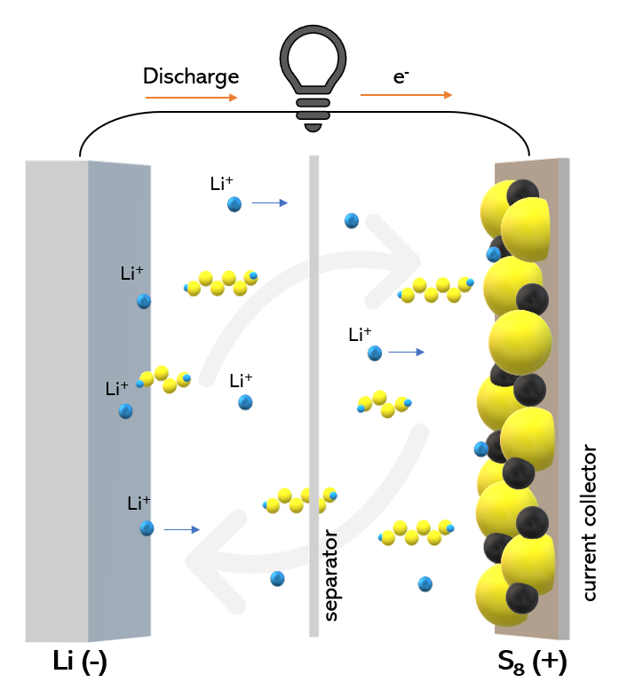{: style="width: 20%; "class="right"}
	
	#### Anode 
	
	$\ce{Li <=> Li+ + e-}$
	
	#### Cathode
	
	$\ce{S_8 + 16e- <=> 8S^{2-}}$
	
	#### Electrolyte
	
	Organic electrolyte

## Fuel Cells

Ae fundamentally similar to batteries, with the primary exception that they require a constant flow of the fuel, rather than having a self contained reserve.

!!! info "Fuel Cell - Proton Exchange Membrane"
	
	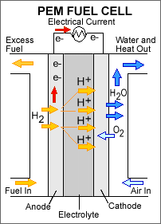{: style="width: 20%; "class="right"}
	
	#### Anode 
	
	$\ce{2H2 -> 4H+ + 4e-}$
	
	#### Cathode
	
	$\ce{O2 + 4H+ + 4e- -> 2H2O}$
	
	#### Electrolyte
	
	Organic electrolyte

## Supercapacitors

Store electricity as a potential between two charged surfaces. These are electrostatic storage mechanisms, not chemical and are designed for short, intense pulses of power, with charging in between, rather than a continuous current as would be provided by a typical battery.

The defining factor for a supercapacitor over a capacitor is that supercapacitors have very large, porous plates (large $A$) with very small dielectric mediums (small $L$), causing them to be able to build up a much larger charge compared to their regular counterparts.

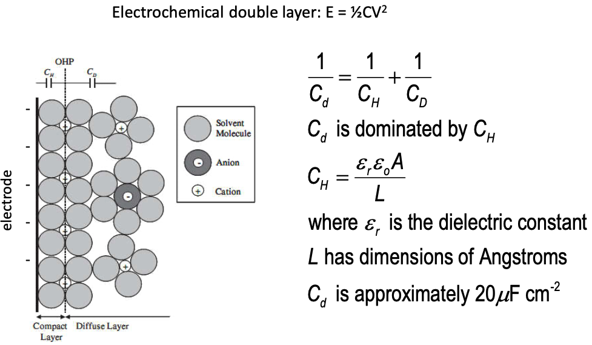{: style="width: 60%; "class="center"}

In the application below, we can see that with a supercapacitor as opposed to a regular capacitor, in a system where a constant voltage is needed, when power pulses are required from the same power source, the voltage can be maintained to a much higher degree than with regular capacitors in their place.

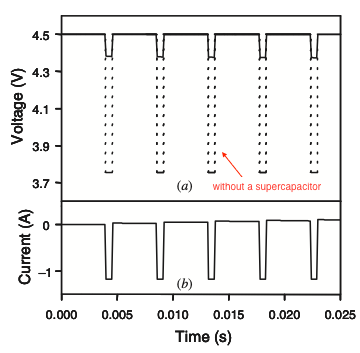{: style="width: 30%; "class="center"}

## Fitting them all together

The ragone plot shows us how all of these technologies overlap in terms of their energy and power output.

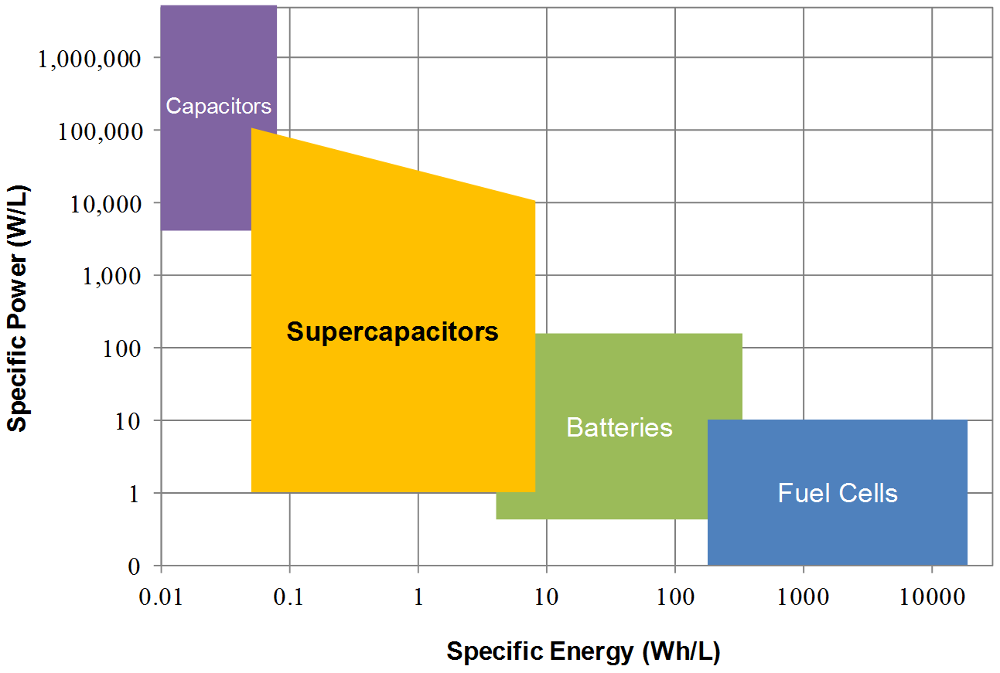{: style="width: 50%; "class="center"}