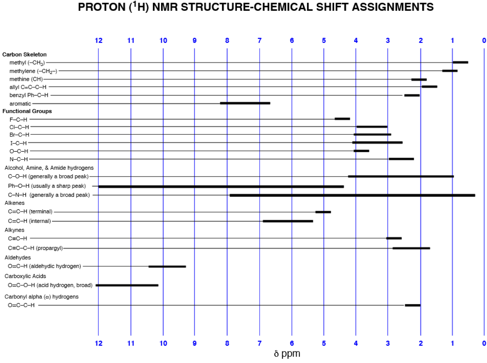
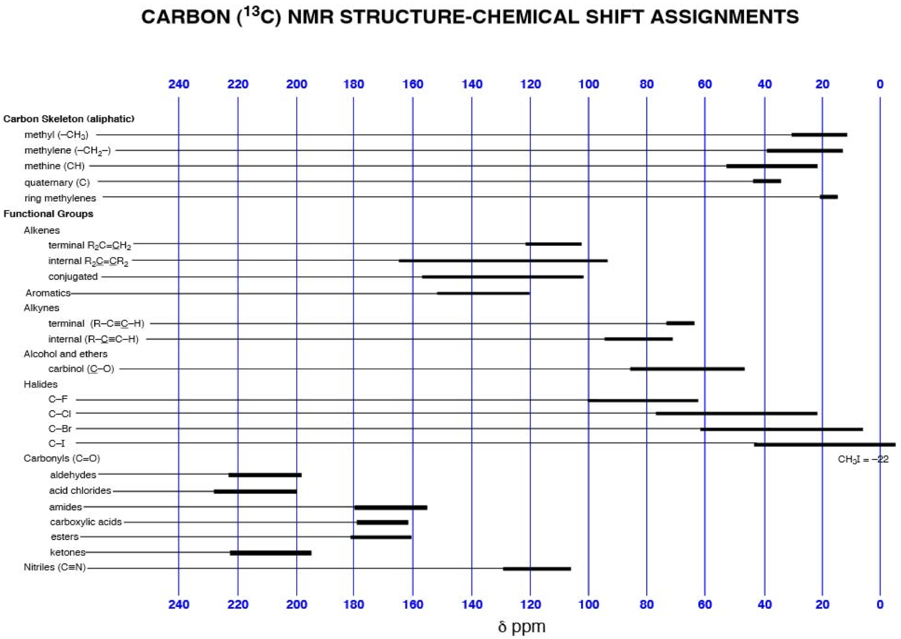

# NMR Recap

### Continues on from [<u>Spectroscopy and Instrumentation</u>](../../../Sem%204.%20Spectroscopy/12.%20Proton%20NMR%20Spectroscopy/)

## NMR Active Nuclei

Fo an atom to be NMR active, it needs to have a quantum number $I\neq0$. 

Nuclei with an odd number of protons (atomic number), neutrons (atomic mass) or both with have a nuclear spin.

| # Protons | # Neutrons | $I$   | Examples                        |
| --------- | ---------- | ----- | ------------------------------- |
| Even      | Even       | 0     | $\ce{^{12}C, ^{16}O, ^{32}S}$   |
| Odd       | Even       | $1/2$ | $\ce{^{1}H, ^{19}F, ^{31}P}$    |
| Odd       | Even       | $3/2$ | $\ce{^{11}B, ^{35}Cl, ^{79}Br}$ |
| Even      | Odd        | $1/2$ | $\ce{^{13}C}$                   |
| Even      | Odd        | $3/2$ | $\ce{^{127}I}$                  |
| Even      | Odd        | $5/2$ | $\ce{^{17}O}$                   |
| Odd       | Odd        | 1     | $\ce{^{2}H, ^{14}N}$            |

NMR needs these isotopes to be relatively high in concentration, or it needs to sample for an incredibly long period of time.

## Chemical Shift

Occurs as the different atoms will have a different electron density surrounding them. Each additional electron will have its own associate magnetic field and so as electrons withdrawn or donated, the atom will have a slightly larger or smaller response to the magnetic field. This can happen for many reasons, including intramolecular h-bonding and hybridisation state.

The chemical shift is measured as a difference from the $0\:ppm$ standard reference (TMS for $\hnmr$ and $\cnmr$ )

$$
\delta=\frac{\text{Shift in }\nu\text{ from TMS (Hz)}}{\nu\text{ of the spectrometer (Hz)}}
$$

The values themselves are scaled up by $\e{6}$, as the shifts are realistically incredibly small.

$$
1\:ppm=\frac{1\:Hz}{10^6\:Hz}
$$

### Shift Tables

{: style="width: 47%; "class="left"} {: style="width: 50%; "class="right"}

## $\pi$ Induced Magnetic Fields

The $\pi$ bond's natural ability to conjugate and have free moving electrons, allows the to create an equivalent magnetic field that will reinforce the magnetic field of the NMR spectrometer. This causes a downfield shift for any aromatic or pi bonded carbon atoms.

.pdf+-+SumatraPDF_2012-12-20_00-45-54.png){: style="width: 40%; "class="center"}

## Splitting

Covered in [Spectroscopy and Instrumentation](../../../Sem%204.%20Spectroscopy/12.%20Proton%20NMR%20Spectroscopy/#splitting), though it's worth noting that most $\cnmr$ spectra are decoupled from protons, so you likely won't see splitting in a $\cnmr$ spectra.

## Integration

Covered in [Spectroscopy and Instrumentation](../../../Sem%204.%20Spectroscopy/12.%20Proton%20NMR%20Spectroscopy/#intensity-of-signals), though again, $\cnmr$ spectra are not so easily integrated. This is because the $\ce{^13C}$ nuclei has a much more varied relaxation period

