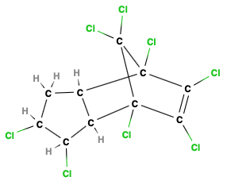
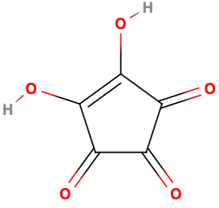
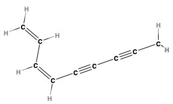
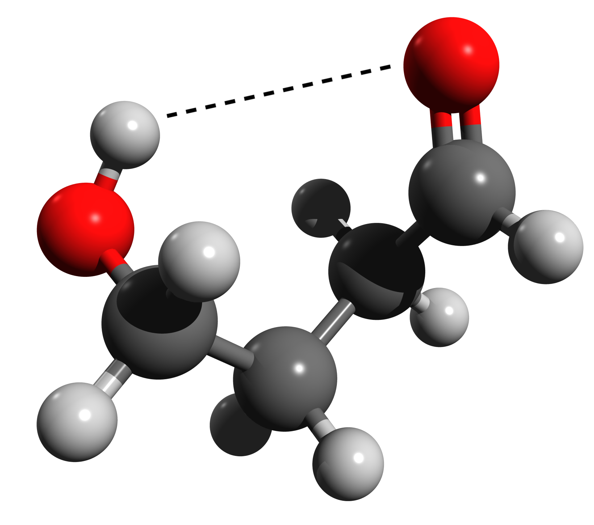

# CNMR vs HNMR and Intramolecular H-Bonding

When the protons are put into a magnetic field ($B_\circ$) and align themselves with or against it, these is a splitting in energy that occurs. 

{: style="width: 30%; "class="center"}

This excitation follows the EM relationship:

$$
\Delta E=h\nu=\gamma \hbar B_\circ\\
\nu=\frac{\gamma B_\circ}{2\pi}
$$

Where:

* $B_\circ=$ the strength of the magnetic field
* $\hbar=\frac{h}{2\pi}$
* $\Delta E=$ the difference in energy between the two spin states
* $\gamma=$ a constant that is specific to the atom type. This gives us atomic specificity.

We can use a bigger magnetic field to increase the sensitivity of the NMR spectrometer, as $\nu\propto B_\circ$. This results in higher resolution spectra:

{: style="width: 30%; "class="center"}

When Shielding or deshielding occurs, what's happening is that we get a change in the effective $B_\circ$, that results in a change in $\nu$

## $\cnmr$ vs $\hnmr$

Both provide information about the number of chemically nonequivalent nuclei in the sample and both give us information about the electronic environment that those nuclei exist, however:

* A $\cnmr$ spectra is $\e{-4}$ times weaker than a $\hnmr$ spectra, as a $\ce{^13C}$ nucleus is only about $1\%$ as intense as the $\ce{^1H}$ nucleus and is significantly less abundant ($\sim1.1\%$) of a sample of carbon (most are $\ce{^12C}$).
* The $\cnmr$ spectra is more spread out over a larger range than the $\hnmr$ spectra, making it easier to identify, count and categorise the nuclei.
* Since the abundance of $\ce{^13C}$ is so low, the likelihood of having two $\ce{^13C}$ atoms next to each other in a molecules is icredibly low, and accounts ofr why we don't see splitting in $\cnmr$

## When to use $\cnmr$ Spectroscopy

When the molecule is heavily unsaturated, the proton information may not give you much clarification to the structure. It may also be used when the $\hnmr$ spectra are just too complex to be analysed alone

|         Chloradane          |           Croconic Acid           |            Polyacetylene            |
| :-------------------------: | :-------------------------------: | :---------------------------------: |
|  |  |  |

## Intramolecular H-Bonding

Since any shift of electron density will cause an NMR shift, an H-bonding oxygen will donate electron density from the hydrogen, deshielding it even further than it might already have been.

{: style="width: 30%; "class="center"}

