# NMR - Aromatics, Timescales, Coupling and Deuteration

## Aromatic Systems

In aromatic systems, symmetry plays a large role in the proton environments. These are pretty straight forward, though have been explicitly laid out below.

| Substitution          | mono                                           | *ortho*                                            | *meta*                                           | *para*                                           |
| --------------------- | ---------------------------------------------- | -------------------------------------------------- | ------------------------------------------------ | ------------------------------------------------ |
| Same substituent      | 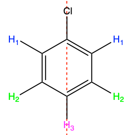{: style="max-width: 100px"} | 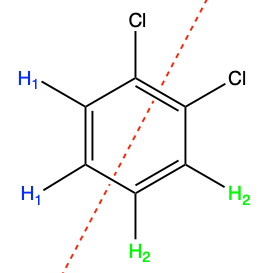{: style="max-width: 100px"} | 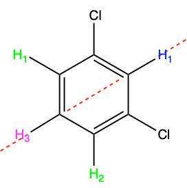{: style="max-width: 100px"} | 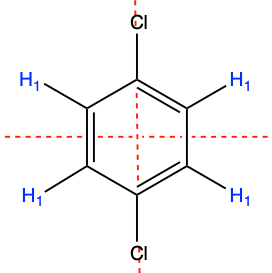{: style="max-width: 100px"} |
| Different substituent |                                                | 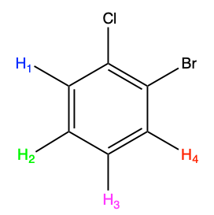{: style="max-width: 100px"} | 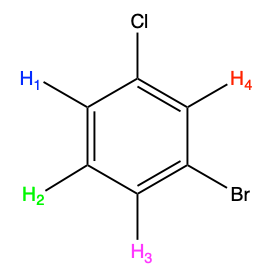{: style="max-width: 100px"} | 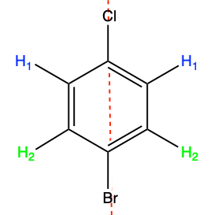{: style="max-width: 100px"} |

## Coupling Constant ($J$)

When two protons are coupled, the amount that they will split is know as the coupling constant. This is the same between the two sides of the coupled protons. These are **independent of the external magnetic field** and the thus will be independent o the spectrometer.

$J$ is measured in $Hz$, not $ppm$ and typically ranges anywhere from $0$ to $18\:Hz$

This basic kind of splitting is know as **first order splitting** and occurs when shift difference (in $Hz$) between the two coupled protons is much larger than $J$

{: style="width: 40%; "class="center"}

### Second Order Splitting

This occurs when the shift difference (in $Hz$) between the two coupled protons is similar or smaller than $J$

As can be seen below (b) this is expressed as a skewing of the integrated peak area of the spit protons. The inner lines will have an area larger than 1 and the outer lines will have an area less than 1.

{: style="width: 50%; "class="center"}

The distinction between first and second order coupling is demonstrated in the figure below:

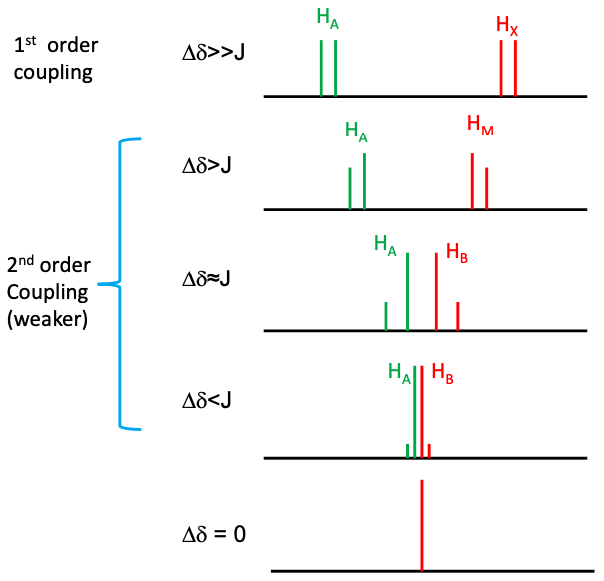{: style="width: 40%; "class="center"}

## Temperature

Temperature plays an important role in NMR, as by increasing the temperature, we increase the kinetic energy and the excitation will start to get averaged.

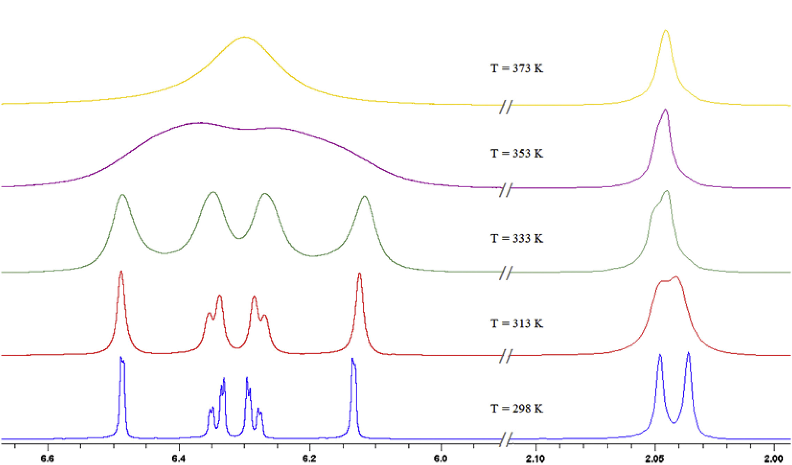{: style="width: 50%; "class="center"}

## Time Scale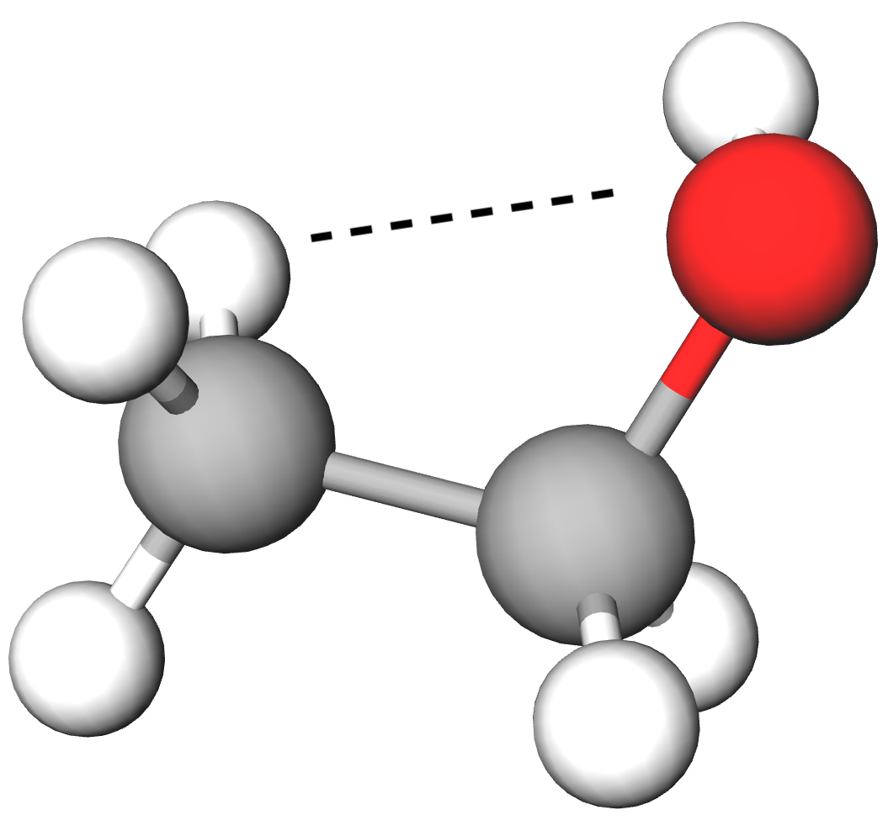{: style="width: 20%; "class="right"}

Within NMR, an important characteristic is the timescale of the measurement, that is; how long it takes the spectrometer to take a reading. This is vital because NMR is geometry dependent, so features such as the asymmetry of the ethanol molecule won't show up. This is because, while the hydroxyl group is off centre, the rotation of the methyl group is so fast that within the timescale of $\hnmr$, on average, all of the methyl hydrogens will interact equally with the hydroxyl LPE.

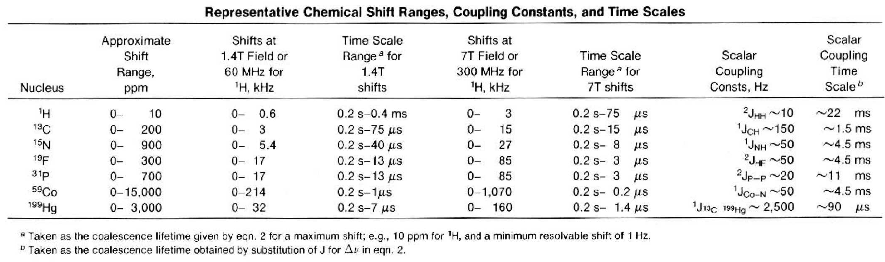{: style="width: 100%; "class="center"} 

## Deuterated Solvents

We use deuterated solvents for three specific reasons:

1. The deuterated protons will absorb the EM waves in a completely different region, so this will prevent the signal from swamping the sample reading. The deuteration is not perfect however and so a solvent peak will typically be seen, however it will be at a much lower concentration.

2. The NMR spectrometer can use this deuterated peak to keep itself in reference/calibrated, as the magnetic field can drift.

3. It can effectively act as another reference, either instead of, or as well as TMS. The shift between TMS and the solvent is well known, so it can remove the need for TMS entirely.

   