# Sample Preparation Techniques

The analytical process is an important one that has multiple steps (red) at multiple different locations. After all, the analysis is only as good as the sample.

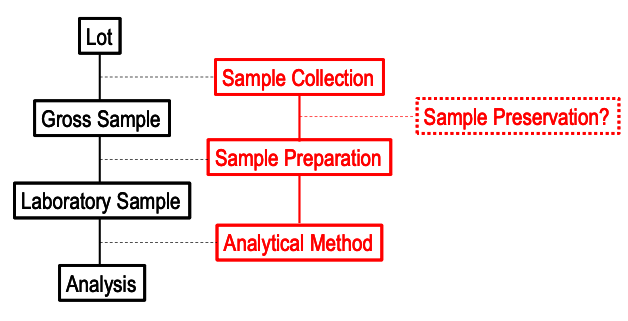{: style="width: 50%; "class="center"}

When collecting a sample, it must be representative of the population, i.e. the population must be homogenous with the analyte and the sample must be able to be divided without a change in composition. For solid samples, this becomes more problematic, as there might be different regions with different composition, and there could be multiple particle sizes. These samples often need to be ground down, though a mixture of two minerals may be inhomogeneous at the molecular level, but homogeneous at the particulate level.

## Sample Preservation

Samples can degrade quite quickly when removed from their environment and in a lot of cases, they need to be stored for an extended period of time, particularly when legal concerns are involved.

### The Vessel

Samples must be stored in an appropriately inert container, that means:

* Samples containing metal ions should be stored in plastic containers, as they would exchange with ions in glass
* Samples containing organic molecules can adsorb onto plastic, so they must be stored in glass containers

It's also important to minimise the headspace above the sample where volatile components are involved and to avoid agitation of the sample. It may also be necessary to use opaque containers to prevent photodegradation 

### Sample Conditions

It may be necessary to modify the conditions the samples are stored in, such as using extreme pH (high or low) to prevent microbial degradation. Refrigeration can often be used for long term storage of "B" samples in drug testing, though freezing can cause phase separation.

#### Preservatives

Most analyses will be performed in a timely manner, however for samples that will be kept for long term storage, the use of preservatives may be required. This could involve:

* Modifying the pH to prevent insoluble hydroxide metal complexes from forming - typically done with nitric acid, as nitrate salts are soluble
* Purging oxygen from the sample with nitrogen gas
* Adding biocidal compounds

## Sample Preparation

The goal of sample preparation is to produce a sample that suitable for the method of analysis. Using classical chemical methods, this would mean having grams/mL of the sample, though instrumental methods typically only require $\mu L$ or $mg$ of sample. At these scales it can be difficult to measure them accurately, so often the samples need to be pre-concentrated. 

Sometimes the matrix itself is incompatible with the method, so **matrix exchange** is required. This can also result in the removal of interferants from the sample.

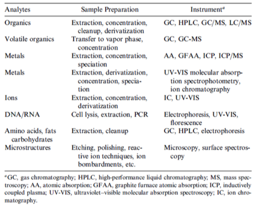{: style="width: 50%; "class="center"}

## Metal Analysis

Some reasons that sample prep might be required for metal analysis include:

* To release all of the metals form the sample by dispersing/solubilising the matrix in an aqueous phase
* To extract metals into a more suitable solvent for analysis
* To concentrate metals to suit a particular technique
* To dilute the matrix to reduce interferences 
* Specification, to analyse the sample for different forms of the metal

### Preparation - Wet Digestion

Results in solubilised metals, suitable for elemental analysis by the oxidation of the metals to form soluble ions

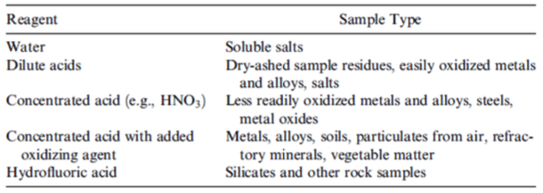{: style="width: 50%; "class="center"}

This can require quite strong conditions and there are a wide range of methodologies available for increasingly difficult samples:

* Water is useful for soluble salts, where the analyte is already in an ionic form
* Dilute acids, such as $\ce{HNO3}$
* Concentrated acids (increasing strength)
  * $\ce{HNO3}$
  * $\ce{HNO3}$ with added $\ce{HCl}$
  * 2:1 $\ce{H2SO4:HNO3}$ with heating that generates $\ce{SO3}$
  * $\ce{HNO3}$ with added $\ce{H2O2}$ (stronger oxidant)
  * $\ce{HNO3}$ with added $\ce{H2O2}$ and $\ce{HF}$ - for silicate samples
  * 3:1 $\ce{HCl:HNO3}$ - Aqua Regia - "king's water" - for dissolving noble metals {: style="width: 15%; "class="right"}

The use of heat can naturally speed up the process and specific apparatus, such as the Kjeldahl flask can help with this, by having a long neck to allow the solvent to be condensed and partially refluxed.

Microwave digestion is also a useful technique, as it allows for both the temperature and pressure of the sample to be increased (commercial units can apply $300^\circ C$ and $800\:psi$). E.g. Alumina samples are typically treated with a high boiling mixture of $\ce{H2SO4}$ and $\ce{H3PO4}$ at $200^\circ C$ and $40\:psi$.

Microwave digestion is also considered preferable due to there being much more granular temperature control, lower solvent requirements and closed sample containers to prevent loss of analyte and cross contamination.

### Preparation - Dry Ashing

Dry ashing is useful for samples with high organic content, and is accomplished by incinerating the sample in a muffle furnace at up to $450^\circ C$. this is useful for food sample that contain Fe, K, Ca, Mg and Mn, though it can cause the volatilisation of other metals such as Pb, Cu, Zn, Cd and Fe (somewhat mitigated by ramping).

This can also unfortunately lead to some analyte loss if the sample smokes, which can occur when fats and oils are present, though this can be overcome by adding $\ce{H2SO4}$ to chemically char the sample.

If there is a high silica content in the sample, it might need to be treated with HF to dissolve the silica and release any contained metals.

### Specification

In many cases it can be vital to know the form of a metal, this is particularly relevant for:

* Arsenic, which is toxic as its inorganic form but not as its organic form
* Mercury which is the reverse and is less toxic in its metallic form as to it organic form
* Chromium, as Cr(VI) is more toxic ad more soluble that Cr(III)

As a result, each requires a specific approach based on sequential extraction techniques to prevent modifying the form of other analytes in the sample. For Be, Ca, Co, Cr, Cu, Fe, K, Li, Mn, Ni, P, Pb, Ti, V and Zn this could look something like the following, with recoveries between 83 and 110%:

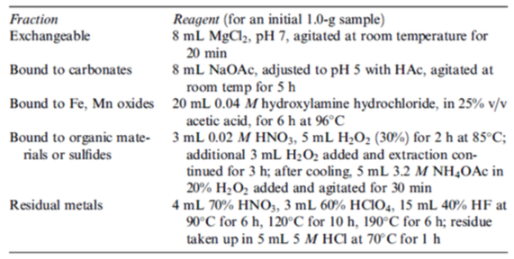{: style="width: 50%; "class="center"}

## Extraction

Remember that extraction is based on partitioning, where a solute partitions between two phases:

$$
\ce{S_A <=> S_B}
$$

Which is described by the partitioning coefficient $K$:

$$
K=\frac{[S_A]}{[S_B]}
$$

We can also measure how much of the solute is transferred using (Where $V_A$ and $V_B$ are the volumes of the phases):

$$
R=\frac{K}{K+\big(\frac{V_A}{V_B}\big)}
$$

For this reason, a large volume of $V_B$ (the receiving phase) is required for efficient transfer. While phase A is typically a liquid, phase B could be any state:

* Liquid --> Liquid - liquid/liquid extraction (LLE)
* Liquid --> Solid - solid phase extraction (SPE)
* Liquid --> Gas - headspace sampling

### Semi Volatile Organics - Solid --> Liquid

####  Soxhlet {: style="width: 15%; "class="right"}

An antiquated technique for extracting semi volatile organics is to use a Soxhlet extractor, which continually partitions the organic compounds of interest in freshly distilled solvent.

The sample is held in a porous inner "thimble" and as the solvent is distilled from the bottom flask, it refluxes into the thimble, extracting the organic compounds in question. Once the upper chamber fills with enough solvent, it is siphoned back down into the bottom flask which can be re-distilled and used for further extractions. The organic extracts will collect and concentrate in the bottom flask.

#### Microwave Assisted Extraction (MAE)

Nowadays, MAE is the preferred method if using an organic solvent with a high boiling temperature. The process uses significantly less solvent than a Soxhlet extraction, though the choice of which solvent to use can be more difficult, as not all solvents are microwave active. Polar solvents are often blended together into non-polar ones to create a organic suitable solvent that also absorbs microwaves

#### Accelerated Solvent Extraction (ASE)

ASE helps with extraction, as the analytes will be better extracted if under a high temperature and pressure. The sample is placed in a tube that is pressurised and heated in an oven. It likely also contains an adsorbent at the bottom to try and collect any interferants before they enter the collection vial. The process is fully automated and uses little solvent, whilst also being fast and relatively easy to use.

{: style="width: 40%; "class="center"}

### Semi Volatile Organics - Liquid --> Liquid

LLE is a widely used technique for extracting solutes from one phase into another and is based on the  partitioning of the solute between the two phases. This means that the two phases must be immiscible and can quite often possess acid-base properties to enhance the solubility in one of the phases. E.g. a solute might be ionisable in the aqueous phase but neutral in the organic phase.

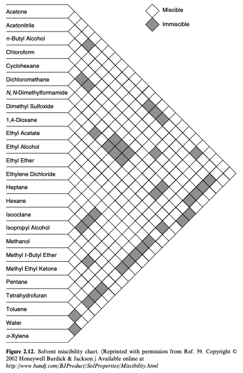{: style="width: 40%; "class="center"}

| Solubility of solvent in water | Solubility of water in solvent |
| :----------------------------: | :----------------------------: |
| 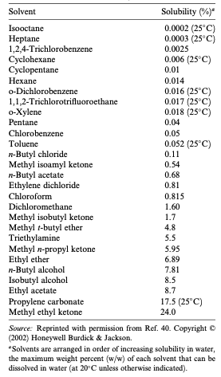 | 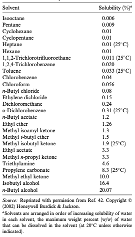 |

 

Based on the equations above, we can see that extraction efficiency will be greatly improved by doing multiple extractions with smaller volumes of solvent. Given that the force of shaking will cause some of the solvent to volatilise, it's important to vent the separatory funnel after each shake.

Because of density difference, it's easy to drain off the more dense solvent and replenish it. it can therefore  be beneficial to use a more dense solvent as your receiving phase, so that it can easily be extracted off and replenished.

### Semi Volatile Organics - Liquid --> Solid

Liquid Solid Extraction (LSE) has encompasses three primary techniques:

* Solid phase extraction (SPE) - nonequilibrium - exhaustive
* Solid phase microextraction (SPME) - equilibrium - nonexhaustive
* Stir bar sorptive extraction (SBSE) - equilibrium - nonexhaustive 

SPE and LLE have large capacities of how much analyte can be extracted, hence exhaustive

#### Solid Phase Extraction (SPE)

SPE  is essentially pulling a solution of analyte through a sorbent with a vacuum and adsorbing it. It follows a four stages:

1. Prepare the cartridge with the solvent of choice
2. Load the sample onto the cartridge - the sample should preferentially bind to the sorbent
3. Wash away any interferants - should use the same solvent as step 2
4. Elute the analyte with a solvent that it prefers over the sorbent

The sorbents are often the same as those that have come from HPLC, so we have:

* Reverse phase - $\ce{-C8}$/$\ce{-C18}$
* Normal phase - $\ce{-NH2}$, $\ce{-CN}$ or $\ce{-C(OH)COH}$ (diol)
* Ion exchange - cations and anions, weak or strong
* Adsorption - magnesium silicate (florisil), alumina, silica

Since there's such a large surface area of the sorbent, the extraction process is almost entirely complete, and is therefore considered "exhaustive". SPE has also led to "digital chromatography" which is the automated process of SPE

#### Solid Phase Microextraction (SPME)

SPME has multiple modes but in effect, it's allowing the solute to adsorb onto the sorbent that's attatched to diffferent components of the apparatus setup

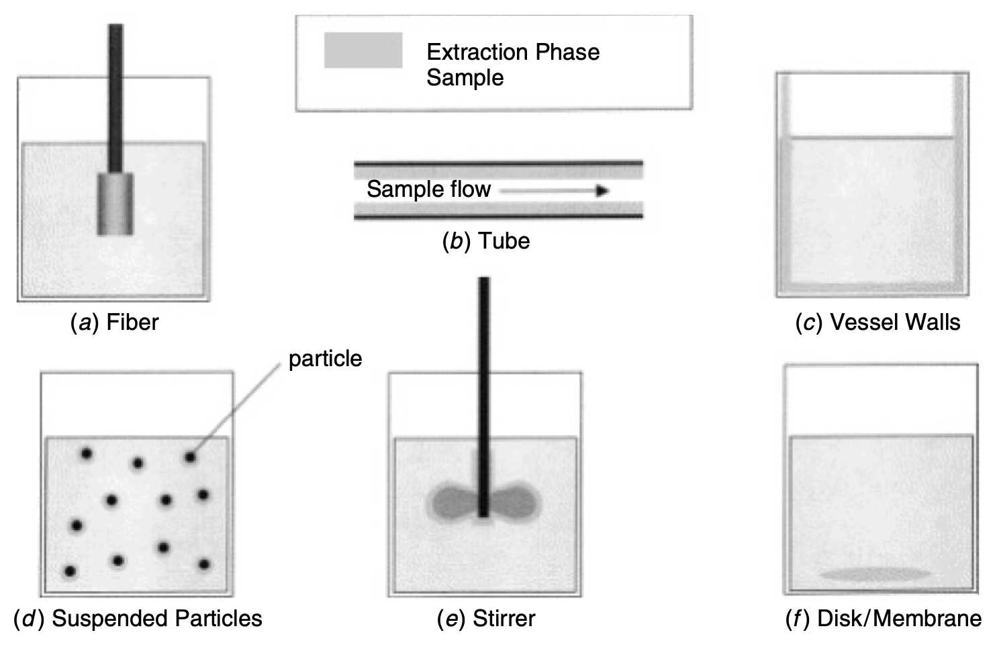{: style="width: 50%; "class="center"}

The types of sorbents are as follows:

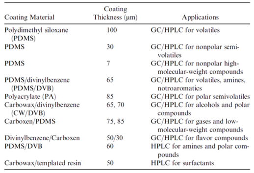{: style="width: 50%; "class="center"}

#### Fiber SPME

Is a pretty typical method of sampling for GC an follows the following process:

1. The syringe needle enters the sample 
2. The fibre is exposed to the sample for a fixed amount of time, letting the solutes adsorb
3. The fiber is retracted and the syringe removed
4. The syringe needle enters the injector of the GC
5. the fiber is exposed and thermal desorption allows the solute to enter the column
6. the fiber is retracted and the syringe removed

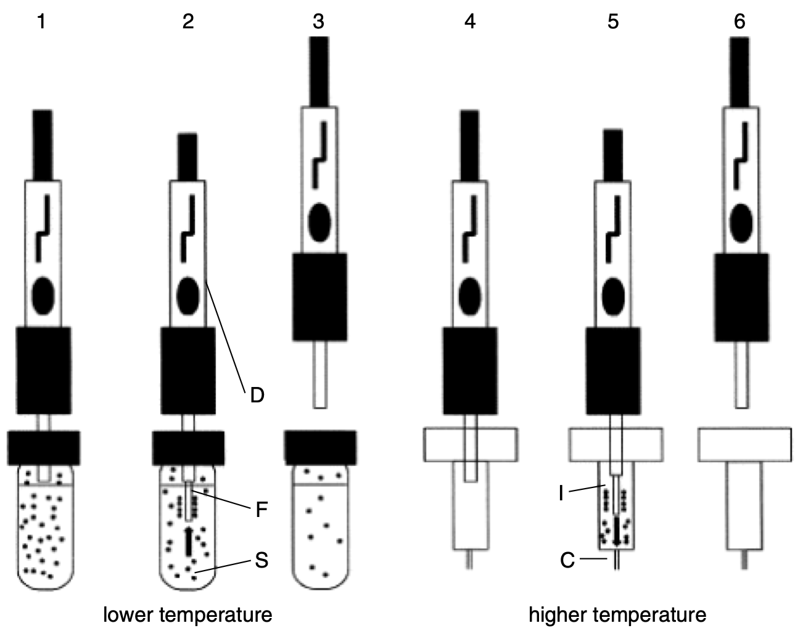{: style="width: 50%; "class="center"}

#### Stir Bar Sorptive Microextraction (SBSE)

Follows the same principles as all other SPME, though because the surface area is larger than fiber SPME, more of the analyte can be extracted.

The stir bar can then either be thermally desorbed for GC or desorbed using preferential solubility for HPLC

#### Cryogenic Focusing

When a sample is thermally desorbed, it will do so in a slow manner, so the analyte peak will be really broad. focusing is a technique that allows the sample to be collected and deposited onto a cooled surface before being thermally heated to volatilise it again.

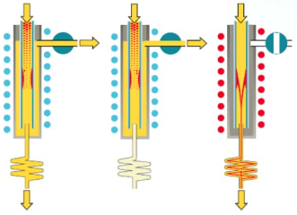{: style="width: 50%; "class="center"}

### Volatile Organics - Liquid --> Gas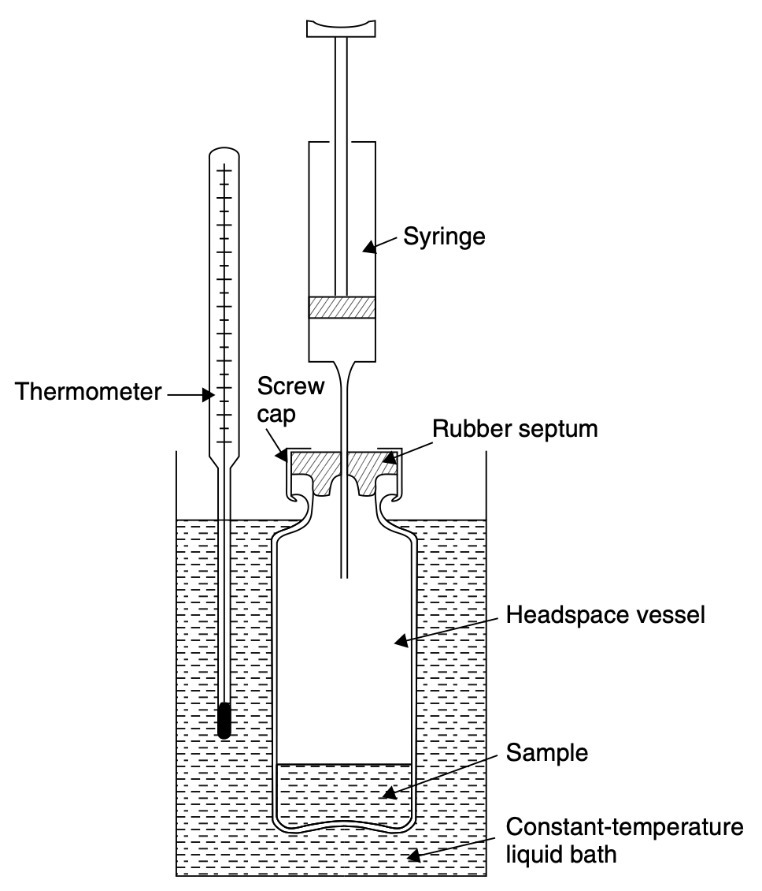{: style="width: 25%; "class="right"}

Headspace sampling uses the vapour pressure of volatile organic species to be able to be able to sample the analyte from the space above the sample. The most simple form of this is to use a syringe to extract some of the headspace from above a volatile sample and inject it into the GC for analysis.

Thermally heating the sample vial can help it to volatilise, though it will only help analytes that are already volatile. The amount of solute in the gas phase is dependent on the partitioning coefficient and the volume ratio of the two phases ($\beta$). Temperature will only effect solutes with a large $K$:

$$
\begin{align}C_{(g)}&\approx\frac{C^\circ}{K+\beta}\\K&=\frac{[S_{(l)}]}{[S_{(g)}]}\end{align}
$$

#### Dynamic Headspace Extraction

Allows us to continuously purge and trap the sample headspace with an inert gas to be accumulated into a small volume. This can be collected using cryogenic focusing or using SPME/SBSE.

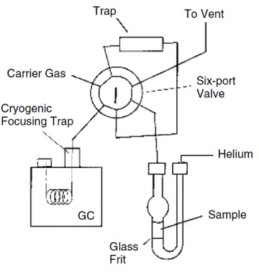{: style="width: 30%; "class="center"}

## Molecularly Imprinted Polymers

Are polymers that mimic bioaffinity systems. They have regions on their surface that are designed to trap target analytes 

## 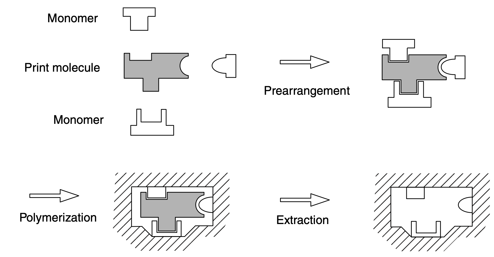{: style="width: 40%; "class="center"}

## Derivitisation

Describes the process where an analyte is modified chemically to make it more suitable for analysis, most commonly implemented to make molecules more volatile for GC.

The derivitisation reagent is the substance which facilitates the modification and it should have a yield of more than 90% to be considered useful. The derivative product should also be stable with respect to time

Silylation is the most prevalent technique to be used with GC, as it takes labile hydrogens that would contribute to H-bonding ($\ce{-OH, -COOH, -NH, -NH2}$ and $\ce{-SH}$) and convert them to bulky trimethylsilyl groups ($\ce{-Si(CH3)3}$) .

Silylation occurs through a nucleophilic $SN_2$ backside attack.

 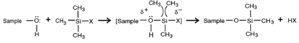{: style="width: 80%; "class="center"}

*N, N*–bis(trimethyl–silyl)trifluoro-acetamide (BSTFA) is the typical derivitisation reagent with trimethylchlorosilane (TMCS) being used to catalyse the reaction (they typically come pre mixed).