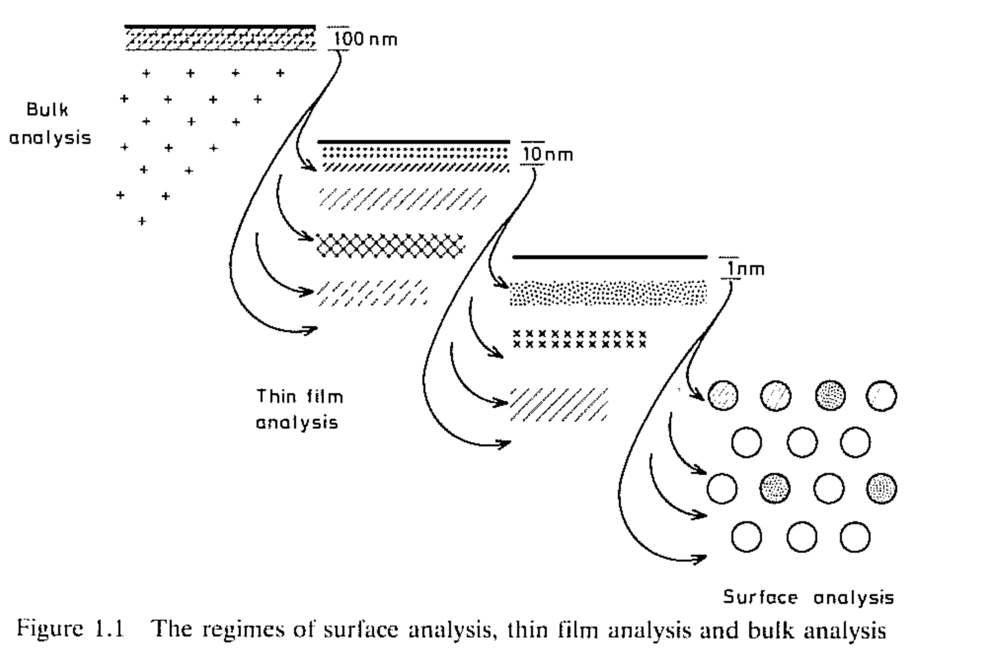
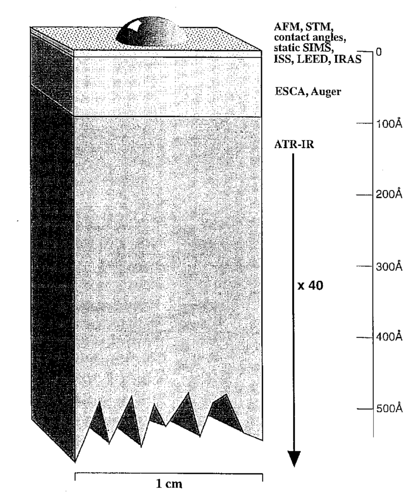

# Surface Analytical Techniques

Surface analytical tech is important in a lot of different applications, some of which include; catalysis, semiconductor devices, composite materials, adhesive coatings, LB technology, metal processing/corrosion, metallized polymers, paint technologies, additives, rubbers, lubricants, paper technology, construction materials, medical implants, biosensors, drug delivery devices and antifouling coatings.

The big thing that all of these applications have in common is surface functionalisation, which could involve:

* Superhydrophobic surfaces
* Polymer brushes
* Nanofibre surfaces
* Atomic layer deposition (ALD)
* Colloid based patterning
* Self assembled monolayers (SAMs)
* Plasma polymerisation

## Formulating a Materials Characterisation Strategy

Since there is such a wide range of applications and tools, we need to formulate a strategy for how we want to characterise the materials. We need to ask a few questions to do so:

* What is the morphology and/or the topology of the object? (AFM/XPS)
* What is the crystal structure of the object or of its constituent sub-structures?
  * Does it have long, or short range order? Is it amorphous? is there a difference between the surface and bulk structure?
* What is the phase structure (if any)? Is it single, or multi phase? which phases are present? is it necessary to identify minor phases?
* What is the atomic or molecular compositions? is the object laterally or vertically different in composition? is trace element analysis required? (e.g. computer chips and impurities)
* What is the bulk/surface/interface chemistry? is the surface chemistry differentiated laterally or in depth? (the properties of the bulk can influence the properties of the surface)
* What is/are the defect structures (if any)? Do planar, line or point defects need to be considered?

## Types of Characterisation

The tools that can be used can be widely broken down in to chemical and morphological/topographic, as well as bulk analysis tools and surface analysis tools:

### Chemical Tools

| Surface Analysis                           | Bulk Analysis                                  |
| ------------------------------------------ | ---------------------------------------------- |
| X-ray photoelectron spectroscopy (XPS)     | Nuclear magnetic resonance (NMR)               |
| Auger electron spectroscopy (AES)          | Fourier transform infrared spectroscopy (FTIR) |
| Secondary ion mass spectrometry (SIMS)     | Raman spectroscopy                             |
| Grazing angle Infrared spectroscopy (IR)   | Chromatography                                 |
| Low energy electron diffraction (LEED)     | Mass spectrometry (MS)                         |
| Surface enhanced Raman spectroscopy (SERS) |                                                |
| Contact angle analysis (CA) ($5\AA$ depth) |                                                |
| Zeta potential measurement                 |                                                |

### Morphological/Topographical Tools

| Surface Analysis                       | Bulk Analysis                                      |
| -------------------------------------- | -------------------------------------------------- |
| Atomic force microscopy (AFM)          | X-ray diffraction (XRD)                            |
| Scanning tunnelling microscopy (STM)   | Differential scanning calorimetry (DSC)            |
| Scanning electron microscopy (SEM)     | Thermal gravimetric analysis (TGA)                 |
| Transmission electron microscopy (TEM) | Confocal scanning laser microscopy (CLSM)          |
| Super optical microscopy               | Positron annihilation lifetime spectroscopy (PALS) |
| Ellipsometry                           | Mechanical property analysis                       |
| Surface plasmons resonance (SPR)       |                                                    |
| Quartz crystal microbalance (QCM)      |                                                    |

## Surface Depth

Surface analysis deals primarily with the top $10\:nm$ of the cross section of the material to be analysed.

 {: style="width: 40%; "class="center"}

The properties that influence interfacial phenomena include:

* Chemical functionality
* Distribution of surface chemistry across the surface
* Orientation of chemical groups on the surface
* Surface texture/
* Surface elasticity
* Contamination
* Surface topology
* Surface energy/surface tension

As a result, many different techniques are required to be able to analyse surface chemistry, each of which has their own penetrating depth 

{: style="width: 30%; "class="center"}