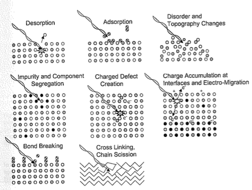
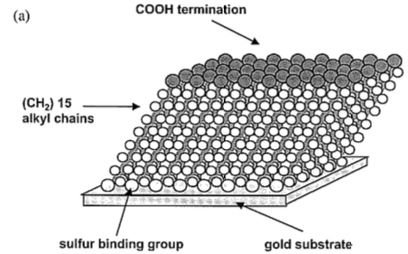
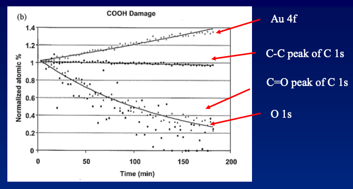
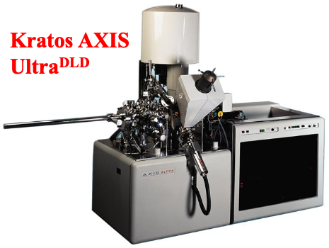
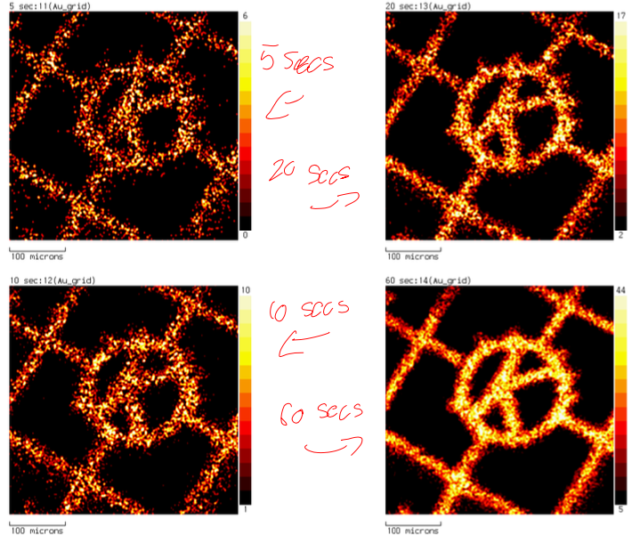
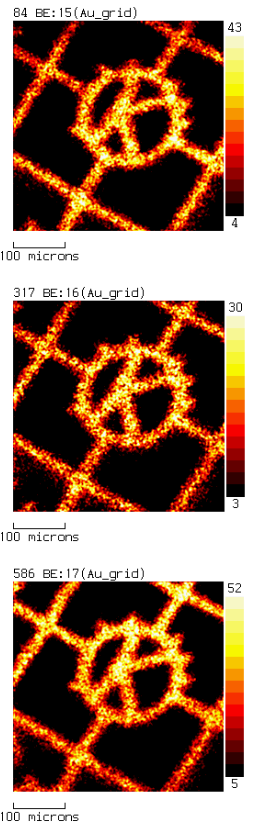
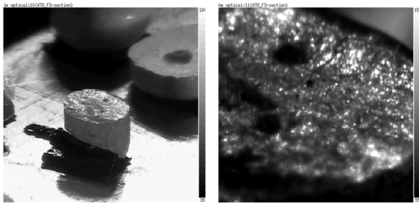
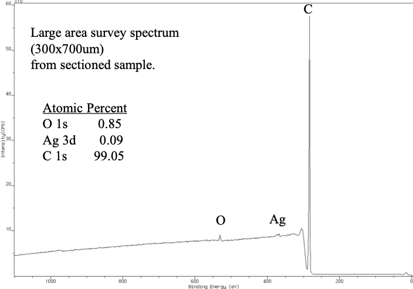
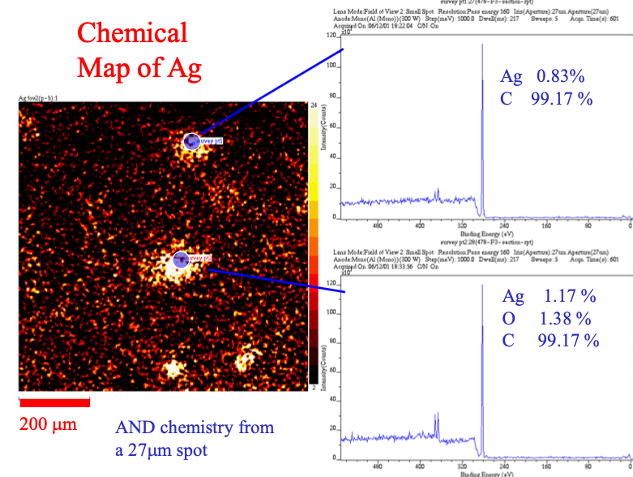
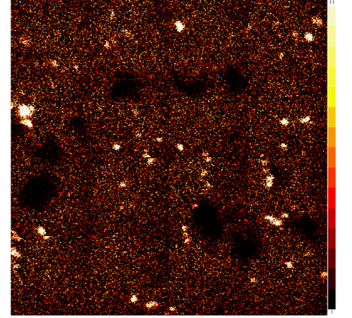

# XPS Damage and Scanning

Even though XPS uses "soft" x-rays, they can still cause damage to the structure as shown below. One way of reducing this is to use a monochromator, so that only the wavelength you want is getting through, reducing the amount of spectrum available to do damage, without impacting the measurement.

{: style="width:50%;" class="center"}

Looking at a carboxylic terminated SAM on a gold surface, when we expose the sample to monochromated x-rays we get a plot that looks like below

{: style="width:40%;" class="center"}

The plot shows that as the time goes on (quite a large amount of time) the gold layer becomes more an more visible to the XPS, while the COOH oxygen decrease significantly. We can clearly see the damage that is being caused to the sample. This is largely because the gold layer will conduct electrons, causing the damage to be more severe, and to come assist in the detachment of the SAM.

{: style="width:60%;" class="center"}

## The Instrument

{: style="width:40%;" class="center"}

The instrument pictured is a typical XPS spectrometer. It has a number of features, including:

* A delay line detector (DLD) for measuring 2D scans in parallel (in real time)

{: style="width:50%;" class="center"}{: style="width:15%;" class="right"}

* The instrument is also capable of detecting an atom from any of its peaks (right)
* It can handle small spot analysis
  * Typically these instruments have a measurement window of $300-700\:\mu m^2$, 
  * In spectroscopy mode, it can analyse at $15\:\mu m^2$
  * In imaging mode it can take snapshots at $3\:\mu m^2$
* Co-axial charge neutralisation allows for insulators to be analysed - this replaces electrons in the sample that have been ejected to prevent charge buildup
* Monochromatic and achromatic x-ray sources allow for minimal degradation and high intensity scanning (respectively)
* Argon sputter gun - allows the sample to be degraded to measure the XPS of the layers underneath the sample
  * Charge build up would cause the peaks to broaden

## Application of 2D

{: style="width:40%;" class="center"}

A pellet of polypropylene that was coated with Ag nanoparticles was theorised to have antimicrobial activity, but didn't in practice. The initial scan looked to have a very low concentration of Ag, as the window it was scanning was far bigger than any of the nanoparticles.

{: style="width:50%;" class="center"}

A 2D scan was taken which indicated that the low concentration of Ag was due to how distributed the particles were across the surface. Scans could be taken at different spots to identify what each feature was made of.

{: style="width:50%;" class="center"}

To get a broad representation of the surface, multiple scanned regions were stitched together to give an even broader view.

{: style="width:50%;" class="center"}

It was ultimately determined that the bacteria would be growing around the nanoparticles, because they were too sparse to inhibit their growth.

