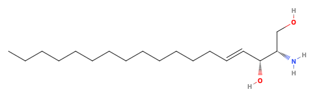
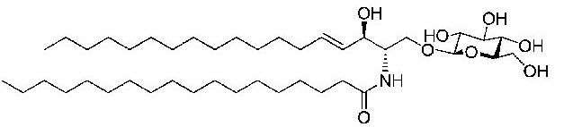

# Lipids

??? info "For lipid structure, see biochem notes attached"

	<iframe width=100% height=600px src=http://adreasnow.com/Undergrad/Notes/Sem%206.%20Food%20Science/lipids.pdf></iframe>

Lipids are a family of biomolecules that are relatively non-polar, compared to the rest of the biomolecules. They have three primary roles in biology

* They serve as a long term energy store (triglycerides)
* They act as molecular messengers and tags (steroids, glycolipids)
* The are used to forms membranes (phospholipids)

## Classification

* Fats and waxes - oils and glycerides
* Complex lipids - membrane constituents (phospho/glycolipids)
* Terpenes 
* Eicosanoids - C20 derivatives of polyunsaturated fatty acids

## Fatty Acids (FAs)

Are long chain carboxylic acids ($\gt12$ carbon atoms). They can be described by their level of saturation as:

* Saturated (no $\ce{C=C}$ bonds)
* monounsaturated (one $\ce{C=C}$ bond)
* polyunsaturated ( more than one $\ce{C=C}$ bond)

They are named in an IUPAC, systematic or common naming pattern:

* Suffixed with [number of $\ce{C=C}$ bonds]**enoic acid**
  * e.g. hexadidecanoic acid has two $\ce{C=C}$ bonds.

## Omega ($\omega$) and Delta ($\Delta$) notations

The omega ($\omega$) system measures from the methyl end and the delta ($\Delta$) system measures from the acid end.

E.g. in the image below, the FA could be considered $\omega7$ or $\Delta^9$

* IUPAC name = (9*E*)-hexanedec-9-enoic acid
* Fatty acid name = trans-$\Delta^9$-hexanedecenoic acid
* Common name = Palmitoleic acid
* Systematic name ($\omega7,\: 16:1,\:\Delta^9$)

{: style="width: 80%; "class="center"}

<iframe style="width: 300px; height: 300px" class="right" frameborder="0" src="https://embed.molview.org/v1/?mode=balls&cid=446284&bg=white"></iframe>

For polyunsaturated fatty acids, the naming convention changes a little bit:

(E.g. IUPAC name is **(5,8,11,14,17Z)-eicos-5,8,11,14,17-pentenoic acid**)

* The $\omega$ system only cares about the first double bond from the end
  * e.g. $\omega3$
* The carboxyl reference (#:#) will take the form
  <number of c atoms\>:<number of $\ce{C=C}$ bonds\>
  * e.g. $20:5$
* The delta system lists all the double bond locations
  * e.g. $\Delta^{5,8,11,14,17}$

## Glycerides

Are made of esters of fatty acids and glycerol. Fatty acids (can be three different fatty acids) bind on to the glycerol hydroxyl groups in a dehydration reaction to form the glyceride. Thy can be mono, di or triglycerides.

Mono and diglycerides are surface active substances (surfactants), as one end of them is polar and the other is non-polar.

The level of saturation of the component fatty acids will determine the viscosity of the triglyceride, as kinked (cis/Z) unsaturated triglycerides will not pack as effectively and so there will be less vDW interaction, causing hem to be less viscous. Saturated triglycerides tend to be solid at room temperature for this reason.

Triglycerides can be chiral if the outermost fatty acids are different from each other.

{: style="width: 50%; "class="center"}

## Phospholipids

In phospholipids, one of the three fatty acids is replaced with a phosphate group that gives is a polar head, making is surface active.

{: style="width: 40%; "class="center"}

Whilst they can have a glycerol backbone making them **glycerophospholipids**, they may also have a sphingosyl backbone (see below), making them **sphingolipids**. in Sphingolipids, the triglyceride bonds onto the amine, creating an amide rather than an ester, producing a molecule called a  **ceramide** (carboxy amide)

{: style="width: 50%; "class="center"}

## Glycolipids

Glycolipids are much like sphingolipids, however rather than a phosphate group attached to the free hydroxyl, a saccharide (mono or oligo) is bound. These also have a sphingosyl backbone but are broken down into two categories:

* Cerebrosides - have a mono or oligosaccharide bound
* Gangliosides - have sialic acid chains bound

{: style="width: 50%; "class="center"}

## Terpenoids{: style="width: 15%; "class="right"}

Are natural compounds that are derived from isoprene units (right). These can include linear molecules such as lycopene (below), found in tomatoes, or ring based molecules such as steroids.

{: style="width: 70%; "class="center"}

### Steroids

Cholesterol (below) is the base of steroid molecules, particularly hormones. They are based on the iconic four ring structure and are either partially or completely saturated/hydrogenated

{: style="width: 25%; "class="center"}