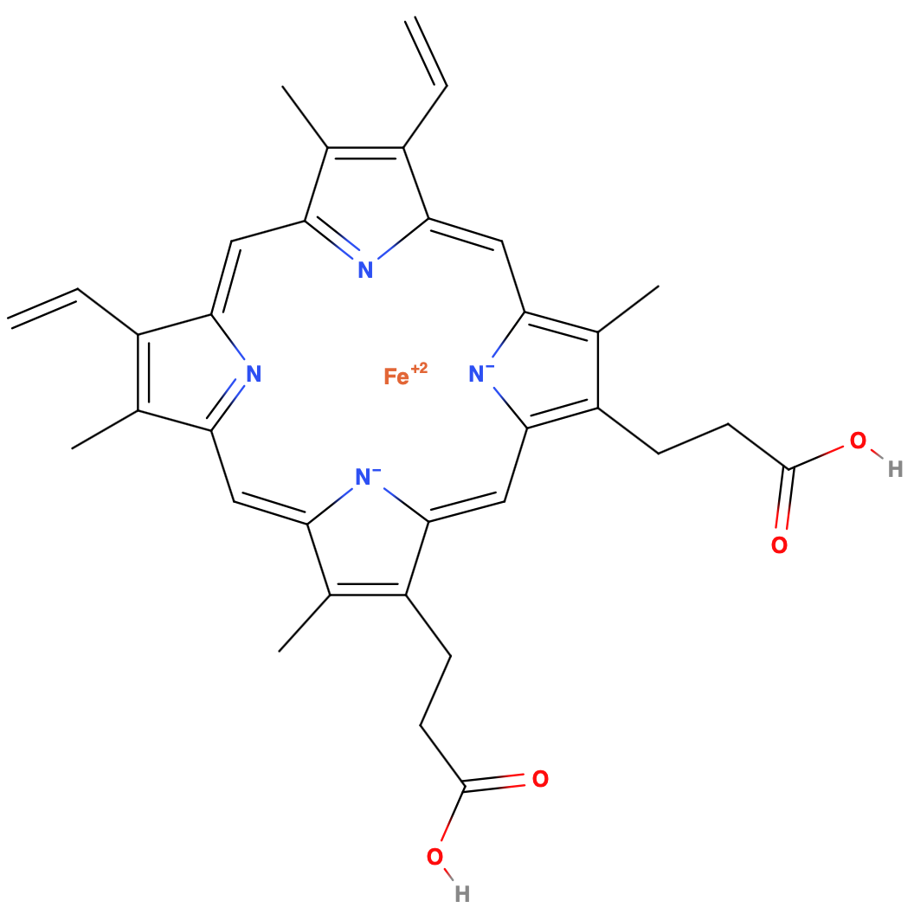

# Heavy Metals in Foods

A heavy metal can be defined in multiple different ways:

* A metal with an atomic number greater than 12 (Mg)
* A density greater than $5\:g/cm^3$

## Important Heavy Metals{: style="width: 30%; "class="right"}

Some heavy metals are required  for biological function, These include:

* Iron (Fe)
  * One of the most important transition metals as it forms porphyrin complexes that can reversibly bind to oxygen (image right)
  * The average adult contains $\sim4\:g$ of Fe 
  * RDA is $8\:mg/day$ for adults and $18\:mg/day$ for menstruating woment
  * Found in red meat, beans, poultry, fish, legumes, leafy vegetables
* Zinc (Zn)
  * Essential trace element for humans, found in $\sim100$ different enzymes
  * Average adult contains $\sim3\:g$ of Zn
  * RDA is $10\:mg/day$
  * Found in oysters, beef, lamb spinach and nuts
* Copper (Cu)
  * Found in the enzymes ceruloplasmin and hemocyanin, though is also used as a catalyst in metalloenzymes
  * Average adult contains $\sim0.3\:g$ of Cu
  * RDA is $0.7\:mg/day$
  * Found in oysters, kalem mushrooms, nuts
* Cobalt (Co)
  * Found in Vitamin B12

## Toxic Heavy Metals

Most heavy elements are toxic, such as lead (Pb), mercury (Hg), cadmium (Cd) and arsenic (As). They can be dangerous because they don't break down and often have a long half life. e.g. cadmium can have a biological half life of 16-33 years

## What They do

There are many things that toxic metals can do in the body, one is to mimic the function of essential metals, but have different reactivities, breaking the fine balance of biochemistry. They can also interact with sulfhydril groups, preventing disulphide linkages, and can interact with the phosphate backbone of DNA, preventing transcription and replication.

Given that they can mimic the function of essential trace metals, they can irreversibly bind to membrane proteins, preventing them form being able to control the flow of solutes.

## How They Enter Food

There are multiple different sources of heavy metals in food, though there are three main methods:

* From processing machinery - typically from wear and tear 
* Adsorption and absorption by plants through contact with contaminated water, soil or air
* Bioaccumulation and biomagnification

### Bioaccumulation

Is the process in which a trace amount of a toxic heavy metal is taken in by a living organism, but in which it cannot be metabolised and removed. As a result the toxic heavy metal will accumulate in the tissues of the organism. For example, deep sea fish tend to accumulate mercury. Organic pollutants tend to be stored in fat, cadmium builds up in the kidneys and mercury builds up in the liver.

### Biomagnification

This is the process by which the bioaccumulation of species that are lower on the food chain will lead to even greater concentrations in higher levels of the food chain. This is a product of each level requiring the consumption of greater and greater amounts of lower levels to get the required nutrition. This is common for mercury in the aquatic food chain, but can also happen with organic pollutants, such as pesticides and dioxins, though not all contaminants will magnify.

E.g. Mercury levels through the aquatic food chain:

| Level | Concentration    | Location    |
| ----- | ---------------- | ----------- |
| 1     | $3.0\e-6\:ppm$   | Seawater    |
| 2     | $4.0\e{-2}\:ppm$ | Zooplankton |
| 3     | $0.5\:ppm$       | Small fish  |
| 4     | $2\:ppm$         | Larger fish |
| 5     | $15\:ppm$        | Osprey      |

## Mercury (Hg)

Occurs in three forms; elemental, salt and organic, with organic mercury (typically formed by bacteria) being the most toxic. Contamination occurs from mining, smelting, insecticides and industrial discharge, though it is often found in common household items, such as; thermometers, dental amalgams, fluorescent light bulbs, disc batteries, electrical switches, folk remedies, chemistry sets and vaccines (as an adjuvant).

It can both be absorbed through the skin and can be inhaled as vapour, resulting in a disruption to neurological function and the immune system (in mammals). The act of being contaminated by coming in to contact with mercury is known as mercurialism and can be detected using a 24 hour urine collection (for inorganic), or via a blood test (for organic). The treatment is chelation therapy to make the mercury in the body more water soluble, so that it can't react with the biochemistry of the body, and so that it can be solubilised and excreted.

### Case Study - Minamata Bay

The disease was first discovered on 1st May 1956, and was caused by eating fish from the Minamata Bay in Japan. The company Nippon Chisso was dumping methyl mercury into the bay from 1930 until 1966 (seven years after the researchers had identified the cause of the illness).

As of October 2001, the Japanese government have officially recognised 2256 victims with 1435 having died. Another 15000 people have registered, but haven't been recognised as victims as of yet. The estimates suggest that up to 2 million people have been victim to the incident.

Fishing in the bay was banned in 16 (10 years after the dumping had stopped), and large nets were rigged to prevent any fish in the bay from leaving. The nets were eventually removed and fishing has since recommenced.

## Analysis of Heavy Metals

Heavy metals are typically identified and quantified using AAS, ICP-OES and electrochemical methods, though colorimetric analysis can also be performed.