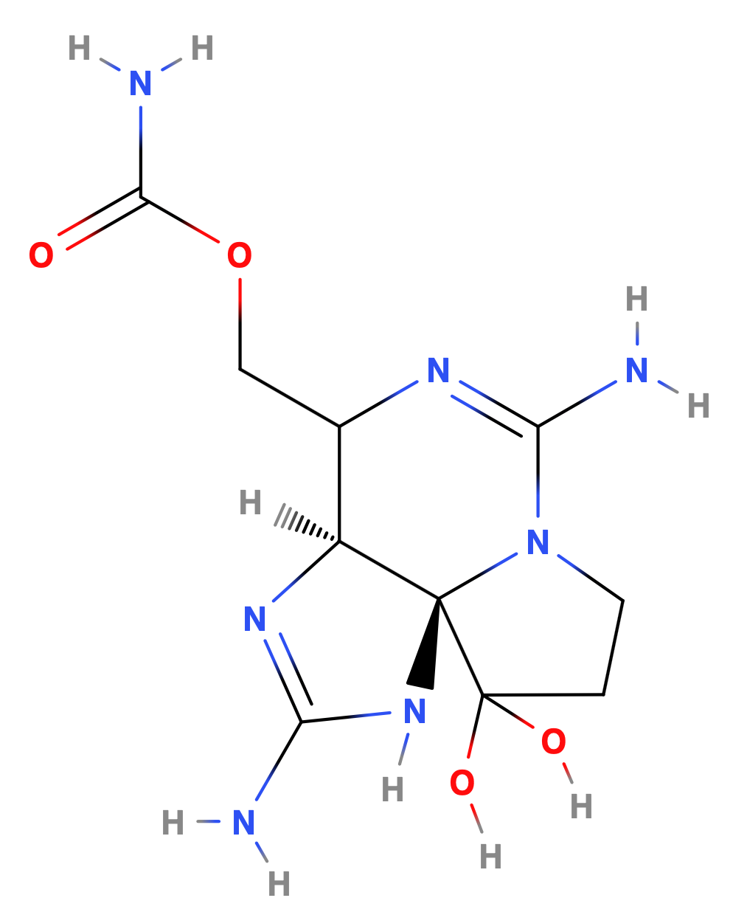
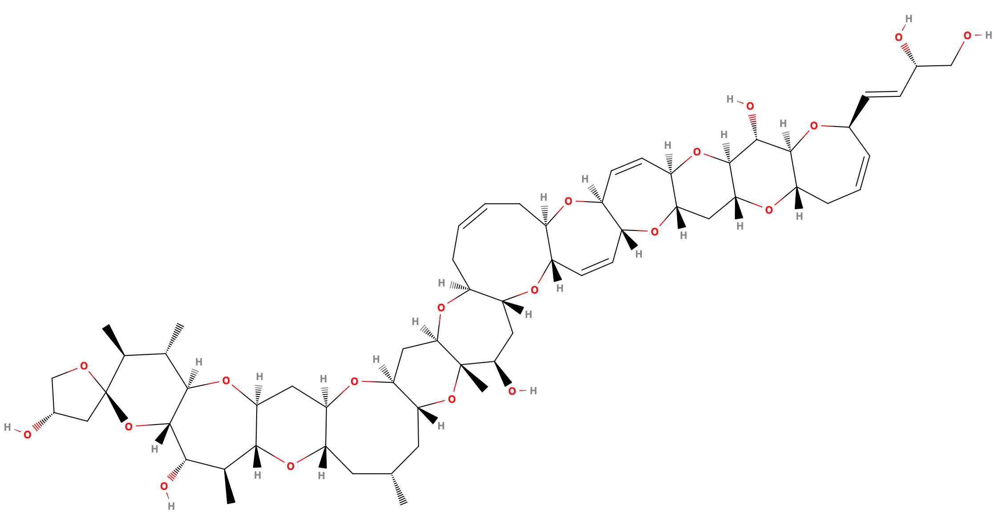
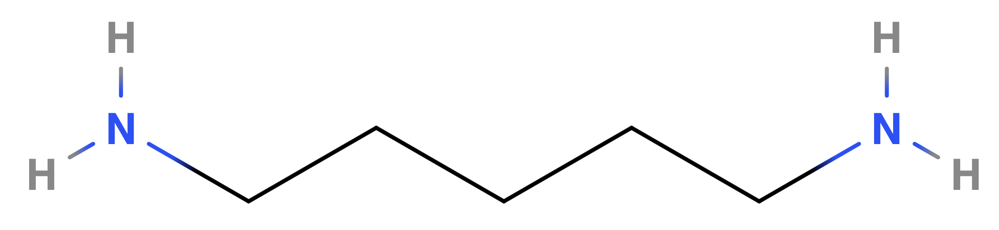
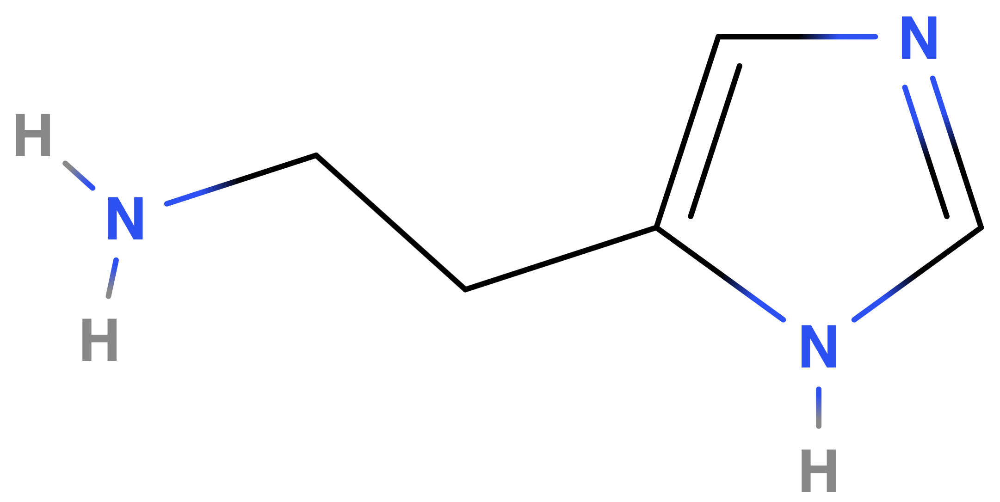
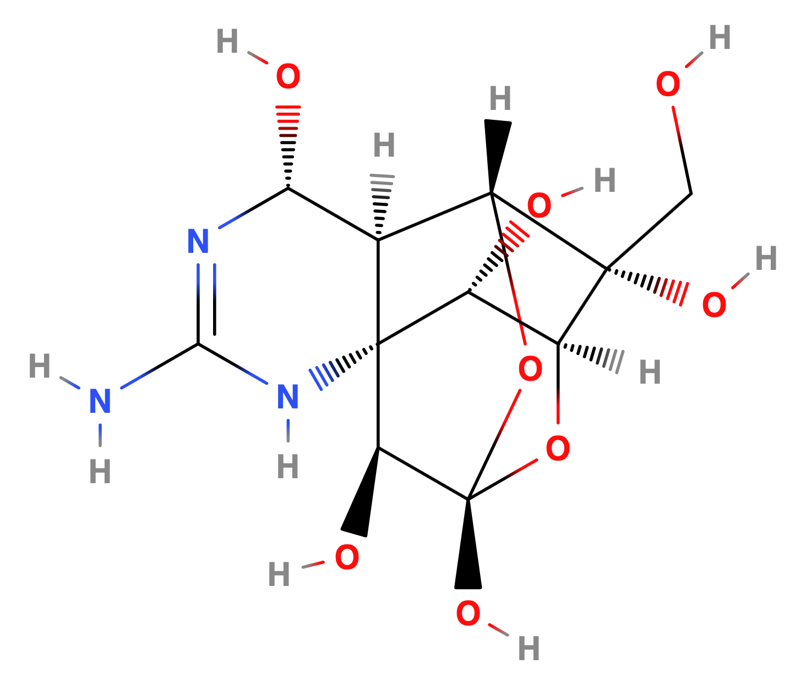
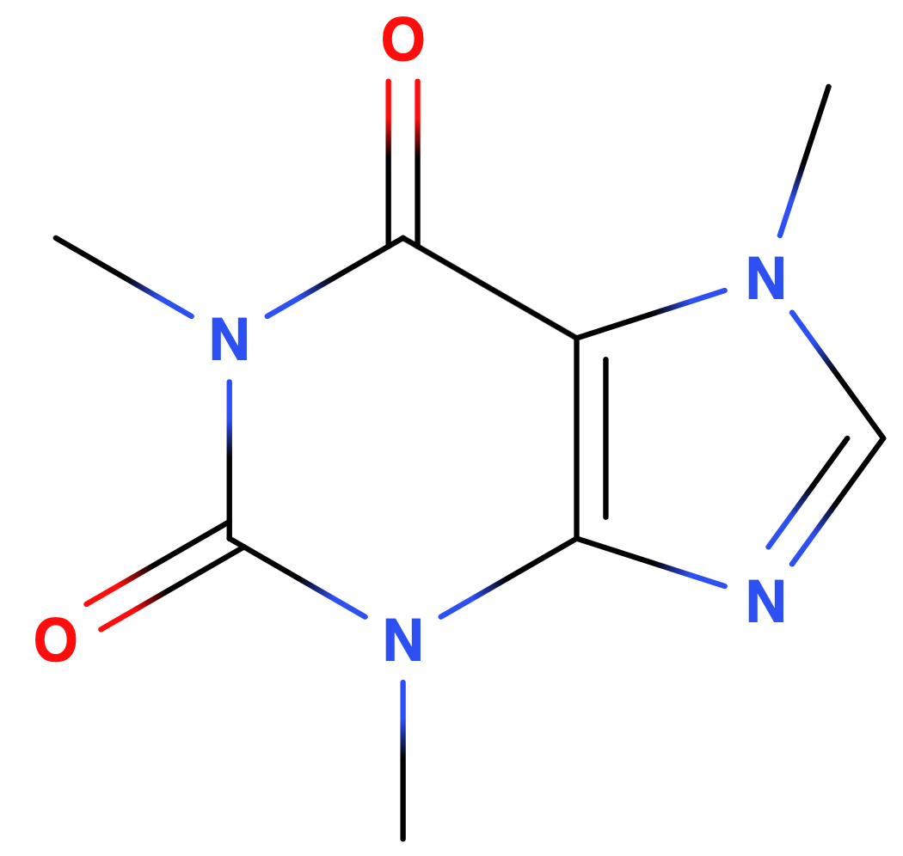

# Foods Toxins

!!! info "Definitions"
	**Toxicant:** A substance which is toxic that is man made 
	**Toxin:** A substance which is toxic that is made by a living organism

## Measure of Toxicity

Median lethal dose ($LD_{50}$) is a measure of lethal dose of a toxin, it is the amount of the substance that is required to kill 50% of the population after a specified test duration. A lower $LD_{50}$ is indicative of a higher toxicity, as a smaller dose is required to kill.

## Fish and Shellfish Toxins

### Red Tides

Red tide is caused by an algal bloom of phytoplankton. They are caused by both natural (seasonal climate and currents) and human means (nutrient loading), but also by global climate change.

Red tides are harmful toe the environment and ocean inhabitants, producing toxins, but also consuming all the dissolved oxygen, suffocating other creatures.

{: style="width: 40%; "class="center"}

#### Saxitoxin{: style="width: 20%; "class="right"}

The algal bloom produces saxitoxin (STS), which is particularly accumulated by shellfish. it's a potent neurotoxin and is the best known paralytic shellfish toxin. In humans the ingestion of the toxin causes the illness known as paralytic shellfish poisoning, and the $LD_{50}$ is only $0.263\:mg/kg$ orally, meaning that an average adult would only need $20\:mg$ to be lethal. It has unsurprisingly been used by the US military as a chemical weapon.

### Ciguatera Poisoning

Ciguatera is the most common cause of fish poisoning, which is caused by the eating of tropical reef fish that have accumulated ciguatoxin in their flesh. It has acute neurological ans gastrointestinal symptoms.****

Ciguatoxin is produced by the eukaryotic microbe *Gambierdiscus toxicus* and is accumulate by large reef fish.

{: style="width: 50%; "class="center"}

### Scombroid Poisoning

Is a food-borne illness that comes from eating spoiled (decayed) fish, which is caused by histamine and cadaverine from the bacterial decomposition of muscle. Histamine is not destroyed by normal cooking temperatures and is the main chemical responsible for true allergic reactions so the symptoms are almost identical to a food allergy. 

|                          Cadaverine                          |                          Histamine                           |
| :----------------------------------------------------------: | :----------------------------------------------------------: |
| {: style="max-width: 300px; "class="center"} | {: style="max-width: 200px; "class="center"} |

### Tetrodotoxin

The majority of pufferfish are toxic and are considered some of the most poisonous vertebrates in the world. In some pufferfish species, the skin and internal organs contain tetrodotoxin (TTX) which is highly toxic to most animals. The toxin binds to the voltage gated sodium channels, blocking the passage of sodium ions through membranes, and as a result is extremely toxic, with an oral $LD_{50}$ (for mice) of $334\:\mu g/kg$

{: style="width: 20%; "class="right"}

## Plant Toxins

### HCN

Hydrogen cyanide is a colourless, extremely poisonous, and flammable liquid that's found in the pits/seeds of some fruit including cherries, apricots apples and also in bitter almonds. It has a rat $LC_{50}$ of $501\:ppm$ for death within 5 minutes or $160\:ppm$ for 30 mins.

It works because the cyanide ion $\ce{CN-}$ binds to cytochrome c oxidase and acts as a non-competitive inhibitor. It binds to iron within the heme subunits of the cytochrome, preventing oxygen transport.

### Ricin

Is a naturally occurring lecithin produced in the seeds of the castor oil plant and is one of the most toxic compounds we know of, with an $LD_{50}$ of $1\:mg/kg$. Its mechanism of action works by inhibiting protein synthesis.

#### Georgi Markov

Ricin was used in the assassination of Bulgarian writer Georgi Markov in 1978. The ricin was incorporated into a small pellet that was fired from an umbrella tip and was absorbed into his body. He died  three days after the incident.

### Mushroom Poisoning

Also known as mycetism or micetismus, refers to the ingestion of toxic substances present in mushrooms. These compounds are typically secondary metabolites of the fungus and can differ greatly, causing mild gastrointestinal issues, to death.

### Glycoalkaloid

Potatoes contain toxic substances known as glycoalkaloids, which are predominantly found in the flowers and sprouts. They're not typically consumed, though in humans they can cause headaches, diarrhea, cramps, and in severe cases, coma and death.

{: style="width: 40%; "class="center"}

### Caffeine and Related Alkaloids

Alkaloids are a group of naturally occurring chemical compounds that mostly contain nitrogen atoms. They have a bitter taste and are poisonous when ingested.

Caffeine is the most widely consumed psychoactve substance in the world and is predominantly unregulated. It is a central nervous system stimulant and reversibly binds to the adenosine receptor.

While caffeine is classified as GRAS, it has a toxid dose of over $10\:g$ ($50-100\:cups/day$) to be lethal

|                           Caffeine                           |                         Theophylline                         |                         Theobromine                          |
| :----------------------------------------------------------: | :----------------------------------------------------------: | :----------------------------------------------------------: |
| {: style="max-width: 150px; "class="center"} | {: style="max-width: 150px; "class="center"} | {: style="max-width: 150px; "class="center"} |