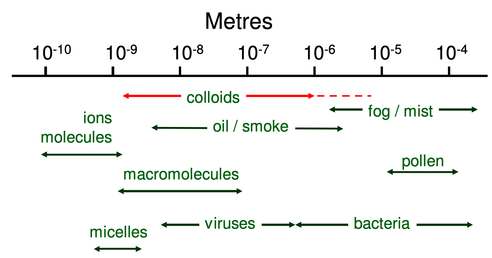
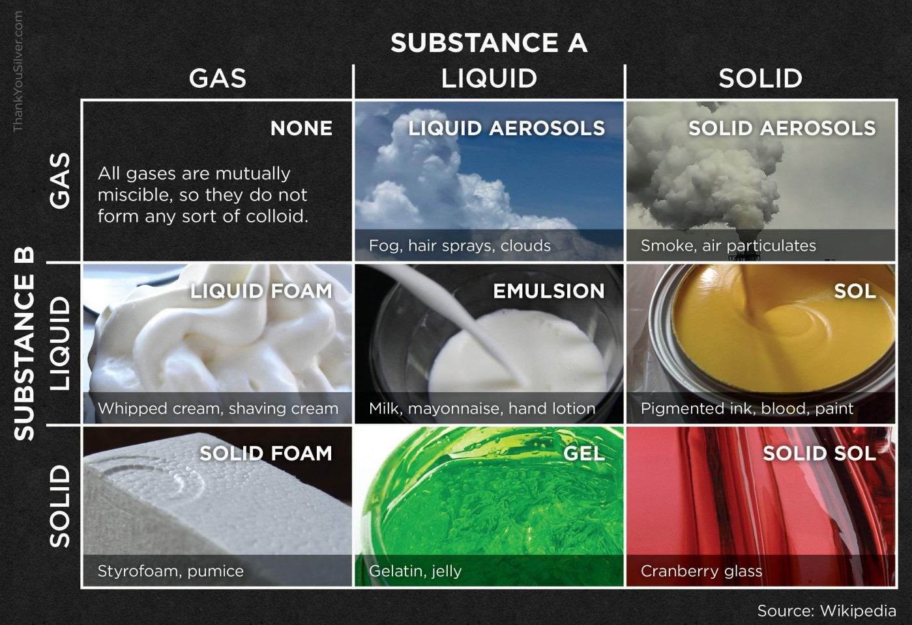

# Introduction to Colloids

## What is a Colloid?

!!! note "Definition"
	Colloids are particles with at least one dimension in the size range of $1\:nm$ to $1\:\mu m$

For some context of scale: 

{: style="width: 40%; "class="center"}

## Types of Colloids

There are a few specific terms for different times of colloids in different media and they go as follows:

* Foam - gas $\ce{->}$ liquid/solid
* Aerosol - liquid  $\ce{->}$ gas/solid
* Emulsion - liquid  $\ce{->}$ liquid
* Gel - liquid  $\ce{->}$ solid
* Sol  - solid $\ce{->}$ liquid/solid

{: style="width: 50%; "class="center"}

## What is Surface Chemistry?

Surface chemistry is concerned with the processes that happen at an interface. Molecules at an interface will have inherently different properties to molecules in the bulk.

Since colloids are incredibly small, they have a much larger surface area than the same amount of matter in a single mass and therefore the surface chemistry becomes much more important.

### Surface Area

A sphere of matter $r=1.00\:cm$ has the volume:

$$
\begin{align}SA&=4\pi r^2\\
SA&=4\pi 1.00^2\\
SA&=12.6\:cm^2
\end{align}
$$

And a volume of:

$$
\begin{align}V&=\frac{4}{3}\pi r^3\\
V&=\frac{4}{3}\pi 1.00^3\\
V&=4.19\:cm^3
\end{align}
$$

If we took that same volume and broke it down into spheres of $r=0.1\:cm$, we would get:

$$
\begin{align}V&=\frac{4}{3}\pi r^3\\
V&=\frac{4}{3}\pi 0.1^3\\
V&=0.00419\:cm^3
\end{align}
$$

And we'd have 1000 of them:

$$
\frac{4.19\:cm^3}{0.00419\:cm^3}=1000
$$
For a total surface area of:

$$
\begin{align}SA&=4\pi r^2\\
SA&=4\pi 0.1^2\\
SA&=0.126\:cm^2\\
1000(12.6\:cm^2)&=126\:cm^2
\end{align}
$$

### Scaling

When we decrease the radius by a factor of 10, the surface area decreases by a factor of $10^2$ ($r^2$), while the volume decreases by a factor of $10^3$ ($r^3$).

At colloidal scales, you end up with massive surface areas

$$
r=100\:nm,V=4.19\:cm^3 : SA=1260000\:cm^2 =126\:m^2
$$
## Preparation of Colloids

Preparation is typically produced either by milling or aggregation. Milling however can lead to contamination. Whatever you are milling the colloid in can leave particulate matter in the colloids.

Aggregation (controlled precipitation from a super-saturated solution) is a cleaner method for this reason.

## Cleaning Colloids

Is typically done by one of three methods:

* Centrifugation - Quick but dirty
* Dialysis - Slow but clean
* Ultrafiltration - Slow, but will clog frequently with fine colloids.