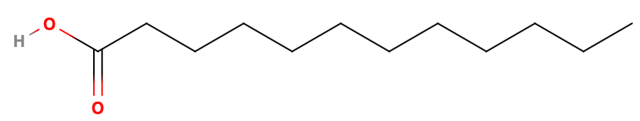
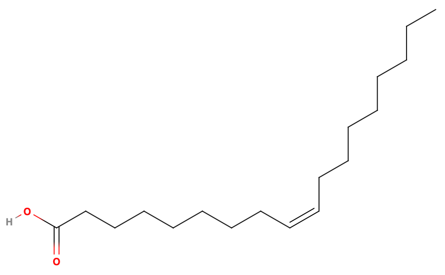
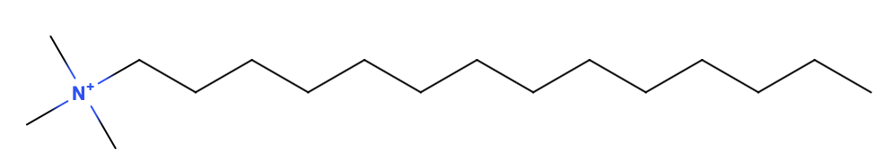
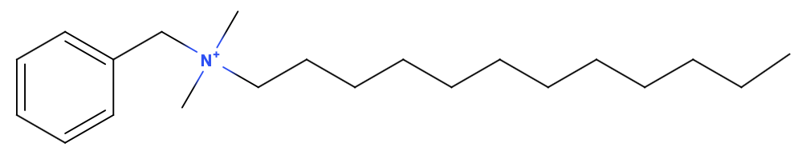
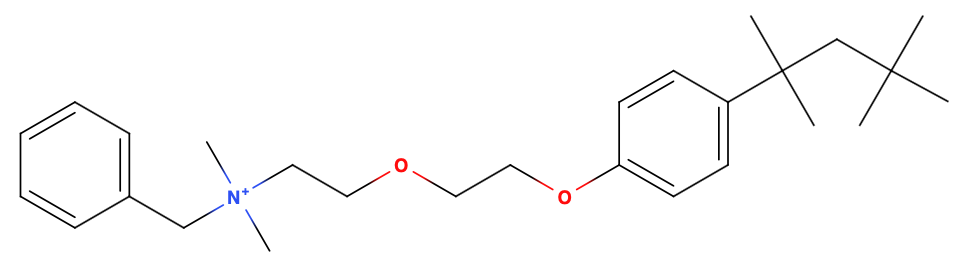
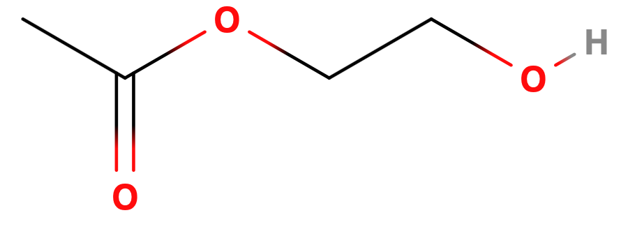

# Emulsions 1

Emulsions are **thermodynamically metastable** dispersions of one phase in another immiscible phase. They can be stabilised by a third substance called an emulsifier or  emulsifying agent.

{: style="width: 50%; "class="center"}

## Types of Emulsions

Emulsions are described by two particular features:

* The dispersed phase - the particulate phase 
* The continuous phase - the bulk, within which the emulsion is suspended

Emulsions can either be oil-in-water (O/W) or water-in-oil (W/O). 

The type of the emulsion can be determined through a few different means, such as:

* Phase volume ratio - typically the continuous phase has the largest volume
* Type of emulsifier - they are typically more soluble in the continuous phase
* Dilution test - an emulsion can only be **diluted** by its continuous phase
* Due solubility test - dyes will typically have a preferential solubility in the different phase, so it 

## Stability of Emulsions

Emulsions are ultimately thermodynamically unstable, the process of emulsifying an immiscible phase increases the interacting surface area and has a resulting increase in $\Delta G$. Though ultimately, apart from spontaneous emulsions, they will separate, making them metastable and not stable. The system would rather be in separate phases, however there is too much of an energy barrier and thus they remain emulsified, though statistical mechanics will ensure that some portion of the emulsion will destabilise over time. 

The $\Delta G$ of the system is given by a derivation of the Gibb's free energy equation:

$$
\Delta G=(\gamma A)-(T\Delta S)
$$
Where:

* $\gamma=$ interfacial tension
* $A=$ interfacial area
* $T=$ temperature
* $\Delta S=$ change in entropy

## Other Types of Emulsions

### Multi Phase Emulsions

In the pursuit of being able to deliver drugs more specifically through multiple changing environments, multi level emulsions have been developed. These include oil-in-water-in-oil (O/W/O) and water-in-oil-in-water (W/O/W) emulsions

{: style="width: 65%; "class="center"}

### Micro-emulsions

Are stable, spontaneous emulsions that are optically transparent, and typically non-viscous. Their transparency comes from them being much smaller than the wavelength of visible light

| Property     |          Micro-emulsion           |          Emulsion          |
| ------------ | :-------------------------------: | :------------------------: |
| Transparency |            Transparent            |   Translucent or opaque    |
| Size         |           $10-100\:nm$            |      $0.1-10\:\mu m$       |
| Formation    |            Spontaneous            |   Manual emulsification    |
| Stability    |              Stable               |         Metastable         |
| Viscosity    | 20-40% without viscosity increase | Viscosity always increases |

## Stabilisation

There are two primary theories to describe the surfactant stabilisation of emulsions:

* [Surface Tension Theory](#surfactants) - the surfactant acts to reduce the interfacial tension (surface tension) ($\gamma$)
* Interfacial Film Theory:
  * [By preventing the droplets from combining into larger droplets](../08b/#hydrocolloid-emulsifying-agents) (and into the one continuous phase)
  * [By forming an EDL on the outside of the droplet](../08b/#edl-formation)

## Surfactants

For Stabilisation based on Surface Tension Theory, we need to use surfactants, these can be classified in to:

### Anionic Surfactants

Monovalent anionic surfactant s such as $\ce{K+}$ and $\ce{Na+}$ salts of lauric/oleic acid are soluble in water and thus act as good O/W surfactants

Polyvalent anionic surfactants (salts of $\ce{Ca^{2+}}$ and $\ce{Mg^{2+}}$) are typically water insoluble and are better W/O emulsifiers

Unfortunately though, they require a high pH ($<10$) to ensure that they remain deprotonated and they have a bitter taste, so are typically not used for the stabilisation fo food products. They're also an irritant to the intestinal mucosa

| Name        | Structure                                                    |
| ----------- | ------------------------------------------------------------ |
| Lauric acid | {: style="width: 80%; "class="center"} |
| Oleic Acid  | {: style="width: 80%; "class="center"} |

### Cationic Surfactants

Are typically used to produce O/W emulsions for external products (lotions and creams). They need to stay in a low pH to ensure their positive charge, though this works well as they're usually used for skin care products, which are typically also acidic ($4-6$). 

While they are also bactericidal, they tend to be comparatively weak emulsifying agents, so they are typically mixed with auxiliary emulsifiers, such as cetostearyl alcohol

These often include quaternary ammonium surfactants, such as:

| Name                  | Structure                                                    |
| --------------------- | ------------------------------------------------------------ |
| Cetrimide             | {: style="width: 80%; "class="center"} |
| Benzalkonium chloride | {: style="width: 80%; "class="center"} |
| Benzethonium chloride | {: style="width: 80%; "class="center"} |

### Nonionic Surfactants

Are polar without being explicitly charged. As a result, they are useful across a wide pH range, as they are less likely to be protonated/deprotonated. They are suitable for both O/W and W/O emulsifiers and are also suitable for internal use, as such they are known as "low irritancy" surfactants.

Some nonionic surfactants include:

| Name                                                         | Structure                                                    |
| ------------------------------------------------------------ | ------------------------------------------------------------ |
| Polyoxy ethylene fatty alcohol ethers                        | {: style="width: 50%; "class="center"} |
| Sorbitan fatty acid esters (Sorbitan monolaurate)            | {: style="width: 80%; "class="center"} |
| Polyoxyethylene sorbitan fatty acid esters (Polysorbate)     | {: style="width: 80%; "class="center"} |
| Polyoxyethylene polyoxypopylene block copolymers (Poloxamers) | {: style="width: 50%; "class="center"} |
| Lanolin alcohols                                             |                                                              |
| Ethoxylated lanolin alcohols (Ethoxylated lanolin acetate)   | {: style="width: 50%; "class="center"} |
