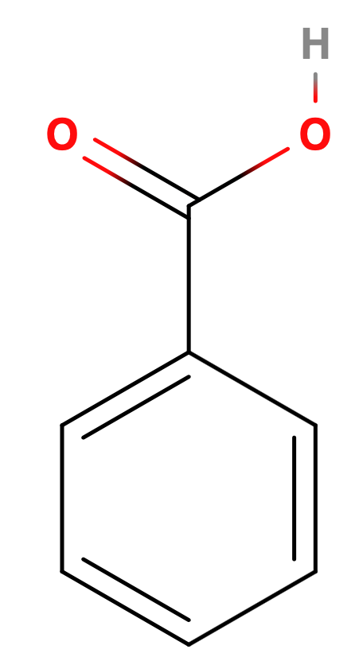
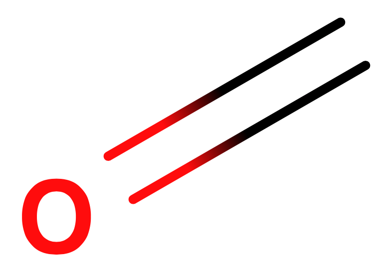
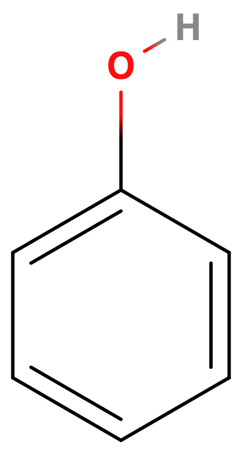
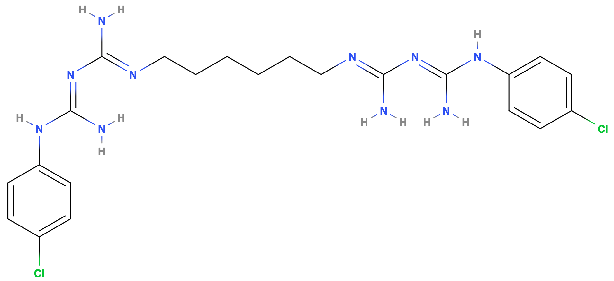
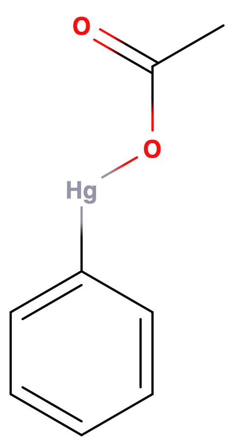
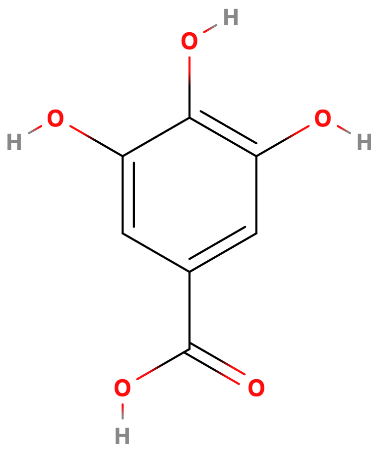
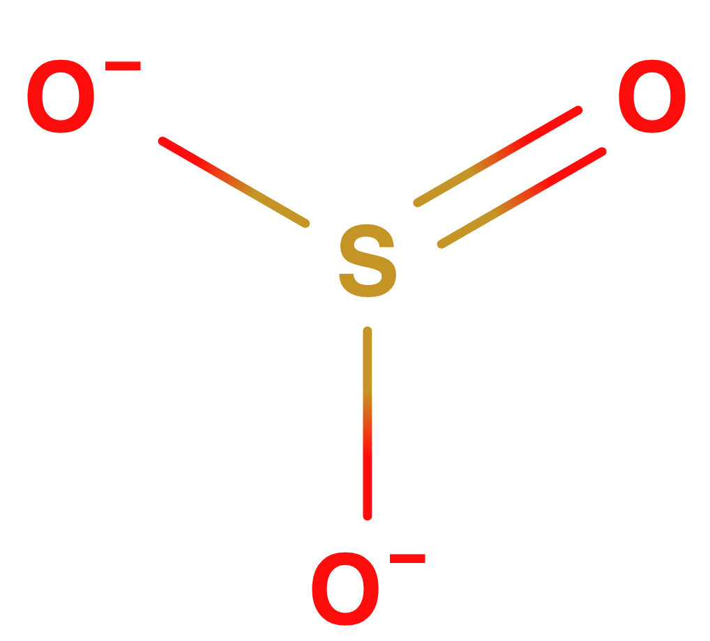
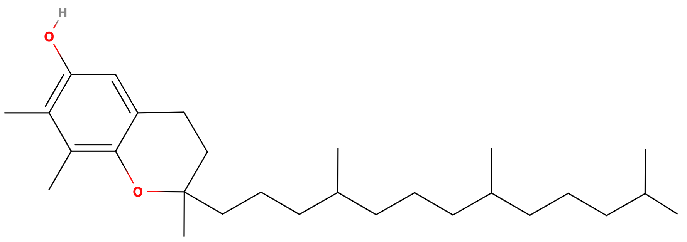
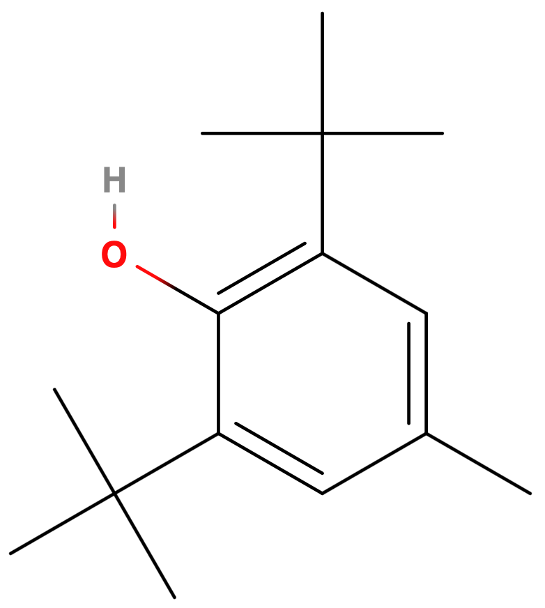
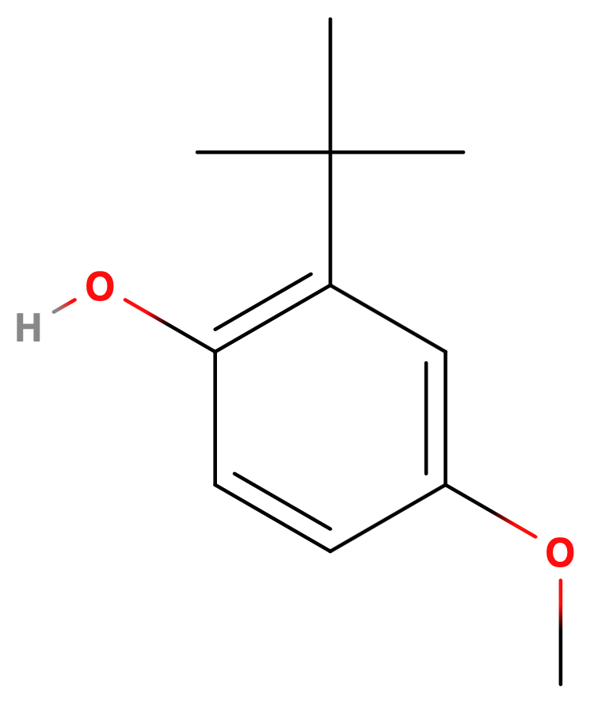

# Emulsions 2

## Hydrophile-Liphophile Balance (HLB)

One metric of quantifying a surfactant for a particular function is the HLB. This metric takes into account that polar components are heavier than non-polar ones, however it really is just an approximation:

$$
HLB=20\bigg(\frac{\text{mass of hydrophillic component}}{\text{mass of whole molecule}}\bigg)
$$
O/W emulsifiers should be HLB 8-16 and W/O emulsifiers should be HLB 3-6

{: style="width: 50%; "class="center"}

!!! info "Example - Calculate the HLB for the molecule $\ce{C16H33E5OH}\:\:\:\:(E=\ce{CH2CH2O})$"
	
	$$
	\begin{align}m_E&=(12.011\times2)+(1.008\times4)+(15.999\times1)\\
	&=44.053\\
	m_{\ce{hydrophillic}} &= 44.053\times 5 + 15.999 + 1.008\\
	&=237.272\\
	m_{\ce{C16H33}}&=(12.011\times16)+(1.008\times33)\\
	&=225.44\\
	HLB&=20\bigg(\frac{237.272}{237.272+225.44}\bigg)\\
	&=10.26
	\end{align}
	$$
	
	This surfactant is suitable for O/W emulsions

## HLB of Surfactant Blends

Pretty simply, the HLB of multiple surfactants will be the weighted sum of each:

$$
HLB_{sum}=\phi_1HLB_1+\phi_2HLB_2
$$
Where $\phi=$ the proportion of that surfactant

To calculate the percentage of surfactant we can use the formula:

$$
\phi=\frac{HLB_f-HLB_2}{HLB_1-HLB_2}
$$

* $\%$ surfactant 1 $=\phi$
* $\%$ surfactant 2 $=1-\phi$

!!! info "Derivation"
	
	$$
	\begin{align}
	\phi_1+\phi_2&=1\\
	\phi_2&=1-\phi_1\\
	\\
	H&=x_1\phi+x_2(1-\phi)\\
	H&=x_1\phi+x_2-x_2\phi\\
	H-x_2&=\phi(x_1-x_2)\\
	\frac{H-x_2}{x_1-x_2}&=\phi
	\end{align}$$	

## Hydrocolloid Emulsifying Agents

Colloidal particles or finely dispersed solids can be used to disperse themselves around the emulsion droplets. these can either impart a charge to the dispersed droplets so that they repel each other, or they can swell to increase the viscosity of the medium, reducing the impact of kinetic brownian motion. Colloidal clays like bentonite ($\ce{Al2O3.4SiO2.H2O}$), veegum ($\ce{MgSiO3/Al2(SiO3)3}$).

## EDL Formation

If the surfactant used is polar or charged, it can form an [EDL that has a repulsive behaviuor](../../Colloids/03a/).

## Natural Emulsifiers

Are typically the preferred choice for food emulsification, as it removes the need for chemical regulation and can limit the amount of social backlash against "chemicals". These are typically:

* Polysaccharides such as Acacia, tragacanth, agar, pectin

  * These polymerise to help to increase the viscosity and act as a [stabilising polymer](../../Colloids/03b/#steric-stabilisation)

* Polypeptides such as gelatine

  * Obtain through the partial hydrolysis of collagen, acts similarly to a polysaccharide

  {: style="width: 60%; "class="center"}

* Surfactants

  * Pectin (o/w), lecithin (below) (o/w) and cholesterol (w/o)

{: style="width: 50%; "class="center"}

## Other Additives

While emulsifiers are the most important additions to emulsions, there are some other additives we can include:

### Auxiliary Emulsifying Agents

These compounds are typically incapable of forming a stable emulsion on their own, though with their addition they can often thicken and thus stabilise the emulsion. Some of them reduce the vDW interaction between droplets, stopping them from aggregating, others provide a physical barrier between the droplets.

These can be peptides, semisynthetic polysaccharides (e.g. CMC - below) or clays

{: style="width: 20%; "class="center"}

### Preservatives

These are vital for all shelf stable, consumer grade emulsions, as they prevent bacterial growth. Emulsions often contain carbohydrates, proteins, sterols and phosphatides which can all acts as growth media fro bacteria. The bacteria could easily contaminate the mixture during production, though it could also be contaminated during use of the product.

Some common antimicrobial agents include:

| Class                      | Example                                                      | Structure                                                    |
| -------------------------- | ------------------------------------------------------------ | ------------------------------------------------------------ |
| Acids and acid derivatives | **Benzoic acid**                                             | {: style="width: 15%; "class="center"} |
| Aldehydes                  | **Formaldehyde**                                             | {: style="width: 10%; "class="center"} |
| Phenolics                  | **Phenol**                                                   | {: style="width: 15%; "class="center"} |
| Quaternaries               | -**Chlorhexidine**,  -Benzalkonium chloride  -Cetyl trimethyl ammonium bromide | {: style="width: 80%; "class="center"} |
| Mercurials                 | **Phenyl mercuric acetate**                                  | {: style="width: 15%; "class="center"} |

### Antioxidants

Oxidation can produce free radical species that can be incredibly destructive to surrounding chemicals. Antioxidants aim to reduce free radicals by acting as an electron donor to the radical species.

While this does ultimately end up with a radical antioxidant, the structure is resonance stabilised and is thus significantly less reactive.

Because resonance is such an important component, antioxidants are quite often phenolic structures, such as BHT:

{: style="width: 50%; "class="center"}

Some common antioxidants include:

| Class                                 | Structure                                                    |
| ------------------------------------- | ------------------------------------------------------------ |
| -**Gallic acid** -Propyl gallate | {: style="width: 25%; "class="center"} |
| Ascorbic Acid                         | {: style="width: 25%; "class="center"} |
| Sulphites                             | {: style="width: 15%; "class="center"} |
| L-tocopherol                          | {: style="width: 80%; "class="center"} |
| Butylated hydroxytoluene              | {: style="width: 25%; "class="center"} |
| Butylated hydroxyanisole              | {: style="width: 25%; "class="center"} |