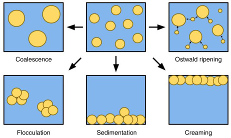

# Emulsions 3

From a stable emulsion, the main way that it will break is that the droplets can coalesce into larger droplets that can lead to complete phase separation (breaking). It is possible for the system to flocculate if the surfactant will provide adequate repulsive force between the droplets.

{: style="width: 60%; "class="center"}

While flocculation can be reversible with some shaking to re-disperse the droplets, once they coalesce, there is not recovery without re-emulsification. How reversible the flocculation is dependent on the:

* Chemical nature of the emulsifier (e.g. will it form an EDL)
* Phase volume ratio
* Concentration of dissolved substances (e.g. electrolyte concentration if an EDL is formed)

When the emulsion doesn't fill the bulk phase, it can condense into a smaller space (without coalescing) in a process that will be dictated by the density difference of the two phases. If the dispersed phase is more dense, it will sink, if it is less dense, it will rise.

## Rate of Setting

The rate of setting is governed by Stoke's law:

$$
V=\frac{d^2(\rho_w-\rho_o)r\omega^2}{18\eta}
$$

Where:

* $d=$ diameter of the particles
* $\rho_w$ and $\rho_w=$ density of the water and oil respectively
* $r\omega^2=$ gravitational constant
* $\eta=$ viscosity of the medium

## Coalescence (Cracking)

Is the process by which emulsified droplets merge with each other to form large particles. This differs from flocculation in that the interfacial film between the droplets breaks and is therefore incapable of reforming.

This will occur because:

* The globule size is big ($>1-\:\mu m$)
* The emulsion is stored at too high a temperature
* There are chemical or physical changes that affect the interfacial film

## Phase Separation (Breaking)

When the interfacial film completely disappears, or is incapable of supporting the emulsion, the two phases will absolutely separate. This will happen due to:

* Chemical reasons (acidification)
* Electrolytic reasons (adding salts)
* Physical means (stirring or centrifuging the emulsion)

## Phase inversion

Is the switching of the continuous and disperse phases (e.g. o/w $\to$ w/o). the process leads to the formation of finely dispersed droplets in the continuous phase and is widely used in industry.

Phase inversion can be accomplished through multiple means, such as agitation, but also the conversion of the surfactant into a form which will favour the opposite phase configuration, e.g. adding $\ce{CaCl2}$ to an o/w emulsion that uses sodium soaps can trigger inversion

## Evaluating Emulsion Stability

By evaluating the stability of the emulsion, we can determine its shelf life. The two main stressors that are tested are:

### Thermal Stress

The room temperature destabilisation rate can be determined by measuring how long it takes to destabilise at $40^\circ C$ and multiplying it by 4.

We can also measure the Phase Inversion Temperature (PIT), as  higher PIT will result in less coalescence. it is vital then, that the PIT be much higher than the storage temperature of the emulsion.

### Gravitational Stress

To simulate the effect of gravity over the course of a year, the emulsion can be centrifuged for 5 hours at 3750 rpm in a radius of 10cm.

## Emulsification Techniques

The two primary steps involved are to; break the dispersed phase into droplets by adding energy into the system and to stabilise the emulsion.

There are a few primary methods to produce the emulsion, as the method in which the emulsion is produced will greatly influence the droplet size and the resulting product stability.

* Dry gum method (continental) - (4:2:1 oil:water:gum) - oil and gum are combined, water is added
  * Stabiliser could be a hydrocolloid or a gum
* Wet gum method (English) - gum is triturated with water to make a mucilage before oil is slowly added
  * After the emulsion is formed, additives are added
  * Technically more difficult to perfrm than the continental method (especially with viscous oils) though the emulsion is more stable
* Bottle method - Used for preparation of emulsions of volatile oils - gums are added to a bottle wit the oil and are capped and shaken
  * The water is added in one go and the bottle is shaken until the emulsion forms
  * Teh gum and oil can't be mixed for too long, or they will completely repel the water 

### Homogenisation

An easy way to break up the dispersed phase is to physically disturb the phases using a homogeniser to break the phase up into smaller droplets.

It can also be accomplished however through the addition of heat, through agitation or through trituration.

## Applications

In food emulsions are used commonly as:

* Milk and beverages
* Butters and spreads
* Dips and sauces
* Ice creams and desserts
* Powdered products, such as creamers, soups and gravy

Lecithin is the most commonly used food emulsifier, as it is zwitterionic (net negative in neutral pH), and as it is abundant in soy beans

{: style="width: 40%; "class="center"}

In health products they're commonly used as/in:

* Oral products - to reduce the unpleasant taste of some drugs and increase the absorption rate (smaller droplets to absorb)
* Parenteral (non-oral) use - lipid based nutrients are o/w emulsified. or w/o emulsions are used to disperse water soluble materials into mineral oils for injection
* Topical use - o/w emulsions are more preferable on skin as they don't have a "greasy" feeling - they are typically also washable so they wont come off as easily and are easier to apply due to their viscosity
* Drug delivery systems - Emulsions can be used to uncapsulate and target the delivery of drugs into specific components of the body and with a specific release rate