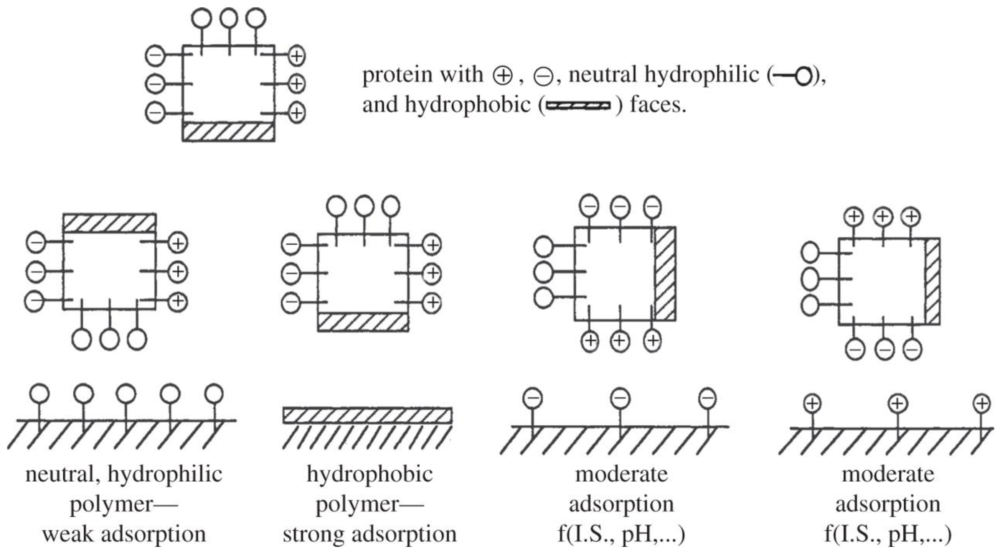
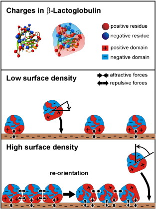
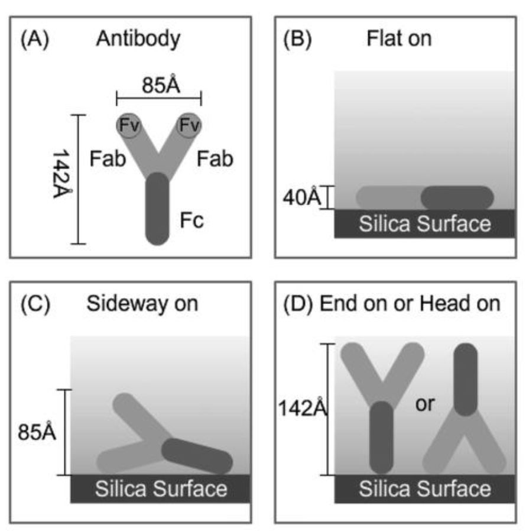
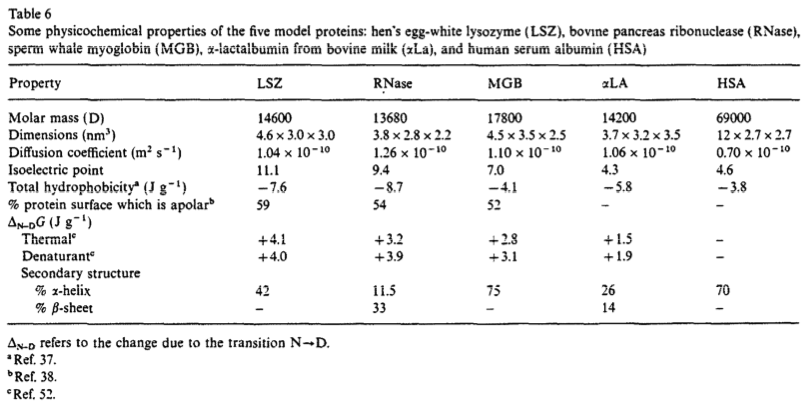

# Proteins and Polymers at the Surface

Proteins are important to consider at surfaces due to their prolific use. Some applications of this include; Medical devices (blood contacting, soft tissue, orthopedic, dental), cell cultures, tissue engineering, biosensors, protein purification (chromatography, filtration), therapeutic apheresis, hemodialysis, biomcrofluidic systems, drug delivery, nanotoxicology, solid phase immunoassays, biofouling (medical and non-medical) and biolubrication.

## Bioaggregation

Happens in four main steps:

1. The artificial surface is introduced in to the biological environment
2. Small molecules adsorb to the surface 
   * Proteins, lipids, polysaccharides, humic acids, etc. 
     * $\lt5\:ng/cm^2$ of protein binding to a surface is enough to trigger platelet adhesion and clotting.
   * Come from blood, urine, interstitial fluid, tears, saliva, etc.
3. Cells investigate and adhere to the surface
   * Macrophages, bacteria, fungi, stem cells,
4. A biosystem is formed on the surface
   * Could include; new tissues, biofilms, blood clots

All of the systems associated have the same first step of adsorption of small molecules on the surface.

When Proteins adsorb on the surface, one of two things will happen, either the protein will maintain its conformation, allowing it to enter back in to solution after it is de-adsorbed, or it will interact too strongly with the surface and will denature, preventing it from detaching and resuming function.

{: style="width: 40%; "class="center"}

The ability for the protein to adhere is not just related to the surface composition, there is no "one size fits all" solution. Different surfaces my have an influence on different regions of the protein, changing the region of it that interacts with the surface.

This is even more complex when you consider the sheer variety of molecules that exist within biological systems.

## Protein Adsorption

Adsorption will only occur if $\Delta G$ of the system decreases. Generally speaking, proteins will have a higher affinity for the surface if:

1. The surface is hydrophobic
   * This will cause the proteins to denature on the surface, since their hydrophobic inners will adsorb
2. The protein exterior is more hydrophobic
   * This will reduce the solubility of the protein in water, making it more likely to adsorb
3. The protein is structurally less stable
   * Increases the chance of it denaturing upon adsorption
4. The protein and the surface have opposite charges
   * Adds electrostatic interactions to the adsorption process

Proteins don't necessarily have a single surface type, however and so different domains of the protein surface will have different interactions. Given the aqueous environment of biological systems, hydrophobic interactions will be the strongest, and hydrophilic the weakest. Electrostatic interactions sit somewhere in the middle.

{: style="width: 30%; "class="center"}

Because of this, the adsorption/aggregation process can happen in multiple directions. At low surface concentration, the protein may adsorb to the surface in a particular orientation, but as the surface concentration increases, the proteins may re-orient themselves to interact with each other as an aggregate, as well as to the surface .

{: style="width: 20%; "class="center"}

The more points of contact the protein has with the surface, the less likely it is to desporb from the surface. For proteins with few points of contact, they're more likely to undergo exchange with other proteins.

## Surface Properties

There are a long of specific properties of the surface that can influence protein adsorption. These include:

* Specific chemical functionality
* Lateral distribution of surface chemistry - how the functional groups on the surface are distributed
* Orientation of surface chemical groups
* Surface texture
* Surface mobility or elasticity - can the surface itself deform in a what that may influence adsorption
* Contamination
* Surface topography - The shape of the particle, or crystallisation structure
* Surface energy/surface tension

## Directionality of ELISA

ELISA follows the binding pattern of:

Antigen (what we're detecting) $\to$ Antibody $\to$ Surface $\to$ Transducer (detector)

The binding of the antigen to the antibody is paramount to the ability of the test to detect the antigen, so the binding site of the antibody has to be available. In the figure below, we can see that many different binding orientations are possible, however only end on will be effective. The orientation that the antibody will bind is based on the chemistry of the surface it's binding to.

It also happens that if there is too much antibody on the surface, then the antigens can't bind, as there will be too much hinderance between them.

{: style="width: 30%; "class="center"}

## Liquid Chromatography and Protein Separation

Since liquid chromatography is a process that only occurs due to the partitioning of the substrate between the mobile and stationary phase, the control of the adsorption of the protein to the stationary phase is vital. Here is an overview table of the methods and substrates available:

|          Type           | Adsorption? |  Resin chemical group   |     Separation by      | Equilibrate with |  Elute with  |
| :---------------------: | :---------: | :---------------------: | :--------------------: | :--------------: | :----------: |
|        Affinity         |     Yes     |     Specific ligand     |     Ligan binding      |   Low [ligand]   | High[ligand] |
| Hydrophobic Interaction |     Yes     |   Hydrophobic groups    |   Hydrophobic effect   |   High [salt]    |  Low [salt]  |
|     Anion exchange      |     Yes     | Positively Charged Ions | Coulombic interactions |    low [salt]    | High [salt]  |
|     Cation exchange     |     Yes     | Negatively Charged Ions | Coulombic interactions |    low [salt]    | High [salt]  |
|    Chromatofocusing     |     Yes     | Negatively Charged Ions |   Isoelectric point    |   Poly-buffer    | pH gradient  |
|     Size exclusion      |     No      |          pores          | shape/size of protein  |      Buffer      |    Buffer    |

Here are some physical properties of proteins to compare to:

{: style="width: 40%; "class="center"}