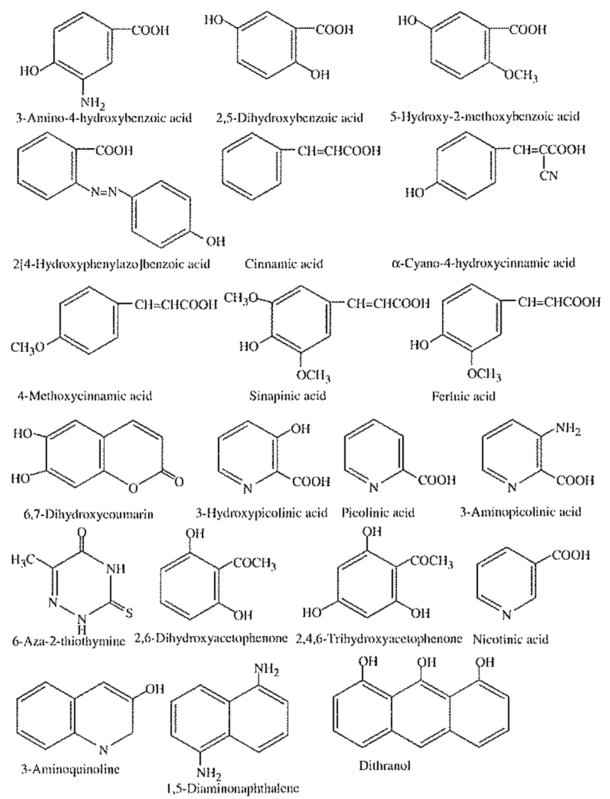
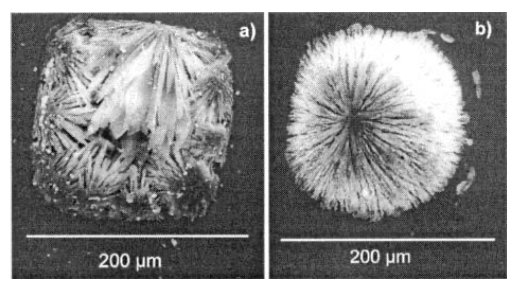
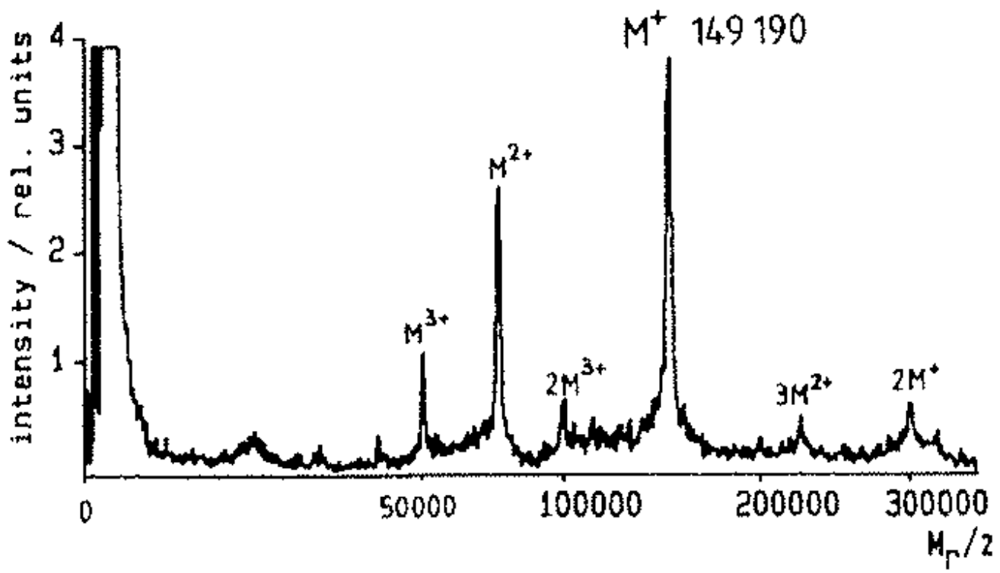

# Matrix Assisted Laser Desorption/Ionisation - Time of Flight Mass Spectrometry (MALDI-TOF)

{: style="width: 30%; "class="right"}

 MALDI-ToF is an MS method that utilises a "soft" ionisation method and is based on the principle of the sample being embedded in a matrix.

The matrix is made up of a crystalline substance that is aromatic to ensure that it's highly absorbent in the range of the laser, and is typically highly protonated, so that it can facilitate ionisation of the samples.

In traditional MALDI-ToF, the sample is mixed with the matrix and will quickly crystallise.

{: style="width: 30%; "class="center"}

## The Principle

Simply put, a laser is fired that will vaporise the matrix and with it some of the sample/analyte will be released as a gas plume and ionised by the protons from the matrix. This is then electrostatically directed through a ToF MS setup to be able to determine the mass of the analyte.

Since the ionisation is "Matrix Assisted", the sample itself shouldn't be degraded like with other forms of MS and the result should be full fragments of the macromolecule with a charge of $\ce{M+}$ or greater.

{: style="width: 40%; "class="center"}

## The Laser

Common lasers used, include:

### UV

| Laser Source       | Wavelength ($\lambda = nm$) |
| ------------------ | --------------------------- |
| $\ce{N2}$          | 337                         |
| Nd:YAG             | 355, 266                    |
| $\ce{ArF}$ excimer | 193                         |

### IR

| Laser Source | Wavelength ($\lambda = \mu m$) |
| ------------ | ------------------------------ |
| $\ce{CO2}$   | 10.6                           |
| Er:YAG       | 2.94                           |
| Nd:YAG OPO   | 3.28                           |

## The Outcome

This technique can be used for diagnostic purposes, when coupled with other techniques, as a "profile" of a disease can be created and patients' serum tested against it.

## Proteomics

A proteomics approach might look like this:

1. Separate a complex protein solution via electrophoretic methods (capillary or gel)
2. Use enzyme digestion to degrade the proteins
3. Use MALDI and either take the outcome to a database search, or use ToF to get a better picture before the search
4. Identify the proteins

## Surface-Enhanced Laser Desorption Ionisation MS (SELDI-MS)

* Uses the MALDI-ToF method however the sample is initially strategically adsorbed to a surface, either treated biochemically (antibodies, DNA, enzymes, receptors) or chemically (hydrophobic, cationic, anionic, etc.).
* This probe is then rinsed, the MALDI matrix applied and analysed via MALDI-ToF