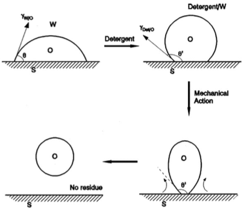
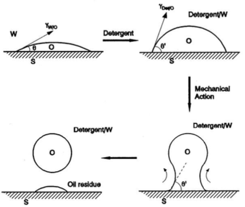
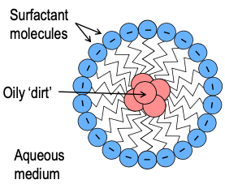
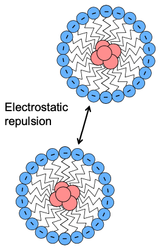
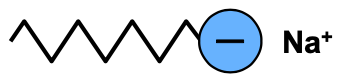
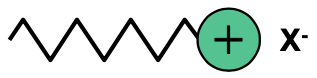
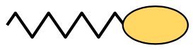
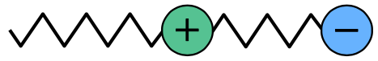

# Detergency

## Wetting

Wetting will occur if $\gamma_{L/V}$ and $\gamma_{S/V}$ are reduced. The easiest way to do this is to add a surfactant which will adsorb at both of these interfaces. The wettability is therefore related to the structure of the surfactant, as floppy, branched hydrocarbons will adsorb more strongly to non-polar surfaces.

This is incredibly important in things like insect sprays and animal dips, so that the chemical of interest permeates all the way across the surface, but also in inks and textiles, as the ink must be able to wet paper and the dye must adsorb strongly to the textile.

## Characteristics of Detergency

"Detergency is the removal unwanted substances/contaminants from a solid surface". The mechanism of this typically involves; chemical treatment, mechanical agitation and increased temperature.

The surfactant used must; wet the solid, remove the solid into the solution, and prevent the re-deposition and scum formation of the solid.

The best wetting agents aren't necessarily the best detergents, however, since they need to be easily dispersed in the rinse phase. they also need to be able to disperse into the textile fibres, which means that their hydrophobic tail can't be too long.

## Dirt or oil Removal

The surfactant should lower $\gamma_{O/W}$ and $\gamma_{S/W}$

$$
W_{AD(O/S)}=\gamma_{O/W}+\gamma_{S/W}-\gamma_{O/S}
$$

The work of adhesion can be thought of similarly to $\Delta G$, in that it must be negative for the process to be spontaneous, therefore we add a surfactant that adsorbs strongly at the oil/solid interface.

## Contact Angle

We also need to consider contact angle, as we realistically want $\cos\theta>90^\circ$ to help in the dehesion of the oil from the surface.

| $\theta>90^\circ$  | $\theta<90^\circ$  |
| :----------------: | :----------------: |
|  |  |

## Micelles

{: style="width: 20%; "class="right"}

It's also vital that the surfactant be able to form micelles to be ale to prevent the re-deposition in the rinse stage. This will also only happen above the CMC, so having a low CMC would ensure that less detergent is needed.

## Charge Stabilisation

{: style="width: 20%; "class="right"}

Ionic surfactants are particularly useful as they not only have all the previously stated effects, but will also prevent the dispersed dirt from being able to aggregate, due to charge repulsion. Most natural surfaces have a negative charge at typical pH, so anionic surfactants are typically better for these surfaces

 

## Types of Surfactant

### Anionic

{: style="width: 30%; "class="center"}

Typically used in detergents and shampoos

* These are the main class of soaps, including traditional fatty acid soaps ($\ce{RCOO- Na+}$)
* Alkylsulphates - SDS ($\ce{C12H25OSO3- Na+}$)
* Alkaryl sulphonates (non-biodegradable) - ($\ce{RC6H4SO3- Na+}$)

### Cationic

{: style="width: 30%; "class="center"}

Not typically used as detergents, though they are used as dispersants for ink, as paper has a negative charge. They're also used as conditioners to counter the charge of the anionic surfactants. They are also known to have bactericidal properties. Almost all are ammonium based

* Long chain quaternary ammonium salts - cety trimethylammonium bromide (CTAB) ($\ce{[C16H33N+(CH3)3]Br}$)

### Non-Ionic

{: style="width: 30%; "class="center"}

Since they don't have charges, they typically have a much bulkier head group to be able to facilitate dipolar bonds. They are typically more surface active, though are less effective as detergents. They also lower the surface tension more effectively at lower concentrations and don't lather, which makes the useful for automated machinery.

* Polyether esters, such as polyethylene oxide derivatives - ($\ce{R-CO-(OCH2CH2)_{x}CH2CH2OH}$)
* Polyether amines - ($\ce{R-CO-N[(OCH2CH2)_{x}OH]2}$)
* TWEENS - fatty acid ester and ethylene oxide esters of anhydrosorbitols
* TRITONS - ethyleneoxide ethers of alkylbenzene 

### Amphoteric

{: style="width: 30%; "class="center"}

Have very specialised purposes (e.g. bactericides, alkaline cleaners), since they can be tailored to have a specific charge at a specific pH. They are pretty much never zwitterionic.

* $\beta$-N-alkylamino propanoic acids ($\ce{R-N+H2CHCH2COO-}$)

## Builders

* Compounds that will form metal complexes to sequester polyvalent metal ions - e.g. sodium triphosphate ($\ce{Na5P3O10}$)
* Buffers, to ensure that the sufactant will remain at a specific pH - e.g. borax ($\ce{Na2CO3}$)
* Deflocculating agents - e.g. carboxy-methyl cellulose (CMC) , increases the negative charge of fabrics

## Brighteners/Bleaches

* Bleaches to try and oxidise any organic matter - e.g. hypochlorite ($\ce{ClO-}$), perborate ($\ce{NaBO3.xH2O}$)
* Fluorescent dyes to absorb UV light and emit blue light which makes naturally yellow tinted fabrics look more white