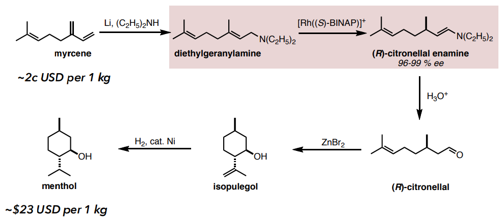
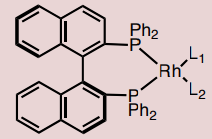
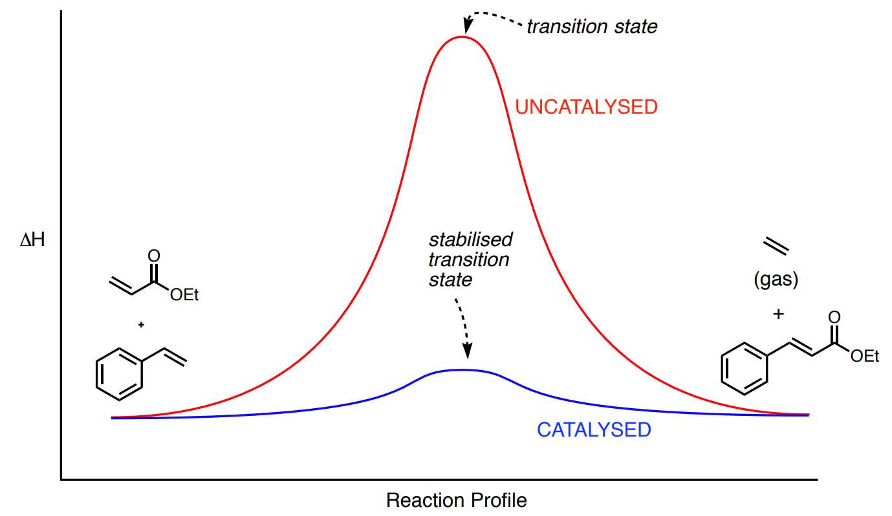
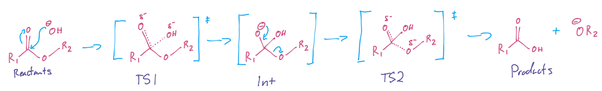
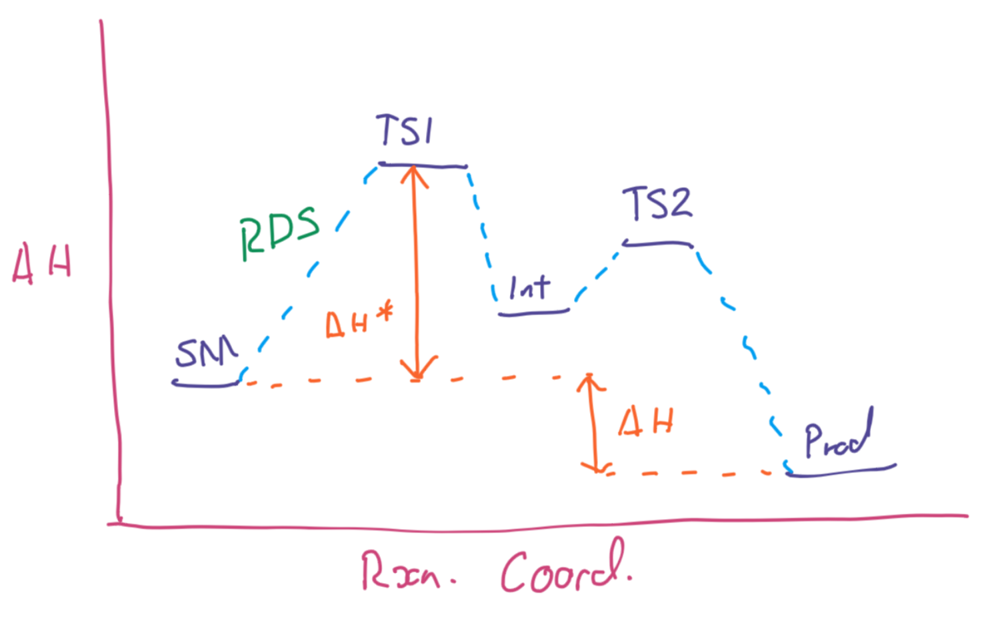
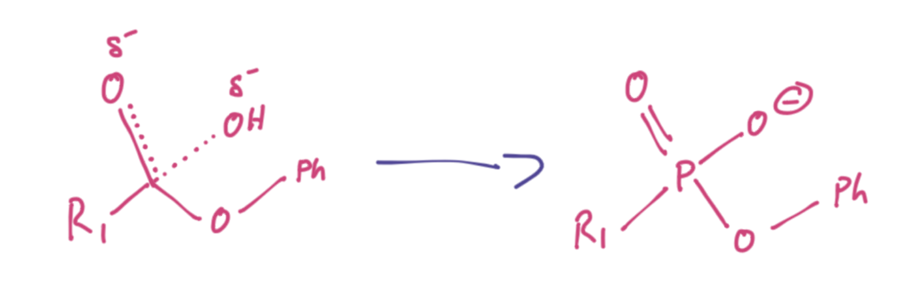
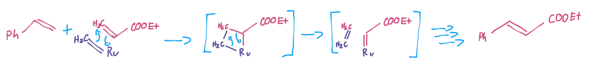

# Introduction to Catalysis

## What is Catalysis

Definition: "A substance that **increases the rate** (k) of a chemical reaction, without undergoing any permanent change ".

In practice, this isn;t entirely true as catalysts do break down over time, however they can partake in significantly more than a stoichiometric amount of reactions.

$$
\begin{align}
\text{Uncatalysed}:\\
\ce{A&->[\hskip{1cm}K_{ab}\hskip{1cm}]B}\\
\text{Catalysed}:\\
\ce{A&->[\hskip{1cm}K_{ab'}\hskip{1cm}]B}\\\\
&K_{ab'}>>K_{ab}
\end{align}
$$

A catalyst doesn;t change the thermodynamics of $A$ or $B$, but it will change the rate in which $A$ will become $B$.

Philosophically speaking, the utility of the reaction is on;y present if $B$ can be formed in your lifetime

## Economics

> "Our ability to devise traightforward and practical chemical syntheses is indespensible to the survival of our species"
>
> Ryoji Noyori

David Lupton would suggest that our ability on its own is not enough, and that we need govrnment penalties on economy to drive the adoption, that maked the discovery meaningful. 

Ryoji Noyori found a way to produce methol which is an incredibly valuable product and can be made with a massive markup.

{: style="width: 80%;" class="center sharp"}

Each of these steps is catalysed, one step in particular uses this rhodium binap TM complex.

{: style="width: 20%;" class="center sharp"}

The economic value of this process is so highly saught after that many companies have since tried to refine it, with BASF being able to synthesise it in four steps. The point being that **economics drives discovery**.

The vast majority of chemical manufacturing revenue comes from three primary industries; pharmaceuticals, polymers and petrochemical cracking (making specific lower MW molecules from the high MW crude material).

## Methods of Catalysis

Catalysis generally comes in two forms:

### Lowering the Energy of the Transition State

{: style="width: 50%;" class="center sharp"}

### Using a Lower Energy TS Pathway

{: style="width: 50%;" class="center sharp"}

## Catalytic Antibodies

One method of biologically reducing the TS energy barrier is to develop some antibodies against the transition state that can stabilise the structure, making it easier for the reaction to occur. In the example of cocaine metabolism, below, we can see that by hydrolysing the ester, the cocaine molecule is deactivated.

{: style="width: 50%;" class="center sharp"}

If we take a closer look at the reaction we can come up with this reaction mechanism that has two transition states and one intermediate.

{: style="width: 100%;" class="center sharp"}

When we plot the energy of this reaction we can easily see that the rate determining step (RDS) is TS1.

{: style="width:60%;" class="center sharp"}

So we can create a mimic of this structure using phosphate to generate some antibodies against.

{: style="width: 40%;" class="center sharp"}

When we introduce these antibodies into the system, they will bind to the transition state, lowering their energy, in turn reducing the activation energy for the metabolism of the cocaine.

## Alternative Pathway

In terms of using an alternative pathway, in the olefin metathesis ("to move about") example above, the reactants and products are **thermoneutral** both the same energy, so this reaction has no real motivator to overcome the massive energy of the transition state. Instead, by making a series of lower cost reaction that are driven by entropy, this reaction has a chance of proceeding.

In this case, the entropy is increased, decreasing the Gibbs free energy, as ethylene gas is produced, but it's also a product that can be removed, driving the equilibrium forward.

{: style="width: 80%;" class="center sharp"}

## Catalyst Phase

Catalysts can either be homogeneous (in the same phase as the reactants) or heterogeneous (in a different phase to the reactants).

There are some advantages/limitations to both:

| Pro/Con | Homogeneous                                                  | Pro/Con | Heterogeneous                                                |
| ------- | ------------------------------------------------------------ | ------- | ------------------------------------------------------------ |
| Con     | Makes separation more difficult, and ensures that a purification step needs to be taken | Pro     | They are good for ensuring that the products and the catalysts remain separated |
| Con     | Catalysts loadings are higher, making them less effective    | Con     | Highly specialised usage and apparatus is required           |
| Pro     | They can be easily treated like any other reagent in the reaction |         |                                                              |
| Pro     | No special hardware is required                              |         |                                                              |

A great example of heterogeneous catalysis is the Haber-Bosch process, as the solid catalysts will never come across in the gaseous products (the ammonia is only liquid once condensed). 

## Quantifying Catalytic Activity

We can quantify the activity of a catalyst with three main metrics; speed, robustness and stereoselectivity

We'll use the reaction below to demonstrate this:

{: style="width: 80%;" class="center sharp"}

### Turn Over Number (TON) - Robustness

This is a measure of how many times the catalytic process can happen before the catalyst expires.

For the reaction above, we have a 97% yield and a 0.1 mol% consumption of catalyst

First we have to calculate how many moles of product, reactant and catlayst areconsumed/produced inthe reaction

$$
\begin{gather}
0.1\:mol\% = \frac{0.1\:mol\:catalyst}{100\:mol\:product}=\frac{1\:mol\:catalyst}{1000\:mol\:product}\\\\
97\% \text{ yield of }1000\:mol\text{ is }970\:mol\:\text{product}\\
\\
\ce{1000 mol ->[\text{1 mol catalyst}] 970 mol}\\
\end{gather}
$$

So now we can calculate the TON

$$
\begin{align}
TON&=\frac{\text{mol product produced}}{\text{mol catalyst consumed}}\\
&=\frac{970}{1}\\
&=970\:\text{cycles}\\
\text{Or we could cmbine the steps:}\\
TON&=\frac{\text{mol%}}{\text{mol reactant converted}}\times\text{yield%}\\
&=\frac{0.1}{1000}\times97\%\\
&=970\:\text{cycles}
\end{align}
$$

### Yield from TON

$$
\begin{align}
TON&=\frac{yield\%}{mol\%}\\
TON\times mol\%&=yield\%\\
970\times0.1&=97
\end{align}
$$

### Turn Over Frequency (TOF) - Speed

Is how often the reaction happens

$$
\begin{align}
TOF&=\frac{\text{TON}}{\text{time of the reaction}}\\
&=\frac{970\:\text{cycles}}{4\:h}\\
&=243\:\text{cycles}/h
\end{align}
$$

### Stereoselectivity

Is a measure of how much of one isomer the catalysts produces over the other. These are a few of the metrics we use

$$
\begin{align}
\text{For Enantiomers A and B:}\\
e.r.&=[A]:[B]\text{ (often normalised to 100)}\\
e.e.&=[A]-[B]\\
\text{or}\\
e.e.\%&=([A]-[B])/([A]+[B])\\
\text{For Diasteromers A and B:}\\
d.r.&=[A]:[B]\text{ (often normalised to 100)}\\
\end{align}
$$

Diasteromeric excess isn't really used as a metric.

#### Converting e.e. to e.r.

Thiese are simultaneous equations, so the second step of the e.e. of $S$ substitutes back in to the second step of the e.e. of $R$. 

$$
\begin{align}
e.e.&=R-S\\
e.e.&=98\%\\
\\
98\%&=R-S\\
98\%&=R-(100-R)\\
198\%&=2R\\
R&=99\%\\
\\
R+S&=100\%\\
S&=100\%-R\\
S&=100\%-99\%\\
S&=1\%\\
\\
e.r.&=99:1
\end{align}
$$

